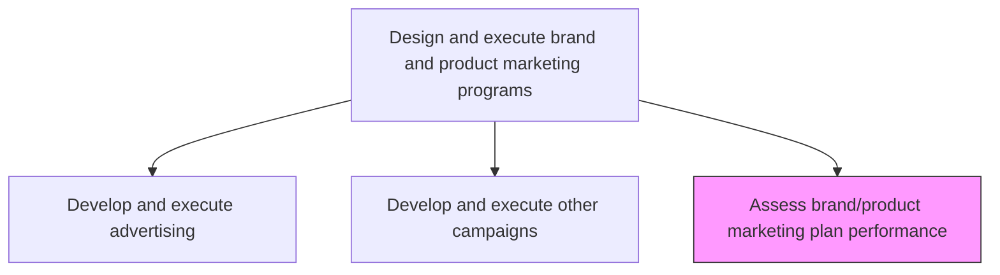
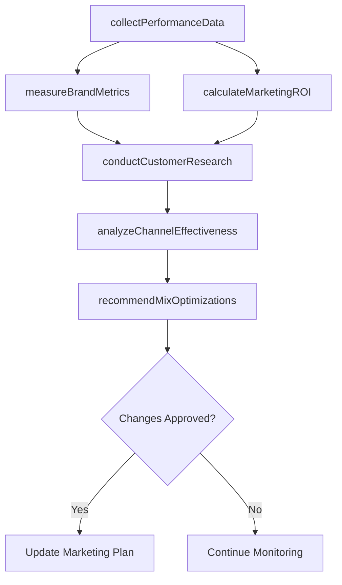

# Assess brand/product marketing plan performance

> Business-as-Code definition for brand and product marketing performance assessment. Models the evaluation of marketing program effectiveness across ROI, brand metrics, engagement, and channel performance to optimize the marketing mix.

## Overview

Examining the performance of all marketing efforts, across multiple parameters in order create an optimal marketing mix. Examine these programs on various aspects, such as return on investment, brand penetration, brand sentiment, and brand impact. Leverage focus groups, client feedback, customer engagement tracking, analytics over customer decisions, activity over the marketing channels employed, etc. Survey the performance of all marketing programs.

## Process Hierarchy



## GraphDL

```yaml
assess:
  object: Brand/product Marketing Plan Performance
  actor: MarketingAnalyst
  result: MarketingPerformanceReport
```

## Actions

| Action | Description |
|--------|-------------|
| collectPerformanceData | Aggregate metrics from all marketing channels, campaigns, and programs |
| measureBrandMetrics | Evaluate brand awareness, penetration, sentiment, and equity changes |
| calculateMarketingROI | Compute return on investment for each program and the overall marketing plan |
| conductCustomerResearch | Run focus groups, surveys, and feedback analysis to gauge customer response |
| analyzeChannelEffectiveness | Assess performance and contribution of each marketing channel |
| recommendMixOptimizations | Propose adjustments to the marketing mix based on performance findings |

## Events

| Event | Description |
|-------|-------------|
| performanceDataCollected | Marketing performance data aggregated from all sources |
| brandMetricsMeasured | Brand awareness, sentiment, and equity metrics evaluated |
| marketingROICalculated | ROI computed for programs and overall marketing plan |
| customerResearchConducted | Focus groups and survey insights compiled |
| channelEffectivenessAnalyzed | Channel-level performance assessment completed |
| mixOptimizationsRecommended | Marketing mix adjustment recommendations documented |

## Searches

| Search | Description |
|--------|-------------|
| getMarketingPerformance | Retrieve marketing performance metrics by program, channel, or period |
| getBrandMetrics | Query brand awareness, sentiment, and equity measurements |
| getChannelROI | Look up return on investment by marketing channel |
| getCustomerFeedback | Access customer research findings and satisfaction data |

## Process Flow



## RACI Matrix

| Activity | Responsible | Accountable | Consulted | Informed |
|----------|-------------|-------------|-----------|----------|
| collectPerformanceData | MarketingAnalyst | MarketingPlanningManager | CampaignManagers | DataScience |
| measureBrandMetrics | BrandAnalyst | BrandManager | MarketResearch | CMO |
| calculateMarketingROI | MarketingFinanceAnalyst | CMO | Finance | ExecutiveTeam |
| recommendMixOptimizations | MarketingPlanningManager | CMO | Sales | ProductMarketing |

## Related Processes

| Process | Relationship |
|---------|-------------|
| 3.3.3.10 Develop and execute other marketing campaigns/programs | Upstream - campaign results feed performance assessment |
| 3.3.3.9 Develop and execute advertising | Upstream - advertising performance is a key assessment input |
| 3.3.7 Track customer management measures | Parallel - customer metrics complement marketing performance data |
| 3.3.1 Establish goals, objectives, and metrics | Upstream - goals provide the benchmarks for assessment |

## Related Departments

| Department | Role |
|-----------|------|
| Marketing | Leads performance assessment and mix optimization |
| Market Research | Conducts customer surveys and focus groups |
| Finance | Validates ROI calculations and financial metrics |
| Data Science | Provides attribution modeling and advanced analytics |

## Related Occupations

| Occupation | Involvement |
|-----------|-------------|
| Marketing Analyst | Collects data, calculates ROI, and analyzes channel effectiveness |
| Brand Analyst | Measures brand health metrics and tracks sentiment |
| Market Research Analyst | Conducts qualitative and quantitative customer research |

## KPIs

| KPI | Description | Unit |
|-----|-------------|------|
| Marketing Plan ROI | Overall return on investment for the marketing plan | Ratio |
| Brand Awareness Lift | Change in brand awareness attributable to marketing programs | % |
| Channel Contribution Score | Relative contribution of each channel to overall marketing goals | Score (1-100) |
| Customer Satisfaction Index | Average customer satisfaction with brand marketing touchpoints | Score (1-10) |
| Assessment Cycle Time | Time from data collection to published performance report | Days |

## Usage

```typescript
import { assessBrandProductMarketingPlanPerformance } from '@headlessly/assess-brand-product-marketing-plan-performance'

const assessment = assessBrandProductMarketingPlanPerformance()

// Calculate marketing ROI across all programs
const roi = await assessment.calculateMarketingROI({
  period: 'FY2026-H1',
  programs: ['brand-campaign', 'demand-gen', 'content-marketing', 'events'],
  attributionModel: 'multi-touch'
})

// Measure brand metrics after campaign execution
const brand = await assessment.measureBrandMetrics({
  metrics: ['awareness', 'consideration', 'sentiment', 'net-promoter-score'],
  comparisonBaseline: 'pre-campaign',
  sampleSize: 2000
})
```
