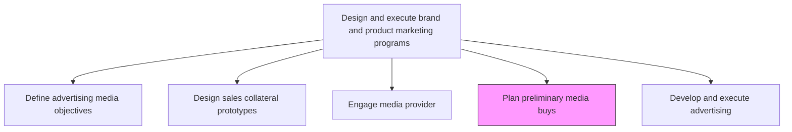
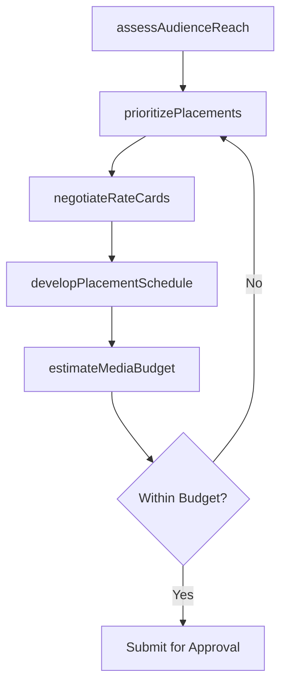

# Plan preliminary media buys (print, television, radio)

> Business-as-Code definition for preliminary media buy planning. Models the research, scheduling, and budgeting of advertising placements across print, television, and radio channels before final commitment.

## Overview

Planning initial media purchases across traditional channels including print publications, television airtime, and radio spots. Evaluate audience reach, frequency, and cost efficiency for each media type. Develop preliminary placement schedules and negotiate rate cards to secure favorable positioning before final budget approval.

## Process Hierarchy



## GraphDL

```yaml
plan:
  object: Preliminary Media Buys (print, Television, Radio)
  actor: MediaPlanner
  result: PreliminaryMediaPlan
```

## Actions

| Action | Description |
|--------|-------------|
| assessAudienceReach | Evaluate circulation, viewership, and listenership data for candidate media outlets |
| developPlacementSchedule | Create a preliminary calendar of ad placements across print, TV, and radio |
| negotiateRateCards | Obtain and negotiate advertising rates, discounts, and package deals with media outlets |
| estimateMediaBudget | Calculate total preliminary media buy costs based on placements and negotiated rates |
| prioritizePlacements | Rank media placements by expected cost-per-impression and audience alignment |

## Events

| Event | Description |
|-------|-------------|
| audienceReachAssessed | Media outlet audience data reviewed and scored |
| placementScheduleDeveloped | Preliminary ad placement calendar created |
| rateCardsNegotiated | Advertising rates and terms obtained from media outlets |
| mediaBudgetEstimated | Total preliminary media buy costs calculated |
| placementsPrioritized | Media placements ranked by efficiency and alignment |

## Searches

| Search | Description |
|--------|-------------|
| getMediaOutlets | Retrieve media outlets by channel type, geography, or audience demographic |
| getRateCards | Query current advertising rates and package options for media outlets |
| getPlacementSchedule | Look up the preliminary placement calendar by channel or campaign |
| getMediaBudgetEstimate | Access estimated costs for planned media buys |

## Process Flow



## RACI Matrix

| Activity | Responsible | Accountable | Consulted | Informed |
|----------|-------------|-------------|-----------|----------|
| assessAudienceReach | MediaPlanner | MediaBuyingManager | MarketResearch | CampaignManagers |
| negotiateRateCards | MediaBuyingManager | VP Marketing | Procurement | Finance |
| developPlacementSchedule | MediaPlanner | MediaBuyingManager | Creative | BrandManager |
| estimateMediaBudget | MediaPlanner | MediaBuyingManager | Finance | CMO |

## Related Processes

| Process | Relationship |
|---------|-------------|
| 3.3.3.1 Define advertising media objectives and strategy | Upstream - media objectives guide placement priorities |
| 3.3.3.5 Engage media provider | Upstream - contracted providers deliver the media placements |
| 3.3.3.9 Develop and execute advertising | Downstream - final media buys are committed during advertising execution |

## Related Departments

| Department | Role |
|-----------|------|
| Media Planning | Researches audiences and develops placement schedules |
| Media Buying | Negotiates rates and manages vendor relationships |
| Finance | Validates budget estimates and approves spend commitments |
| Market Research | Provides audience data and media consumption insights |

## Related Occupations

| Occupation | Involvement |
|-----------|-------------|
| Media Planner | Develops placement schedules and evaluates audience reach |
| Media Buying Manager | Negotiates rates and manages media vendor relationships |
| Market Research Analyst | Provides audience demographics and media consumption data |

## KPIs

| KPI | Description | Unit |
|-----|-------------|------|
| Cost Per Thousand Impressions | Average CPM across planned media buys | Currency |
| Audience Reach Coverage | Percentage of target audience reached by the planned media mix | % |
| Rate Card Discount | Average discount achieved against published media rates | % |
| Planning Cycle Time | Time from initial audience assessment to submitted media plan | Days |

## Usage

```typescript
import { planPreliminaryMediaBuys } from '@headlessly/plan-preliminary-media-buys-print-television-radio'

const mediaPlan = planPreliminaryMediaBuys()

// Assess audience reach for candidate media outlets
const reach = await mediaPlan.assessAudienceReach({
  channels: ['print', 'television', 'radio'],
  targetDemographic: 'adults-25-54',
  markets: ['national', 'top-10-dma']
})

// Develop preliminary placement schedule
const schedule = await mediaPlan.developPlacementSchedule({
  campaignId: 'spring-product-launch',
  outlets: reach.topOutlets,
  flightDates: { start: '2026-03-01', end: '2026-05-31' },
  frequency: 'weekly'
})
```
