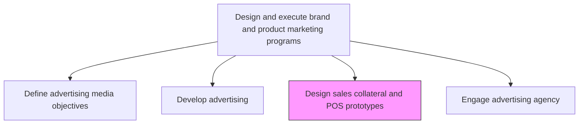
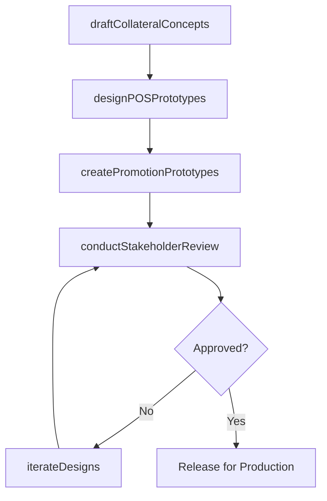

# Design preliminary sales collateral, point-of-sale (POS) and promotion prototypes

> Business-as-Code definition for sales collateral and POS prototype design. Models the creation of preliminary marketing materials including brochures, display units, and promotional prototypes for stakeholder review.

## Overview

Creating preliminary versions of sales enablement materials, point-of-sale displays, and promotional prototypes. Design mockups of brochures, sell sheets, display fixtures, signage, and promotional packaging to validate messaging, layout, and visual impact before committing to full production runs.

## Process Hierarchy



## GraphDL

```yaml
design:
  object: Preliminary Sales Collateral, Point-of-sale (POS) And Promotion Prototypes
  actor: CreativeDesigner
  result: CollateralPrototypes
```

## Actions

| Action | Description |
|--------|-------------|
| draftCollateralConcepts | Create initial design concepts for sales brochures, data sheets, and leave-behinds |
| designPOSPrototypes | Develop mockups for point-of-sale displays, signage, and merchandising fixtures |
| createPromotionPrototypes | Build prototype promotional materials including packaging, inserts, and coupons |
| conductStakeholderReview | Present prototypes to sales, marketing, and retail teams for feedback |
| iterateDesigns | Refine prototypes based on stakeholder feedback and testing results |

## Events

| Event | Description |
|-------|-------------|
| collateralConceptsDrafted | Sales collateral design concepts completed |
| posPrototypesDesigned | Point-of-sale display prototypes created |
| promotionPrototypesCreated | Promotional material prototypes produced |
| stakeholderReviewConducted | Stakeholder review session completed with feedback |
| designsIterated | Prototypes refined based on review feedback |

## Searches

| Search | Description |
|--------|-------------|
| getPrototypes | Retrieve collateral and POS prototypes by campaign or product |
| getReviewFeedback | Query stakeholder feedback on specific prototypes |
| getDesignAssets | Access design files and assets for approved prototypes |

## Process Flow



## RACI Matrix

| Activity | Responsible | Accountable | Consulted | Informed |
|----------|-------------|-------------|-----------|----------|
| draftCollateralConcepts | CreativeDesigner | CreativeDirector | Sales | BrandManager |
| designPOSPrototypes | CreativeDesigner | CreativeDirector | RetailOps | Merchandising |
| conductStakeholderReview | CampaignManager | MarketingDirector | Sales | Operations |

## Related Processes

| Process | Relationship |
|---------|-------------|
| 3.3.3.2 Develop advertising | Parallel - collateral aligns with advertising creative |
| 3.2.6.7 Define POS communication strategy | Upstream - POS strategy guides display design |
| 3.3.9 Develop and manage packaging strategy | Parallel - packaging and POS materials coordinate |

## Related Departments

| Department | Role |
|-----------|------|
| Creative Services | Designs collateral and POS prototypes |
| Sales | Provides requirements and reviews collateral effectiveness |
| Retail Operations | Validates POS feasibility for in-store deployment |
| Brand Management | Ensures brand guideline compliance |

## Related Occupations

| Occupation | Involvement |
|-----------|-------------|
| Creative Designer | Creates collateral and POS mockups |
| Sales Enablement Manager | Defines collateral requirements for sales teams |
| Visual Merchandiser | Validates POS display feasibility |

## KPIs

| KPI | Description | Unit |
|-----|-------------|------|
| Prototype Approval Rate | Percentage of prototypes approved on first review | % |
| Design Cycle Time | Average time from brief to approved prototype | Days |
| Sales Team Adoption | Percentage of sales team using approved collateral | % |
| POS Compliance Rate | Percentage of retail locations deploying POS materials correctly | % |

## Usage

```typescript
import { designPreliminarySalesCollateralPosAndPromotionPrototypes } from '@headlessly/design-preliminary-sales-collateral-pos-and-promotion-prototypes'

const prototypes = designPreliminarySalesCollateralPosAndPromotionPrototypes()

// Draft collateral concepts for a product launch
const concepts = await prototypes.draftCollateralConcepts({
  product: 'enterprise-platform-v3',
  collateralTypes: ['sell-sheet', 'brochure', 'case-study-template'],
  audience: 'enterprise-buyers'
})

// Design POS display prototypes
const pos = await prototypes.designPOSPrototypes({
  campaign: 'product-launch-2026',
  displayTypes: ['counter-display', 'end-cap', 'digital-signage'],
  retailPartners: ['partner-a', 'partner-b']
})
```
