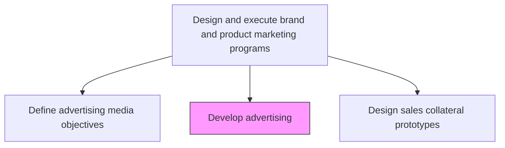
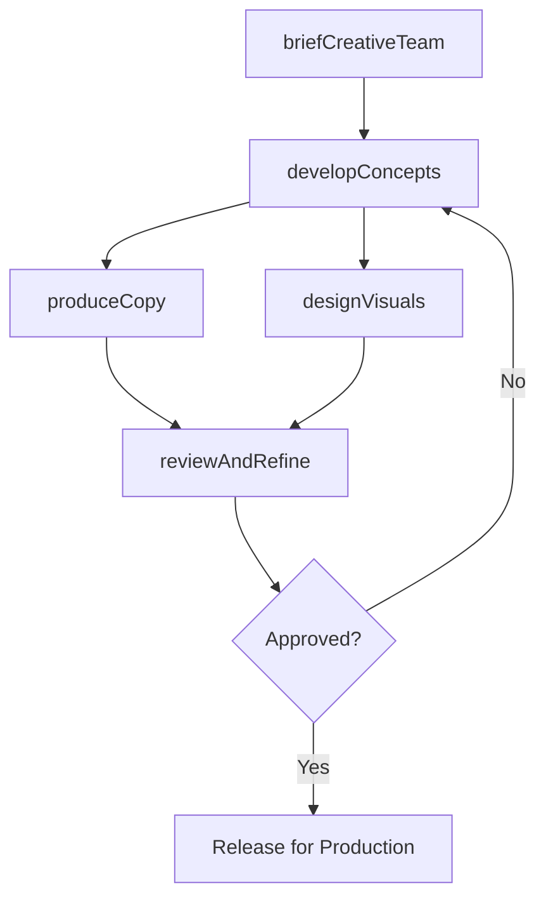

# Develop advertising

> Business-as-Code definition for advertising development. Models the creative development process from concept to production-ready advertising assets across all media formats.

## Overview

Creating advertising content and creative assets for marketing campaigns. Develop messaging concepts, write copy, design visual elements, and produce advertising materials for use across print, digital, broadcast, and out-of-home media. Ensure all advertising aligns with brand guidelines and campaign objectives.

## Process Hierarchy



## GraphDL

```yaml
develop:
  object: Advertising
  actor: CreativeDirector
  result: AdvertisingAssets
```

## Actions

| Action | Description |
|--------|-------------|
| briefCreativeTeam | Prepare and deliver the creative brief including objectives, audience, and key messages |
| developConcepts | Generate multiple creative concepts and directions for the campaign |
| produceCopy | Write advertising copy including headlines, body text, and calls to action |
| designVisuals | Create visual elements, layouts, and graphic assets for advertising |
| reviewAndRefine | Conduct internal reviews, incorporate feedback, and refine advertising drafts |

## Events

| Event | Description |
|-------|-------------|
| creativeTeamBriefed | Creative brief delivered and reviewed with production team |
| conceptsDeveloped | Creative concepts presented and shortlisted |
| copyProduced | Advertising copy written and approved |
| visualsDesigned | Visual assets and layouts created |
| advertisingRefined | Final advertising drafts approved for production |

## Searches

| Search | Description |
|--------|-------------|
| getCreativeBriefs | Retrieve creative briefs by campaign or product |
| getAdConcepts | Query advertising concepts and their approval status |
| getAdAssets | Access production-ready advertising assets by campaign |

## Process Flow



## RACI Matrix

| Activity | Responsible | Accountable | Consulted | Informed |
|----------|-------------|-------------|-----------|----------|
| briefCreativeTeam | CampaignManager | MarketingDirector | BrandManager | Creative |
| developConcepts | CreativeDirector | MarketingDirector | BrandManager | Sales |
| produceCopy | Copywriter | CreativeDirector | Legal | BrandManager |
| designVisuals | GraphicDesigner | CreativeDirector | BrandManager | Marketing |

## Related Processes

| Process | Relationship |
|---------|-------------|
| 3.3.3.1 Define advertising media objectives and strategy | Upstream - media strategy guides creative development |
| 3.3.3.9 Develop and execute advertising | Downstream - developed ads are finalized and released |
| 3.2.3 Develop and manage brands | Upstream - brand guidelines govern creative execution |

## Related Departments

| Department | Role |
|-----------|------|
| Creative Services | Leads concept development, copywriting, and design |
| Marketing | Provides campaign briefs and strategic direction |
| Brand Management | Ensures brand guideline compliance |
| Legal | Reviews advertising for regulatory compliance |

## Related Occupations

| Occupation | Involvement |
|-----------|-------------|
| Creative Director | Leads creative concept development and quality |
| Copywriter | Writes advertising copy and messaging |
| Graphic Designer | Creates visual assets and layouts |

## KPIs

| KPI | Description | Unit |
|-----|-------------|------|
| Creative Turnaround Time | Average time from brief to approved advertising | Days |
| Concept Approval Rate | Percentage of concepts approved on first presentation | % |
| Brand Compliance Score | Adherence of advertising to brand guidelines | Score (1-10) |
| Creative Production Cost | Average cost to produce advertising assets | Currency |

## Usage

```typescript
import { developAdvertising } from '@headlessly/develop-advertising'

const advertising = developAdvertising()

// Brief the creative team on a new campaign
const brief = await advertising.briefCreativeTeam({
  campaign: 'summer-launch-2026',
  objective: 'brand-awareness',
  targetAudience: 'professionals-30-50',
  keyMessages: ['innovation', 'reliability', 'value']
})

// Develop creative concepts
const concepts = await advertising.developConcepts({
  briefId: brief.id,
  numberOfConcepts: 3,
  formats: ['digital-banner', 'social-video', 'print-ad']
})
```
