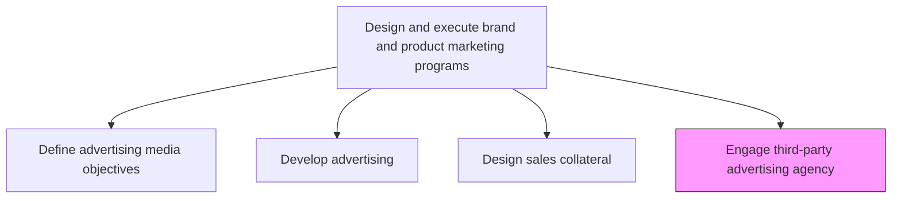
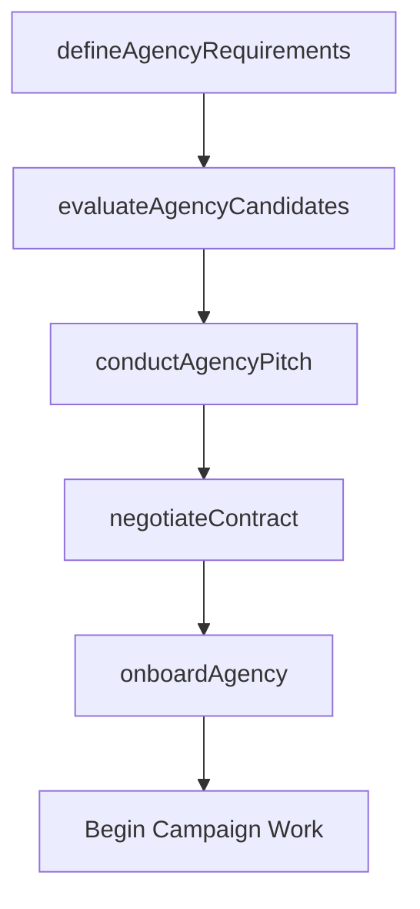

# Engage third-party advertising agency

> Business-as-Code definition for advertising agency engagement. Models the selection, contracting, briefing, and management of external advertising agencies for campaign development and execution.

## Overview

Selecting and contracting with third-party advertising agencies to support marketing campaign development and execution. Evaluate agency capabilities, review portfolios, conduct pitches, negotiate terms, and establish ongoing working relationships to augment internal creative and media capabilities.

## Process Hierarchy



## GraphDL

```yaml
engage:
  object: Third-party Advertising Agency
  actor: MarketingDirector
  result: AgencyEngagementContract
```

## Actions

| Action | Description |
|--------|-------------|
| defineAgencyRequirements | Specify capabilities, scope, and deliverables needed from an external agency |
| evaluateAgencyCandidates | Review agency portfolios, credentials, and relevant experience |
| conductAgencyPitch | Invite shortlisted agencies to present creative and strategic proposals |
| negotiateContract | Establish terms, pricing, deliverables, and service level agreements |
| onboardAgency | Brief the selected agency on brand guidelines, strategy, and campaign objectives |

## Events

| Event | Description |
|-------|-------------|
| agencyRequirementsDefined | Agency scope and capability requirements documented |
| agencyCandidatesEvaluated | Agency shortlist compiled from candidate review |
| agencyPitchConducted | Agency pitch presentations completed and scored |
| contractNegotiated | Agency contract terms agreed and signed |
| agencyOnboarded | Selected agency briefed and operational |

## Searches

| Search | Description |
|--------|-------------|
| getAgencyRoster | Retrieve current and past advertising agency relationships |
| getAgencyPerformance | Query agency performance metrics and scorecards |
| getAgencyContracts | Access active agency contracts and terms |

## Process Flow



## RACI Matrix

| Activity | Responsible | Accountable | Consulted | Informed |
|----------|-------------|-------------|-----------|----------|
| defineAgencyRequirements | MarketingDirector | CMO | Creative | Procurement |
| evaluateAgencyCandidates | MarketingDirector | CMO | BrandManager | Legal |
| negotiateContract | Procurement | CMO | Legal | Finance |
| onboardAgency | CampaignManager | MarketingDirector | BrandManager | Creative |

## Related Processes

| Process | Relationship |
|---------|-------------|
| 3.3.3.2 Develop advertising | Downstream - agency produces advertising content |
| 3.3.3.5 Engage media provider | Parallel - agency and media provider work together on campaigns |
| 3.3.3.1 Define advertising media objectives and strategy | Upstream - media strategy informs agency brief |

## Related Departments

| Department | Role |
|-----------|------|
| Marketing | Defines agency requirements and manages relationship |
| Procurement | Leads contract negotiation and vendor management |
| Legal | Reviews agency contracts and IP agreements |
| Finance | Approves agency budget and payment terms |

## Related Occupations

| Occupation | Involvement |
|-----------|-------------|
| Marketing Director | Selects agency and manages strategic relationship |
| Procurement Manager | Negotiates contract terms and pricing |
| Campaign Manager | Manages day-to-day agency collaboration |

## KPIs

| KPI | Description | Unit |
|-----|-------------|------|
| Agency Selection Cycle Time | Time from requirements definition to signed contract | Days |
| Agency Satisfaction Score | Internal satisfaction rating with agency performance | Score (1-10) |
| Creative Quality Score | Rating of agency-produced creative against brand standards | Score (1-10) |
| Agency Cost Efficiency | Agency fees as percentage of total campaign spend | % |

## Usage

```typescript
import { engageThirdPartyAdvertisingAgency } from '@headlessly/engage-third-party-advertising-agency'

const agency = engageThirdPartyAdvertisingAgency()

// Evaluate agency candidates for a major campaign
const candidates = await agency.evaluateAgencyCandidates({
  capabilities: ['digital', 'brand-strategy', 'video-production'],
  budgetRange: { min: 500000, max: 2000000 },
  industryExperience: 'enterprise-technology'
})

// Onboard the selected agency
const onboarding = await agency.onboardAgency({
  agencyId: candidates[0].id,
  brandGuidelines: 'brand-guide-v4',
  campaignBrief: 'q2-product-launch',
  kickoffDate: '2026-03-15'
})
```
