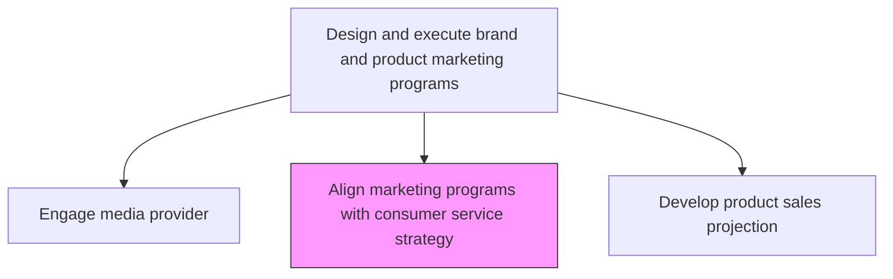
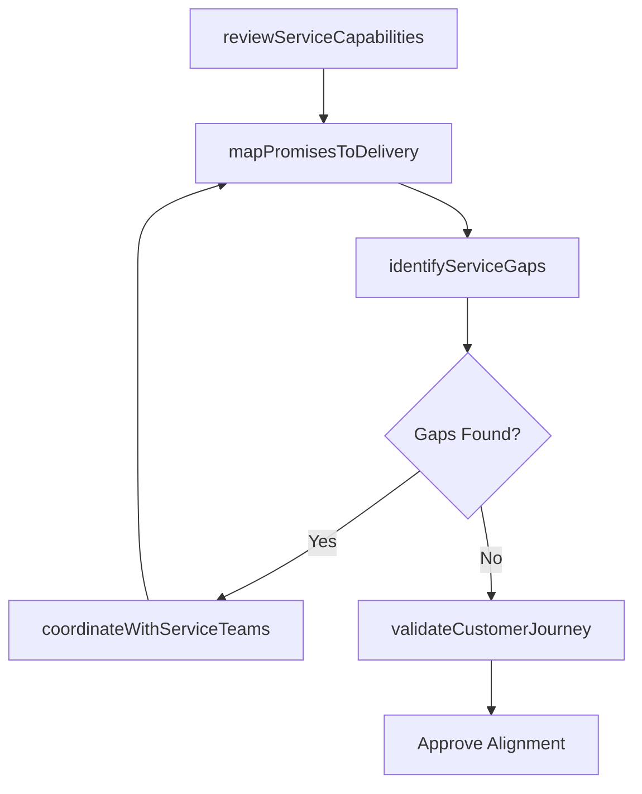

# Align marketing programs with consumer service strategy

> Business-as-Code definition for marketing-service alignment. Models the coordination of marketing campaigns with consumer service strategy to ensure consistent customer experience across all touchpoints.

## Overview

Ensuring marketing programs and campaigns are consistent with the organization's consumer service strategy. Validate that promotional messaging, offers, and customer expectations set by marketing are deliverable by service operations. Coordinate pre-sale marketing with post-sale service capabilities to create a seamless customer journey.

## Process Hierarchy



## GraphDL

```yaml
align:
  object: Marketing Programs With Consumer Service Strategy
  actor: MarketingPlanningManager
  result: AlignmentValidationReport
```

## Actions

| Action | Description |
|--------|-------------|
| reviewServiceCapabilities | Assess current consumer service capacity and readiness for campaign commitments |
| mapPromisesToDelivery | Match marketing promises and offers to service delivery capabilities |
| identifyServiceGaps | Detect gaps between marketing commitments and service readiness |
| coordinateWithServiceTeams | Collaborate with customer service to prepare for campaign-driven demand |
| validateCustomerJourney | Ensure end-to-end customer journey from marketing to service is seamless |

## Events

| Event | Description |
|-------|-------------|
| serviceCapabilitiesReviewed | Service capacity assessment completed |
| promisesMappedToDelivery | Marketing commitments validated against service delivery |
| serviceGapsIdentified | Gaps between marketing promises and service readiness detected |
| serviceTeamsCoordinated | Service teams briefed on campaign demands |
| customerJourneyValidated | Customer journey alignment confirmed |

## Searches

| Search | Description |
|--------|-------------|
| getAlignmentStatus | Retrieve marketing-to-service alignment status by campaign |
| getServiceGaps | Query identified service gaps for specific marketing programs |
| getServiceReadiness | Access service team readiness data for upcoming campaigns |

## Process Flow



## RACI Matrix

| Activity | Responsible | Accountable | Consulted | Informed |
|----------|-------------|-------------|-----------|----------|
| reviewServiceCapabilities | CustomerServiceManager | MarketingDirector | Operations | IT |
| mapPromisesToDelivery | MarketingPlanningManager | CMO | CustomerService | Sales |
| coordinateWithServiceTeams | MarketingPlanningManager | CMO | CustomerServiceManager | Operations |

## Related Processes

| Process | Relationship |
|---------|-------------|
| 3.5.5 Manage customer service operations | Parallel - service operations must support marketing promises |
| 3.3.5 Develop and manage promotional activities | Upstream - promotions must align with service capacity |
| 3.2.6 Develop marketing communication strategy | Upstream - communication strategy sets service expectations |

## Related Departments

| Department | Role |
|-----------|------|
| Marketing | Leads alignment review and adjusts campaigns as needed |
| Customer Service | Validates service delivery capacity for marketing commitments |
| Operations | Confirms operational readiness for campaign-driven demand |
| Sales | Provides front-line customer feedback on service alignment |

## Related Occupations

| Occupation | Involvement |
|-----------|-------------|
| Marketing Planning Manager | Coordinates alignment between marketing and service |
| Customer Service Manager | Validates service readiness for campaigns |
| Customer Experience Manager | Ensures end-to-end journey consistency |

## KPIs

| KPI | Description | Unit |
|-----|-------------|------|
| Promise-to-Delivery Match Rate | Percentage of marketing promises fulfilled by service operations | % |
| Service Gap Resolution Time | Average time to close identified service alignment gaps | Days |
| Post-Campaign Complaint Rate | Customer complaints related to unmet marketing expectations | Count per Campaign |
| Customer Journey Consistency Score | Rating of experience consistency across touchpoints | Score (1-10) |

## Usage

```typescript
import { alignMarketingProgramsWithConsumerServiceStrategy } from '@headlessly/align-marketing-programs-with-consumer-service-strategy'

const alignment = alignMarketingProgramsWithConsumerServiceStrategy()

// Map marketing promises to service delivery capabilities
const mapping = await alignment.mapPromisesToDelivery({
  campaign: 'holiday-promotion-2026',
  promises: ['24hr-shipping', 'extended-returns', 'priority-support'],
  serviceRegions: ['north-america', 'europe']
})

// Coordinate with service teams for upcoming campaign
const coordination = await alignment.coordinateWithServiceTeams({
  campaign: 'holiday-promotion-2026',
  expectedVolumeIncrease: 3.5,
  preparationLeadTime: '4-weeks'
})
```
