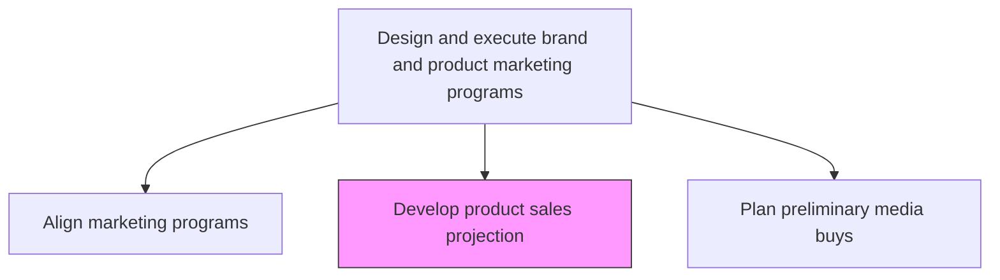
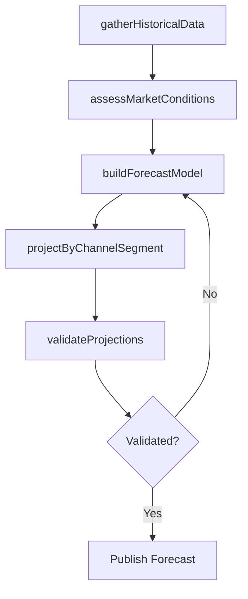

# Develop product sales projection

> Business-as-Code definition for product sales forecasting. Models the creation of sales projections that estimate future product demand by channel and segment to guide marketing investment decisions.

## Overview

Creating sales forecasts for specific products based on market analysis, historical data, marketing campaign plans, and economic indicators. Develop unit and revenue projections by time period, channel, and customer segment to inform budget allocation, inventory planning, and marketing program design.

## Process Hierarchy



## GraphDL

```yaml
develop:
  object: Product Sales Projection
  actor: MarketingAnalyst
  result: ProductSalesForecast
```

## Actions

| Action | Description |
|--------|-------------|
| gatherHistoricalData | Collect past sales data by product, channel, and segment for trend analysis |
| assessMarketConditions | Evaluate current market dynamics, competitive landscape, and economic indicators |
| buildForecastModel | Create sales projection model incorporating historical trends and marketing plans |
| projectByChannelSegment | Generate unit and revenue forecasts broken down by channel and customer segment |
| validateProjections | Review projections with sales, finance, and product teams for accuracy |

## Events

| Event | Description |
|-------|-------------|
| historicalDataGathered | Sales history compiled for forecast modeling |
| marketConditionsAssessed | Market analysis completed for projection inputs |
| forecastModelBuilt | Sales projection model created and calibrated |
| channelSegmentProjected | Forecasts generated by channel and segment |
| projectionsValidated | Sales projections reviewed and approved by stakeholders |

## Searches

| Search | Description |
|--------|-------------|
| getSalesProjections | Retrieve sales projections by product, channel, or period |
| getHistoricalSales | Query historical sales data for trend analysis |
| getForecastAccuracy | Access forecast versus actual performance comparisons |

## Process Flow



## RACI Matrix

| Activity | Responsible | Accountable | Consulted | Informed |
|----------|-------------|-------------|-----------|----------|
| gatherHistoricalData | MarketingAnalyst | MarketingPlanningManager | Sales | Finance |
| buildForecastModel | MarketingAnalyst | MarketingPlanningManager | DataScience | ProductManagement |
| projectByChannelSegment | MarketingAnalyst | MarketingPlanningManager | ChannelManagers | Sales |
| validateProjections | MarketingPlanningManager | CMO | Finance | ExecutiveTeam |

## Related Processes

| Process | Relationship |
|---------|-------------|
| 3.3.2 Establish marketing budgets | Downstream - projections inform budget allocation |
| 3.3.4 Develop and manage pricing | Parallel - pricing decisions affect sales volume forecasts |
| 3.3.1 Establish goals, objectives, and metrics | Upstream - marketing goals provide projection targets |

## Related Departments

| Department | Role |
|-----------|------|
| Marketing | Leads forecast development and scenario analysis |
| Sales | Validates projections against pipeline and field intelligence |
| Finance | Uses projections for revenue planning and budget validation |
| Product Management | Provides product roadmap inputs for forecast adjustment |

## Related Occupations

| Occupation | Involvement |
|-----------|-------------|
| Marketing Analyst | Builds and maintains sales projection models |
| Sales Operations Manager | Validates forecasts against sales pipeline data |
| Financial Analyst | Integrates projections into financial planning models |

## KPIs

| KPI | Description | Unit |
|-----|-------------|------|
| Forecast Accuracy | Variance between projected and actual sales | % |
| Projection Coverage | Percentage of products with active sales projections | % |
| Forecast Timeliness | Time from data collection to published forecast | Days |
| Scenario Range | Spread between optimistic and conservative projections | % |

## Usage

```typescript
import { developProductSalesProjection } from '@headlessly/develop-product-sales-projection'

const forecast = developProductSalesProjection()

// Build forecast model for a product line
const model = await forecast.buildForecastModel({
  product: 'enterprise-platform',
  historicalPeriod: '24-months',
  marketInputs: ['competitive-landscape', 'economic-indicators'],
  campaignPlans: ['q2-launch', 'q3-expansion']
})

// Generate channel and segment projections
const projections = await forecast.projectByChannelSegment({
  modelId: model.id,
  channels: ['direct', 'partner', 'digital'],
  segments: ['enterprise', 'mid-market'],
  period: 'FY2026'
})
```
