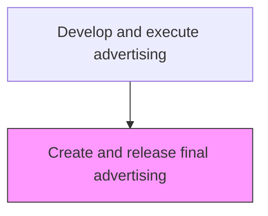
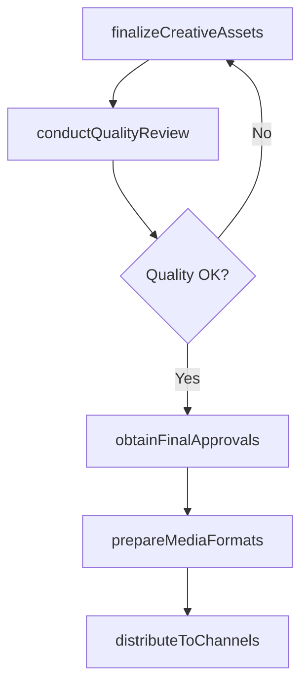

# Create and release final advertising

> Business-as-Code definition for final advertising production and release. Models the finalization, quality assurance, and distribution of production-ready advertising assets to media channels and platforms.

## Overview

Finalizing advertising creative assets and releasing them for publication across booked media channels. Conduct final quality checks, obtain legal and brand approvals, prepare media-specific file formats, and distribute finished ads to publishers, broadcasters, and digital platforms according to the media plan schedule.

## Process Hierarchy



## GraphDL

```yaml
create:
  object: And Release Final Advertising
  actor: ProductionManager
  result: ReleasedAdvertisingAssets
```

## Actions

| Action | Description |
|--------|-------------|
| finalizeCreativeAssets | Complete production of advertising assets in all required formats and specifications |
| conductQualityReview | Perform technical and creative quality checks on finished advertising |
| obtainFinalApprovals | Secure legal, brand, and executive sign-off on final advertising |
| prepareMediaFormats | Convert advertising assets into format specifications required by each media outlet |
| distributeToChannels | Release final advertising to publishers, broadcasters, and digital platforms |

## Events

| Event | Description |
|-------|-------------|
| creativeAssetsFinalized | Production-ready advertising assets completed |
| qualityReviewConducted | Quality assurance checks passed |
| finalApprovalsObtained | All required approvals secured for release |
| mediaFormatsPrepared | Channel-specific ad formats produced |
| advertisingDistributed | Final advertising released to all booked media channels |

## Searches

| Search | Description |
|--------|-------------|
| getFinalAssets | Retrieve production-ready advertising assets by campaign |
| getApprovalStatus | Query approval status of advertising materials |
| getDistributionLog | Access delivery confirmation records for distributed ads |

## Process Flow



## RACI Matrix

| Activity | Responsible | Accountable | Consulted | Informed |
|----------|-------------|-------------|-----------|----------|
| finalizeCreativeAssets | ProductionManager | CreativeDirector | BrandManager | CampaignManager |
| conductQualityReview | QualityAssurance | CreativeDirector | Legal | BrandManager |
| obtainFinalApprovals | CampaignManager | MarketingDirector | Legal | CMO |
| distributeToChannels | MediaTrafficManager | MediaBuyingManager | Production | CampaignManager |

## Related Processes

| Process | Relationship |
|---------|-------------|
| 3.3.3.2 Develop advertising | Upstream - developed ads are finalized for release |
| 3.3.3.8 Plan preliminary media buys | Upstream - media schedule dictates release timing |
| 3.3.3.11 Assess brand/product marketing plan performance | Downstream - released ads generate performance data |

## Related Departments

| Department | Role |
|-----------|------|
| Creative Services | Finalizes advertising production and quality |
| Legal | Provides compliance review and approval |
| Media Operations | Manages ad trafficking and distribution to channels |
| Brand Management | Validates final creative against brand guidelines |

## Related Occupations

| Occupation | Involvement |
|-----------|-------------|
| Production Manager | Manages final asset production and quality control |
| Media Traffic Manager | Distributes ads to media outlets and platforms |
| Creative Director | Approves final creative quality |

## KPIs

| KPI | Description | Unit |
|-----|-------------|------|
| Release Timeliness | Percentage of ads released on or before scheduled date | % |
| First-Pass Approval Rate | Percentage of ads approved without revision requests | % |
| Format Compliance | Percentage of assets meeting media outlet specifications | % |
| Distribution Confirmation Rate | Percentage of outlets confirming receipt of final ads | % |

## Usage

```typescript
import { createAndReleaseFinalAdvertising } from '@headlessly/create-and-release-final-advertising'

const release = createAndReleaseFinalAdvertising()

// Finalize creative assets for a campaign
const assets = await release.finalizeCreativeAssets({
  campaign: 'spring-launch-2026',
  formats: ['tv-30sec', 'digital-banner-300x250', 'social-video-15sec'],
  deliveryDate: '2026-03-01'
})

// Distribute to booked media channels
const distribution = await release.distributeToChannels({
  assetIds: assets.map(a => a.id),
  channels: ['broadcast-network', 'programmatic-display', 'social-platforms'],
  flightStart: '2026-03-15'
})
```
