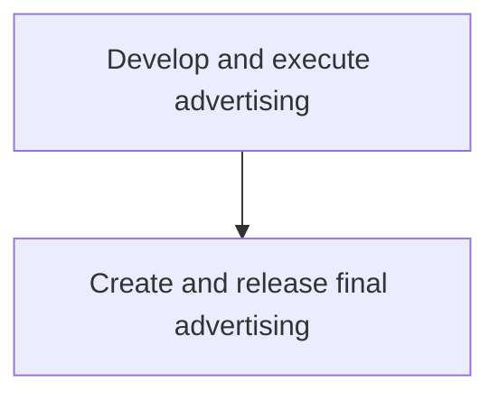
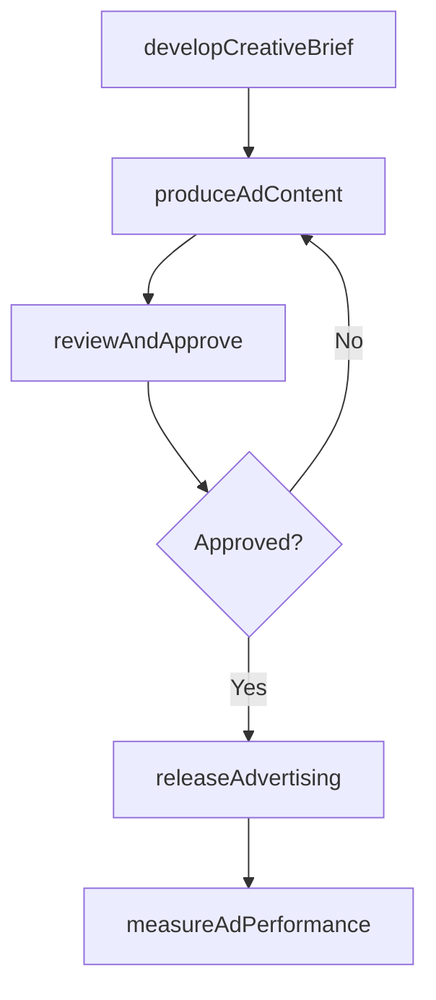

# Develop and execute advertising

> Business-as-Code definition for advertising development and execution. Models the creation, production, and release of advertising campaigns across media channels to influence target audience purchasing decisions.

## Overview

Developing and delivering advertising messages to the target audience, with the objective of influencing their purchasing decisions. Create advertising campaigns geared to specific offerings, and deliver through the media providers. Create content (textual and visual) that is highly contextualized to deliver the message in a specific manner. Consider enlisting specialized professional services.

## Process Hierarchy



## GraphDL

```yaml
develop:
  object: And Execute Advertising
  actor: AdvertisingManager
  result: AdvertisingCampaignDeliverable
```

## Actions

| Action | Description |
|--------|-------------|
| developCreativeBrief | Define campaign objectives, target audience, and creative direction |
| produceAdContent | Create advertising content including copy, visuals, and multimedia |
| reviewAndApprove | Conduct internal review and secure approvals for ad content |
| releaseAdvertising | Deploy finalized advertising across media channels |
| measureAdPerformance | Track advertising reach, engagement, and conversion metrics |

## Events

| Event | Description |
|-------|-------------|
| creativeBriefDeveloped | Advertising creative brief approved |
| adContentProduced | Advertising content produced and ready for review |
| advertisingApproved | Ad content reviewed and approved for release |
| advertisingReleased | Advertising deployed to media channels |
| adPerformanceMeasured | Advertising performance metrics reported |

## Searches

| Search | Description |
|--------|-------------|
| getAdCampaigns | Retrieve advertising campaigns by product, channel, or status |
| getAdPerformance | Query advertising performance metrics and ROI |
| getCreativeAssets | Access advertising creative assets by campaign or format |

## Process Flow



## RACI Matrix

| Activity | Responsible | Accountable | Consulted | Informed |
|----------|-------------|-------------|-----------|----------|
| developCreativeBrief | AdvertisingManager | BrandMarketingManager | ProductMarketing | Sales |
| produceAdContent | CreativeDirector | AdvertisingManager | Legal | BrandManager |
| releaseAdvertising | MediaPlanner | AdvertisingManager | Finance | Sales |
| measureAdPerformance | MarketingAnalyst | AdvertisingManager | Finance | ExecutiveTeam |

## Sub-Processes

| ID | Name | Description |
|----|------|-------------|
| 3.3.3.9.1 | Create and release final advertising | Producing finalized advertising assets, securing legal and brand approvals, and distributing completed ads to media providers for publication across scheduled channels. |

## Related Processes

| Process | Relationship |
|---------|-------------|
| 3.3.3.1 Define advertising media objectives and strategy | Upstream - media objectives guide advertising development |
| 3.3.3.10 Develop and execute other marketing campaigns/programs | Parallel - advertising coordinates with other campaign types |
| 3.3.3.11 Assess brand/product marketing plan performance | Downstream - ad performance feeds overall plan assessment |
| 3.2.6 Develop marketing communication strategy | Upstream - communication strategy guides advertising approach |

## Related Departments

| Department | Role |
|-----------|------|
| Advertising | Develops and manages advertising campaigns |
| Creative Services | Produces advertising content and visual assets |
| Media Planning | Places advertising across channels and monitors delivery |
| Legal | Reviews ad content for compliance and claims accuracy |

## Related Occupations

| Occupation | Involvement |
|-----------|-------------|
| Advertising Manager | Coordinates end-to-end advertising campaign development |
| Creative Director | Leads creative concept development and production |
| Media Planner | Plans and executes media placements for advertising |
| Copywriter | Authors advertising copy and messaging |

## KPIs

| KPI | Description | Unit |
|-----|-------------|------|
| Ad Reach | Total audience reached by advertising campaign | Impressions |
| Click-Through Rate | Percentage of ad impressions resulting in clicks | % |
| Cost Per Click | Average advertising cost per audience click | USD |
| Ad Conversion Rate | Percentage of ad interactions resulting in desired action | % |
| Advertising ROI | Revenue generated relative to advertising spend | Ratio |

## Usage

```typescript
import { developAndExecuteAdvertising } from '@headlessly/develop-and-execute-advertising'

const advertising = developAndExecuteAdvertising()

// Develop creative brief for a campaign
const brief = await advertising.developCreativeBrief({
  campaign: 'q2-product-launch',
  targetAudience: 'enterprise-decision-makers',
  channels: ['linkedin', 'google-search', 'trade-publications'],
  budget: 150000
})

// Release advertising and track performance
const release = await advertising.releaseAdvertising({
  briefId: brief.id,
  launchDate: '2026-04-01',
  flightDuration: { weeks: 8 }
})
```
