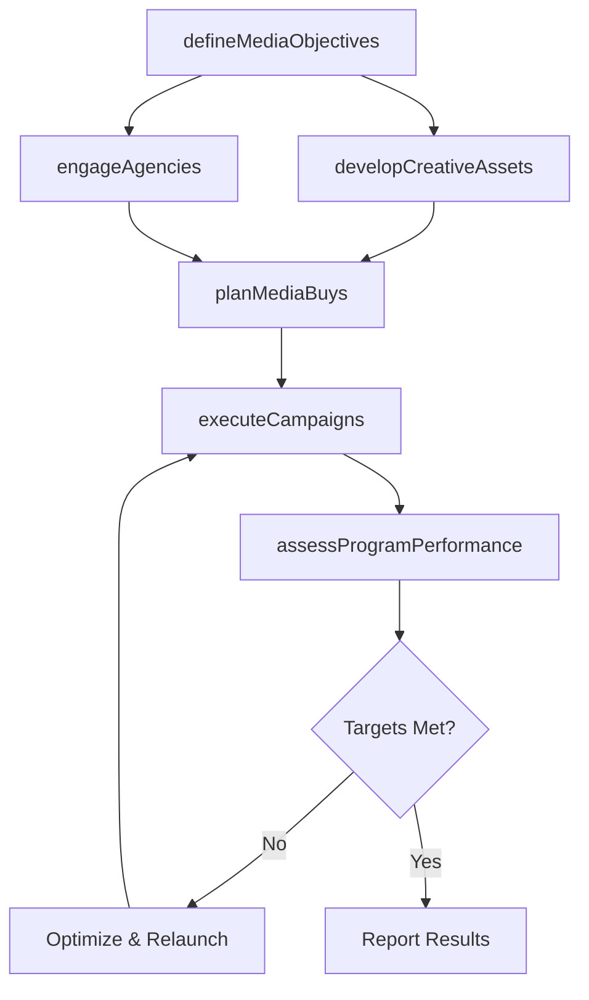

# Design and execute brand and product marketing programs

> Business-as-Code definition for brand and product marketing program execution. Models the complete lifecycle from defining advertising objectives and developing creative through media planning, campaign execution, performance assessment, and cross-program coordination.

## Overview

Designing, developing, and executing integrated brand and product marketing programs across all channels. Define advertising media objectives and strategy, develop creative assets and sales collateral, engage third-party agencies and media providers, align programs with consumer service strategy, project sales impact, plan media buys, and assess overall marketing plan performance.

## Process Hierarchy

```mermaid
graph TD
    A[Design and execute brand and product marketing programs]
    A --> B[Define advertising media objectives and strategy]
    A --> C[Develop advertising]
    A --> D[Design preliminary sales collateral, point-of-sale (POS) and promotion prototypes]
    A --> E[Engage third-party advertising agency]
    A --> F[Engage media provider]
    A --> G[Align marketing programs with consumer service strategy]
    A --> H[Develop product sales projection]
    A --> I[Plan preliminary media buys (print, television, radio)]
    A --> J[Develop and execute advertising]
    A --> K[Develop and execute other marketing campaigns/programs]
    A --> L[Assess brand/product marketing plan performance]
```

## GraphDL

```yaml
design:
  object: And Execute Brand And Product Marketing Programs
  actor: BrandMarketingManager
  result: MarketingProgramResults
```

## Actions

| Action | Description |
|--------|-------------|
| defineMediaObjectives | Set advertising media objectives, target audiences, and channel strategy |
| developCreativeAssets | Create advertising content, sales collateral, and POS prototypes |
| engageAgencies | Select and manage third-party advertising agencies and media providers |
| planMediaBuys | Plan and negotiate media placements across print, digital, and broadcast |
| executeCampaigns | Launch brand and product marketing campaigns across channels |
| assessProgramPerformance | Measure campaign effectiveness and marketing plan ROI |

## Events

| Event | Description |
|-------|-------------|
| mediaObjectivesDefined | Advertising media objectives and strategy approved |
| creativeAssetsDeveloped | Campaign creative and collateral produced and approved |
| agenciesEngaged | Third-party agencies and media providers contracted |
| mediaBuysPlanned | Media placement schedule finalized and purchased |
| campaignsExecuted | Marketing campaigns launched in market |
| programPerformanceAssessed | Campaign performance metrics analyzed and reported |

## Searches

| Search | Description |
|--------|-------------|
| getCampaignMetrics | Retrieve performance data for active and completed campaigns |
| getMediaPlan | Access media buy schedule and placement details by channel |
| getCreativeAssets | Query creative assets by campaign, product, or format |
| getAgencyPerformance | Retrieve agency performance metrics and contract details |
| getProgramROI | Calculate return on investment by marketing program |

## Process Flow



## RACI Matrix

| Activity | Responsible | Accountable | Consulted | Informed |
|----------|-------------|-------------|-----------|----------|
| defineMediaObjectives | BrandMarketingManager | CMO | Sales | Finance |
| developCreativeAssets | CreativeDirector | BrandMarketingManager | ProductMarketing | Legal |
| engageAgencies | MarketingProcurementManager | CMO | Finance | Legal |
| planMediaBuys | MediaPlanner | BrandMarketingManager | Finance | Sales |
| assessProgramPerformance | MarketingAnalyst | CMO | Finance | ExecutiveTeam |

## Sub-Processes

| ID | Name | Description |
|----|------|-------------|
| 3.3.3.1 | Define advertising media objectives and strategy | Creating a set of general objectives that the organization aims to achieve through the use of variou |
| 3.3.3.2 | Develop advertising | Creating advertising content and creative assets including copy, visuals, and multimedia materials aligned with brand positioning and campaign objectives. |
| 3.3.3.3 | Design preliminary sales collateral, point-of-sale (POS) and promotion prototypes | Designing draft sales materials, POS displays, and promotional prototypes for review and testing before full production and distribution. |
| 3.3.3.4 | Engage third-party advertising agency | Selecting, contracting, and managing external advertising agencies to supplement internal creative capabilities for campaign development and execution. |
| 3.3.3.5 | Engage media provider | Enrolling the services of certain media providers, who employ marketing channels that are appropriat |
| 3.3.3.6 | Align marketing programs with consumer service strategy | Ensuring marketing programs and campaigns are synchronized with consumer service goals, support touchpoints, and post-sale engagement strategies. |
| 3.3.3.7 | Develop product sales projection | Forecasting expected sales volumes and revenue for marketed products based on campaign reach, historical conversion data, and market conditions. |
| 3.3.3.8 | Plan preliminary media buys (print, television, radio) | Developing initial media purchase plans across print, broadcast, and digital channels, negotiating rates, and scheduling ad placements. |
| 3.3.3.9 | Develop and execute advertising | Developing and delivering advertising messages to the target audience, with the objective of influen |
| 3.3.3.10 | Develop and execute other marketing campaigns/programs | Designing and executing additional marketing campaigns, besides advertising, including undercover ma |
| 3.3.3.11 | Assess brand/product marketing plan performance | Examining the performance of all marketing efforts, across multiple parameters in order create an op |

## Related Processes

| Process | Relationship |
|---------|-------------|
| 3.2.3 Develop and manage brands | Upstream - brand strategy guides program design |
| 3.2.6 Develop marketing communication strategy | Upstream - communication strategy directs messaging |
| 3.3.2 Establish marketing budgets | Upstream - budget funds program execution |
| 3.3.5 Develop and manage promotional activities | Parallel - promotions complement brand programs |

## Related Departments

| Department | Role |
|-----------|------|
| Brand Marketing | Owns program design and execution strategy |
| Creative Services | Produces advertising content and campaign assets |
| Media Planning | Plans and negotiates media placements |
| Product Marketing | Ensures product messaging alignment |
| Sales | Provides market feedback and coordinates with demand generation |

## Related Occupations

| Occupation | Involvement |
|-----------|-------------|
| Brand Marketing Manager | Designs and orchestrates marketing programs |
| Creative Director | Leads creative development for campaigns |
| Media Planner | Plans and executes media buys across channels |
| Marketing Analyst | Measures program performance and ROI |

## KPIs

| KPI | Description | Unit |
|-----|-------------|------|
| Campaign Reach | Total audience reached across all campaign channels | Impressions |
| Campaign Conversion Rate | Percentage of audience taking desired action | % |
| Brand Awareness Lift | Increase in brand recognition from pre to post campaign | Percentage Points |
| Cost Per Acquisition | Average cost to acquire a customer through marketing programs | USD |
| Marketing Program ROI | Revenue generated relative to program investment | Ratio |

## Usage

```typescript
import { designAndExecuteBrandAndProductMarketingPrograms } from '@headlessly/design-and-execute-brand-and-product-marketing-programs'

const programs = designAndExecuteBrandAndProductMarketingPrograms()

// Define media objectives for a product launch
const objectives = await programs.defineMediaObjectives({
  campaign: 'platform-v3-launch',
  channels: ['digital', 'social', 'email', 'webinar'],
  targetReach: 500000,
  targetConversion: 0.03
})

// Assess program performance
const performance = await programs.assessProgramPerformance({
  campaignId: objectives.campaignId,
  metrics: ['reach', 'engagement', 'conversion', 'revenue']
})
```
