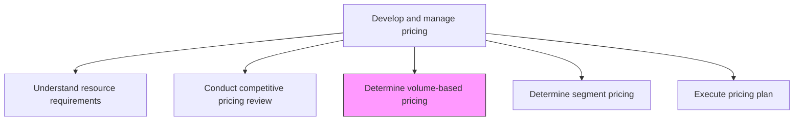
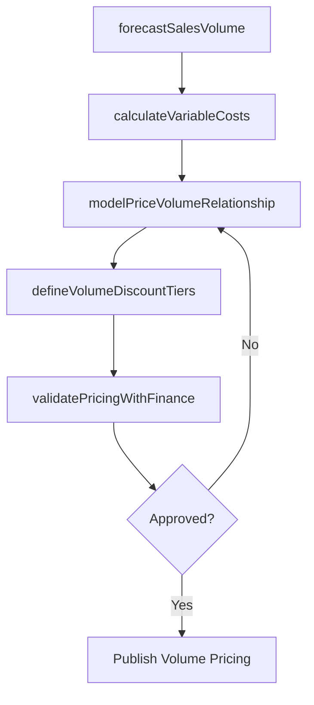

# Determine pricing based on volume/unit forecast

> Business-as-Code definition for volume-based pricing determination. Models the calculation of optimal price points using anticipated sales volumes, variable costs, and production economics.

## Overview

Establishing a dynamic pricing mechanism for the organization's offerings that is supported by the number of units in production. Outline a system for determining the optimum price point for each product/service. Based this model on an estimation of the volume of anticipated sales for each offering and variable costs.

## Process Hierarchy



## GraphDL

```yaml
determine:
  object: Pricing Based On Volume/unit Forecast
  actor: PricingAnalyst
  result: VolumePricingModel
```

## Actions

| Action | Description |
|--------|-------------|
| forecastSalesVolume | Project unit sales volumes by product, channel, and period based on demand signals |
| calculateVariableCosts | Compute per-unit variable costs at different production volume levels |
| modelPriceVolumeRelationship | Build pricing models that optimize margin contribution at forecasted volumes |
| defineVolumeDiscountTiers | Establish tiered pricing brackets that incentivize higher purchase quantities |
| validatePricingWithFinance | Cross-check volume-based pricing against margin targets and financial constraints |

## Events

| Event | Description |
|-------|-------------|
| salesVolumeForecasted | Unit sales projections by product and channel completed |
| variableCostsCalculated | Per-unit variable costs determined at target volume levels |
| priceVolumeModelBuilt | Pricing optimization model calibrated to forecasted volumes |
| volumeDiscountTiersDefined | Tiered volume pricing structure established |
| pricingValidatedWithFinance | Volume-based pricing approved against margin targets |

## Searches

| Search | Description |
|--------|-------------|
| getVolumeForecast | Retrieve sales volume projections by product, channel, or period |
| getVolumePricingModel | Query the current volume-to-price optimization model and parameters |
| getDiscountTiers | Look up volume discount tiers and their eligibility thresholds |
| getMarginAnalysis | Access margin contribution analysis at different volume levels |

## Process Flow



## RACI Matrix

| Activity | Responsible | Accountable | Consulted | Informed |
|----------|-------------|-------------|-----------|----------|
| forecastSalesVolume | DemandPlanner | PricingManager | Sales | SupplyChain |
| modelPriceVolumeRelationship | PricingAnalyst | PricingManager | Finance | ProductManagement |
| defineVolumeDiscountTiers | PricingManager | VP Marketing | Sales | ChannelPartners |
| validatePricingWithFinance | PricingAnalyst | CFO | Finance | ExecutiveTeam |

## Related Processes

| Process | Relationship |
|---------|-------------|
| 3.3.4.1 Understand resource requirements for each product/service | Upstream - resource costs inform variable cost calculations |
| 3.3.4.5 Determine customer segment specific pricing | Parallel - segment pricing may interact with volume tiers |
| 3.3.4.6 Execute pricing plan | Downstream - volume pricing feeds the pricing execution plan |

## Related Departments

| Department | Role |
|-----------|------|
| Pricing | Builds volume pricing models and defines discount tiers |
| Finance | Validates margin targets and financial viability |
| Demand Planning | Provides sales volume forecasts |
| Sales | Provides customer demand intelligence and feedback on pricing |

## Related Occupations

| Occupation | Involvement |
|-----------|-------------|
| Pricing Analyst | Builds volume-pricing models and calculates optimal price points |
| Demand Planner | Forecasts unit sales volumes by product and channel |
| Financial Analyst | Validates pricing against margin and profitability targets |

## KPIs

| KPI | Description | Unit |
|-----|-------------|------|
| Forecast Accuracy | Variance between forecasted and actual sales volumes | % |
| Volume Discount Uptake | Percentage of orders qualifying for volume discount tiers | % |
| Contribution Margin at Volume | Average margin contribution per unit at actual sales volumes | Currency |
| Price-Volume Elasticity | Measured sensitivity of demand to price changes | Coefficient |

## Usage

```typescript
import { determinePricingBasedOnVolumeUnitForecast } from '@headlessly/determine-pricing-based-on-volume-unit-forecast'

const volumePricing = determinePricingBasedOnVolumeUnitForecast()

// Model price-volume relationship for a product line
const model = await volumePricing.modelPriceVolumeRelationship({
  productLine: 'enterprise-platform',
  volumeScenarios: [1000, 5000, 10000, 25000],
  variableCostPerUnit: 45.00,
  targetMargin: 0.65
})

// Define volume discount tiers
const tiers = await volumePricing.defineVolumeDiscountTiers({
  productId: 'SKU-1001',
  tiers: [
    { minUnits: 1, discount: 0 },
    { minUnits: 100, discount: 0.10 },
    { minUnits: 500, discount: 0.18 },
    { minUnits: 1000, discount: 0.25 }
  ]
})
```
