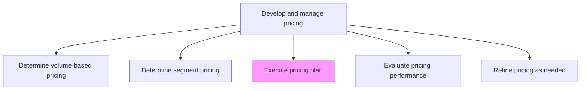
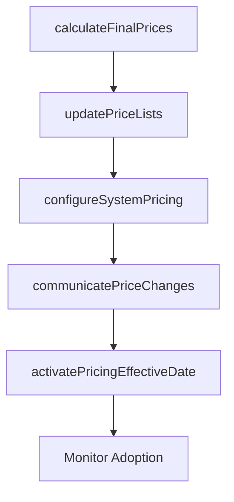

# Execute pricing plan

> Business-as-Code definition for pricing plan execution. Models the implementation of approved pricing across products, channels, and systems including price list updates, system configuration, and stakeholder communication.

## Overview

Implementing the pricing mechanism to determine prices for all individual offerings in the organizational portfolio. Calculate the prices of all offerings based on the established methodology and/or formulaic structure.

## Process Hierarchy



## GraphDL

```yaml
execute:
  object: Pricing Plan
  actor: PricingManager
  result: ImplementedPricingPlan
```

## Actions

| Action | Description |
|--------|-------------|
| calculateFinalPrices | Apply approved pricing methodology to determine prices for each product and SKU |
| updatePriceLists | Publish updated price lists across all sales channels and commerce systems |
| configureSystemPricing | Update ERP, CPQ, and e-commerce platforms with new pricing rules and tiers |
| communicatePriceChanges | Notify sales teams, channel partners, and customers of pricing updates |
| activatePricingEffectiveDate | Enable new pricing on the designated effective date across all channels |

## Events

| Event | Description |
|-------|-------------|
| finalPricesCalculated | Product and SKU-level prices computed from approved methodology |
| priceListsUpdated | Updated price lists published across sales channels |
| systemPricingConfigured | Pricing rules and tiers updated in ERP, CPQ, and e-commerce systems |
| priceChangesCommunicated | Sales teams, partners, and customers notified of pricing updates |
| pricingActivated | New pricing live across all channels on effective date |

## Searches

| Search | Description |
|--------|-------------|
| getCurrentPrices | Retrieve active prices by product, SKU, or channel |
| getPriceChangeHistory | Query price change history for a product or portfolio |
| getPricingRules | Look up active pricing rules, tiers, and discount structures |
| getPendingPriceChanges | Access scheduled but not yet activated price updates |

## Process Flow



## RACI Matrix

| Activity | Responsible | Accountable | Consulted | Informed |
|----------|-------------|-------------|-----------|----------|
| calculateFinalPrices | PricingAnalyst | PricingManager | Finance | ProductManagement |
| configureSystemPricing | ITSystems | PricingManager | E-Commerce | Sales |
| communicatePriceChanges | PricingManager | VP Marketing | Sales | ChannelPartners |
| activatePricingEffectiveDate | PricingManager | CMO | IT | Finance |

## Related Processes

| Process | Relationship |
|---------|-------------|
| 3.3.4.4 Determine pricing based on volume/unit forecast | Upstream - volume pricing models feed execution |
| 3.3.4.7 Evaluate pricing performance | Downstream - executed pricing generates performance data |
| 3.3.4.12 Communicate and implement price changes | Parallel - price communication is a component of execution |

## Related Departments

| Department | Role |
|-----------|------|
| Pricing | Calculates final prices and manages execution timeline |
| IT | Configures pricing in enterprise systems and commerce platforms |
| Sales | Receives updated pricing and communicates to customers |
| Finance | Validates implemented prices against approved plan |

## Related Occupations

| Occupation | Involvement |
|-----------|-------------|
| Pricing Manager | Leads pricing plan execution and coordinates stakeholders |
| Pricing Analyst | Calculates final product prices using approved methodology |
| Systems Administrator | Configures pricing rules in ERP and commerce platforms |

## KPIs

| KPI | Description | Unit |
|-----|-------------|------|
| Price Implementation Accuracy | Percentage of products with correctly implemented prices | % |
| System Update Cycle Time | Time to configure new pricing across all systems | Hours |
| Channel Adoption Rate | Percentage of channels reflecting new pricing by effective date | % |
| Price Communication Coverage | Percentage of affected stakeholders notified before activation | % |

## Usage

```typescript
import { executePricingPlan } from '@headlessly/execute-pricing-plan'

const pricing = executePricingPlan()

// Calculate final prices for the product portfolio
const prices = await pricing.calculateFinalPrices({
  methodology: 'cost-plus-competitive',
  productCatalog: 'full-portfolio',
  effectiveDate: '2026-04-01'
})

// Configure pricing in commerce systems
const systems = await pricing.configureSystemPricing({
  priceListId: prices.id,
  platforms: ['erp', 'cpq', 'shopify', 'salesforce'],
  activateOnDate: '2026-04-01'
})
```
