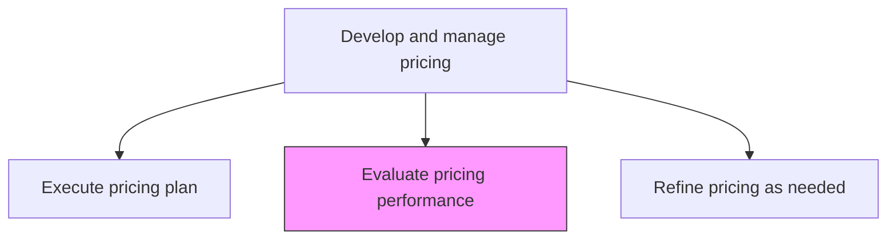
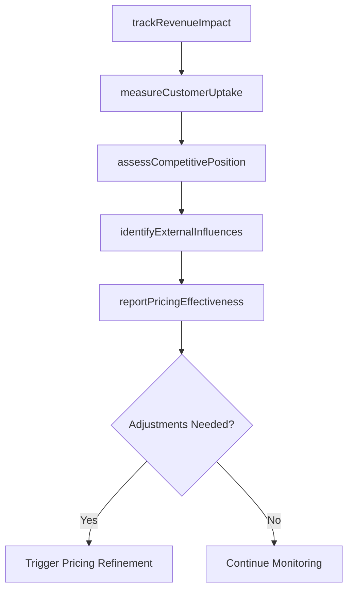

# Evaluate pricing performance

> Business-as-Code definition for pricing performance evaluation. Models the measurement and analysis of pricing effectiveness across revenue growth, margin contribution, customer uptake, and competitive positioning.

## Overview

Examining the efficiency of pricing with the objective of identifying any divergence from the equilibrium prices and avoiding any deadweight loss. Gauge the performance of the pricing plan by tracking growth in the revenue and/or customer uptake, secured as a result of new prices. Measure the performance of pricing by periodically checking the profits generated from the sale of each of the organization's offerings against the backdrop of any events that may have influenced the uptake of a certain good/service by the customer base.

## Process Hierarchy



## GraphDL

```yaml
evaluate:
  object: Pricing Performance
  actor: PricingAnalyst
  result: PricingPerformanceReport
```

## Actions

| Action | Description |
|--------|-------------|
| trackRevenueImpact | Monitor revenue growth and contribution margin changes attributable to pricing |
| measureCustomerUptake | Analyze changes in customer acquisition and purchase frequency tied to price levels |
| assessCompetitivePosition | Compare current pricing against competitor price movements and market benchmarks |
| identifyExternalInfluences | Catalog market events, regulatory changes, and demand shifts affecting pricing outcomes |
| reportPricingEffectiveness | Compile findings into a pricing performance report with actionable recommendations |

## Events

| Event | Description |
|-------|-------------|
| revenueImpactTracked | Revenue and margin impact of pricing analyzed |
| customerUptakeMeasured | Customer acquisition and purchase frequency data assessed |
| competitivePositionAssessed | Pricing compared against competitor and market benchmarks |
| externalInfluencesIdentified | Market events affecting pricing outcomes cataloged |
| pricingEffectivenessReported | Pricing performance report published with recommendations |

## Searches

| Search | Description |
|--------|-------------|
| getPricingPerformance | Retrieve pricing performance metrics by product, channel, or period |
| getRevenueByPricePoint | Query revenue contribution at different price levels |
| getCompetitorPricing | Look up competitor pricing data and trends |
| getPriceElasticity | Access measured price elasticity data by product or segment |

## Process Flow



## RACI Matrix

| Activity | Responsible | Accountable | Consulted | Informed |
|----------|-------------|-------------|-----------|----------|
| trackRevenueImpact | PricingAnalyst | PricingManager | Finance | Sales |
| assessCompetitivePosition | CompetitiveIntelligenceAnalyst | PricingManager | Marketing | ProductManagement |
| reportPricingEffectiveness | PricingManager | VP Marketing | CFO | ExecutiveTeam |

## Related Processes

| Process | Relationship |
|---------|-------------|
| 3.3.4.6 Execute pricing plan | Upstream - executed pricing generates the data being evaluated |
| 3.3.4.8 Refine pricing as needed | Downstream - evaluation findings drive pricing adjustments |
| 3.3.4.2 Conduct competitive pricing review | Parallel - competitive data supports performance assessment |

## Related Departments

| Department | Role |
|-----------|------|
| Pricing | Leads performance measurement and analysis |
| Finance | Validates revenue and margin calculations |
| Sales | Provides customer feedback on pricing effectiveness |
| Competitive Intelligence | Supplies competitor pricing benchmarks |

## Related Occupations

| Occupation | Involvement |
|-----------|-------------|
| Pricing Analyst | Tracks metrics and analyzes pricing effectiveness |
| Financial Analyst | Validates revenue and margin impact calculations |
| Competitive Intelligence Analyst | Provides market and competitor pricing context |

## KPIs

| KPI | Description | Unit |
|-----|-------------|------|
| Revenue Growth from Pricing | Incremental revenue attributable to pricing changes | Currency |
| Gross Margin Impact | Change in gross margin percentage after pricing updates | % |
| Win Rate at Price Point | Percentage of deals won at established price levels | % |
| Price Realization Rate | Actual transaction prices as a percentage of list price | % |

## Usage

```typescript
import { evaluatePricingPerformance } from '@headlessly/evaluate-pricing-performance'

const evaluation = evaluatePricingPerformance()

// Track revenue impact of recent pricing changes
const revenue = await evaluation.trackRevenueImpact({
  products: ['enterprise-platform', 'team-plan', 'starter-plan'],
  period: 'Q1-2026',
  comparisonBaseline: 'pre-change'
})

// Assess competitive pricing position
const competitive = await evaluation.assessCompetitivePosition({
  competitors: ['competitor-a', 'competitor-b', 'competitor-c'],
  metrics: ['price-index', 'value-positioning', 'discount-depth']
})
```
