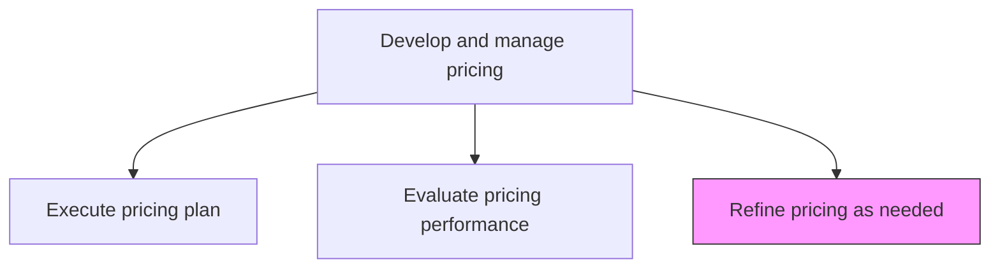
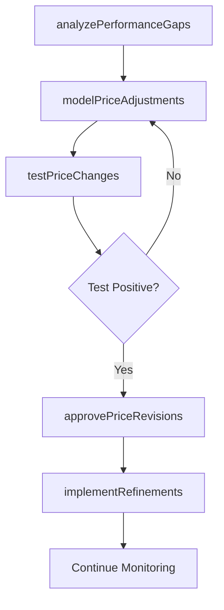

# Refine pricing as needed

> Business-as-Code definition for pricing refinement. Models the iterative adjustment of prices based on performance data, market conditions, and competitive dynamics to maximize profitability and customer uptake.

## Overview

Refining the pricing mechanism to create equitable prices for all products/services with the objective of maximizing the profits and/or customer uptake of these offerings. Reconcile the pricing mechanism in order to achieve equilibrium pricing. Adjust the prices for all of the organization's offerings, using the insights gleaned from examining how much profit or customer uptake is generated by the present pricing strategy.

## Process Hierarchy



## GraphDL

```yaml
refine:
  object: Pricing As Needed
  actor: PricingManager
  result: RefinedPricingPlan
```

## Actions

| Action | Description |
|--------|-------------|
| analyzePerformanceGaps | Review pricing evaluation findings to identify products with underperforming price points |
| modelPriceAdjustments | Simulate the revenue and margin impact of proposed price changes |
| testPriceChanges | Run controlled A/B tests or regional pilots to validate price adjustment hypotheses |
| approvePriceRevisions | Present recommended price changes to leadership for approval |
| implementRefinements | Deploy approved price adjustments across all channels and systems |

## Events

| Event | Description |
|-------|-------------|
| performanceGapsAnalyzed | Underperforming price points identified from evaluation data |
| priceAdjustmentsModeled | Revenue and margin impact of proposed changes simulated |
| priceChangesTested | Controlled price tests completed with measurable results |
| priceRevisionsApproved | Recommended price adjustments approved by leadership |
| refinementsImplemented | Approved price adjustments deployed across all channels |

## Searches

| Search | Description |
|--------|-------------|
| getPriceAdjustmentHistory | Retrieve history of price refinements by product or period |
| getTestResults | Query results from price change A/B tests or regional pilots |
| getPerformanceGaps | Look up products with pricing performance below targets |
| getApprovalQueue | Access pending price revision requests awaiting approval |

## Process Flow



## RACI Matrix

| Activity | Responsible | Accountable | Consulted | Informed |
|----------|-------------|-------------|-----------|----------|
| analyzePerformanceGaps | PricingAnalyst | PricingManager | Sales | Finance |
| modelPriceAdjustments | PricingAnalyst | PricingManager | DataScience | ProductManagement |
| approvePriceRevisions | PricingManager | CMO | CFO | ExecutiveTeam |
| implementRefinements | PricingManager | VP Marketing | IT | Sales |

## Related Processes

| Process | Relationship |
|---------|-------------|
| 3.3.4.7 Evaluate pricing performance | Upstream - performance evaluation identifies refinement needs |
| 3.3.4.6 Execute pricing plan | Downstream - refined prices are re-executed through the pricing plan |
| 3.3.4.12 Communicate and implement price changes | Downstream - refinements trigger price change communications |

## Related Departments

| Department | Role |
|-----------|------|
| Pricing | Leads analysis, modeling, and refinement recommendations |
| Finance | Validates financial impact of proposed price adjustments |
| Sales | Provides field-level feedback on pricing competitiveness |
| Data Science | Supports price sensitivity modeling and test design |

## Related Occupations

| Occupation | Involvement |
|-----------|-------------|
| Pricing Manager | Leads refinement strategy and approval process |
| Pricing Analyst | Models adjustments and analyzes test results |
| Data Scientist | Designs pricing experiments and sensitivity models |

## KPIs

| KPI | Description | Unit |
|-----|-------------|------|
| Refinement Impact | Revenue or margin improvement from pricing adjustments | Currency |
| Test-to-Implementation Rate | Percentage of price tests that result in full rollout | % |
| Refinement Cycle Time | Average time from gap identification to price adjustment deployment | Days |
| Price Stability Index | Frequency of price changes per product per year | Count |

## Usage

```typescript
import { refinePricingAsNeeded } from '@headlessly/refine-pricing-as-needed'

const refinement = refinePricingAsNeeded()

// Model price adjustments for underperforming products
const model = await refinement.modelPriceAdjustments({
  products: ['starter-plan', 'team-plan'],
  adjustmentRange: { min: -0.10, max: 0.15 },
  targetMetric: 'contribution-margin',
  constraints: ['maintain-competitive-parity']
})

// Test proposed price changes in a regional pilot
const test = await refinement.testPriceChanges({
  adjustments: model.recommendations,
  testRegion: 'north-america',
  controlRegion: 'europe',
  duration: 30,
  successMetric: 'revenue-per-user'
})
```
