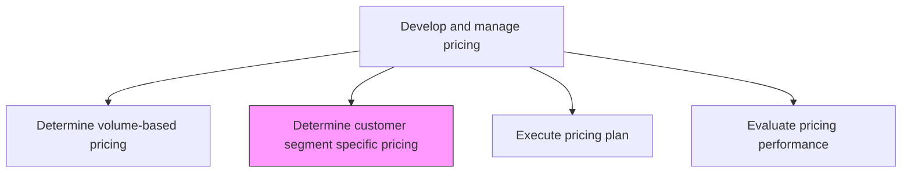
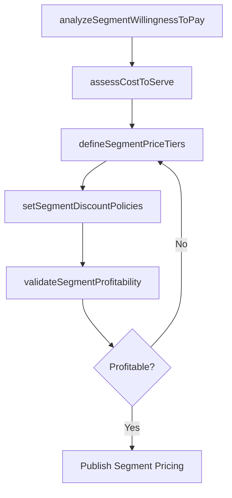

# Determine customer segment specific pricing

> Business-as-Code definition for segment-specific pricing determination. Models the differentiation of pricing by customer segment based on willingness to pay, value perception, competitive dynamics, and cost-to-serve.

## Overview

Establishing differentiated pricing for each customer segment based on factors such as willingness to pay, perceived value, competitive alternatives, cost-to-serve, and strategic importance. Define segment-specific price lists, discount structures, and bundling strategies that optimize revenue and market share within each target audience.

## Process Hierarchy



## GraphDL

```yaml
determine:
  object: Customer Segment Specific Pricing
  actor: PricingManager
  result: SegmentPricingStructure
```

## Actions

| Action | Description |
|--------|-------------|
| analyzeSegmentWillingnessToPay | Research and model each segment's price sensitivity and willingness to pay |
| assessCostToServe | Calculate the cost to serve each customer segment including support, onboarding, and delivery |
| defineSegmentPriceTiers | Establish differentiated price lists and packaging for each customer segment |
| setSegmentDiscountPolicies | Create segment-specific discount rules, approval thresholds, and bundling options |
| validateSegmentProfitability | Confirm that segment-level pricing meets margin and profitability targets |

## Events

| Event | Description |
|-------|-------------|
| segmentWillignessAnalyzed | Price sensitivity and willingness-to-pay models completed per segment |
| costToServeAssessed | Per-segment cost-to-serve calculations finalized |
| segmentPriceTiersDefined | Differentiated pricing tiers published for each customer segment |
| segmentDiscountPoliciesSet | Segment-specific discount rules and approval thresholds established |
| segmentProfitabilityValidated | Margin and profitability targets confirmed for segment pricing |

## Searches

| Search | Description |
|--------|-------------|
| getSegmentPricing | Retrieve pricing tiers and structures by customer segment |
| getSegmentDiscountRules | Query discount policies and approval thresholds for a segment |
| getSegmentProfitability | Look up revenue and margin data by customer segment |
| getWillingnessToPay | Access price sensitivity research data by segment |

## Process Flow



## RACI Matrix

| Activity | Responsible | Accountable | Consulted | Informed |
|----------|-------------|-------------|-----------|----------|
| analyzeSegmentWillingnessToPay | PricingAnalyst | PricingManager | MarketResearch | Sales |
| assessCostToServe | FinancialAnalyst | PricingManager | Operations | CustomerSuccess |
| defineSegmentPriceTiers | PricingManager | VP Marketing | ProductManagement | Sales |
| validateSegmentProfitability | PricingManager | CFO | Finance | ExecutiveTeam |

## Related Processes

| Process | Relationship |
|---------|-------------|
| 3.3.4.4 Determine pricing based on volume/unit forecast | Parallel - volume pricing may interact with segment pricing tiers |
| 3.3.4.6 Execute pricing plan | Downstream - segment pricing feeds the overall pricing execution |
| 3.1.2 Determine market segments | Upstream - market segmentation defines the segments to price |

## Related Departments

| Department | Role |
|-----------|------|
| Pricing | Leads segment pricing analysis and tier definition |
| Market Research | Provides willingness-to-pay and price sensitivity data |
| Finance | Validates cost-to-serve and profitability calculations |
| Sales | Provides field feedback on segment-level pricing competitiveness |

## Related Occupations

| Occupation | Involvement |
|-----------|-------------|
| Pricing Manager | Defines segment pricing tiers and discount policies |
| Pricing Analyst | Conducts willingness-to-pay analysis and cost modeling |
| Market Research Analyst | Provides customer research for pricing decisions |

## KPIs

| KPI | Description | Unit |
|-----|-------------|------|
| Segment Revenue Contribution | Revenue generated per customer segment | Currency |
| Segment Margin | Gross margin percentage achieved in each customer segment | % |
| Price Differentiation Index | Degree of price variation across segments for comparable products | Ratio |
| Segment Win Rate | Deal win rate at segment-specific price points | % |

## Usage

```typescript
import { determineCustomerSegmentSpecificPricing } from '@headlessly/determine-customer-segment-specific-pricing'

const segmentPricing = determineCustomerSegmentSpecificPricing()

// Analyze willingness to pay by customer segment
const wtp = await segmentPricing.analyzeSegmentWillingnessToPay({
  segments: ['enterprise', 'mid-market', 'smb', 'startup'],
  products: ['platform-pro', 'platform-team', 'platform-starter'],
  methodology: 'van-westendorp'
})

// Define segment-specific price tiers
const tiers = await segmentPricing.defineSegmentPriceTiers({
  segment: 'enterprise',
  tiers: [
    { name: 'standard', price: 499, features: ['core'] },
    { name: 'professional', price: 999, features: ['core', 'advanced'] },
    { name: 'enterprise', price: 'custom', features: ['core', 'advanced', 'premium'] }
  ]
})
```
