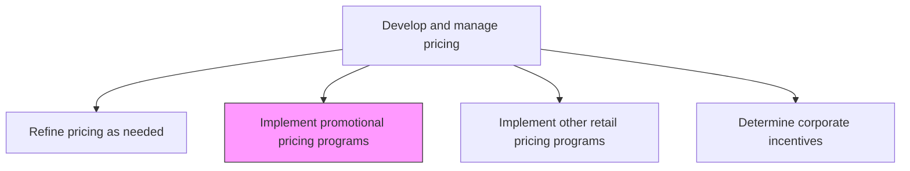
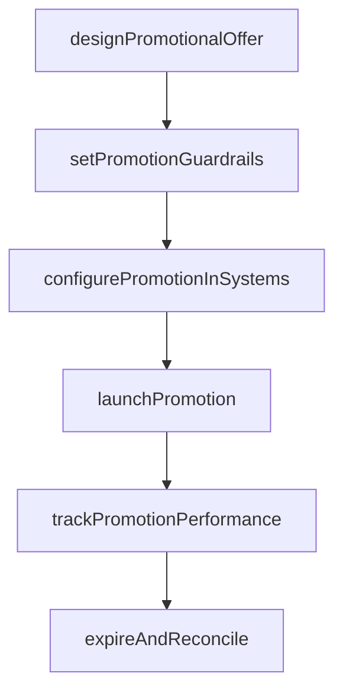

# Implement promotional pricing programs

> Business-as-Code definition for promotional pricing program implementation. Models the design, execution, and management of time-limited price reductions and incentive offers to drive product launches, seasonal sales, and customer acquisition.

## Overview

Managing schemes that offer lower pricing for a limited time as a promotional and sales incentive when launching a new product or a service.

## Process Hierarchy



## GraphDL

```yaml
implement:
  object: Promotional Pricing Programs
  actor: PricingManager
  result: ActivePromotionalPricingProgram
```

## Actions

| Action | Description |
|--------|-------------|
| designPromotionalOffer | Define the discount type, amount, eligibility criteria, and duration of the promotional price |
| setPromotionGuardrails | Establish margin floors, stacking rules, and channel restrictions for promotional pricing |
| configurePromotionInSystems | Update commerce, POS, and CPQ systems with promotional pricing rules and effective dates |
| launchPromotion | Activate the promotional pricing across designated channels and communicate to sales teams |
| trackPromotionPerformance | Monitor redemption rates, revenue impact, and margin erosion during the promotion period |
| expireAndReconcile | Deactivate promotional pricing at end date and reconcile financial impact |

## Events

| Event | Description |
|-------|-------------|
| promotionalOfferDesigned | Promotional pricing terms, eligibility, and duration defined |
| promotionGuardrailsSet | Margin floors, stacking rules, and channel restrictions established |
| promotionConfigured | Promotional pricing rules loaded into commerce and POS systems |
| promotionLaunched | Promotional pricing activated and communicated to stakeholders |
| promotionPerformanceTracked | Redemption and revenue data collected during promotion |
| promotionExpiredAndReconciled | Promotion deactivated and financial impact reconciled |

## Searches

| Search | Description |
|--------|-------------|
| getActivePromotions | Retrieve currently active promotional pricing programs |
| getPromotionPerformance | Query redemption rates, revenue, and margin data for a promotion |
| getPromotionHistory | Look up past promotional pricing programs and their outcomes |
| getPromotionEligibility | Check whether a product or customer qualifies for active promotions |

## Process Flow



## RACI Matrix

| Activity | Responsible | Accountable | Consulted | Informed |
|----------|-------------|-------------|-----------|----------|
| designPromotionalOffer | PricingManager | VP Marketing | ProductMarketing | Sales |
| setPromotionGuardrails | PricingManager | CFO | Finance | Legal |
| launchPromotion | CampaignManager | PricingManager | DigitalMarketing | ChannelPartners |
| trackPromotionPerformance | PricingAnalyst | PricingManager | Finance | Sales |

## Related Processes

| Process | Relationship |
|---------|-------------|
| 3.3.5 Develop and manage promotional activities | Parallel - promotional pricing coordinates with broader promotional campaigns |
| 3.3.4.6 Execute pricing plan | Upstream - promotional pricing operates within the overall pricing framework |
| 3.3.6 Manage trade pricing, promotions and allowances | Parallel - trade promotions may include promotional pricing components |

## Related Departments

| Department | Role |
|-----------|------|
| Pricing | Designs promotional offers and sets guardrails |
| Marketing | Coordinates promotional campaigns with pricing programs |
| Finance | Validates margin impact and reconciles promotion costs |
| IT | Configures promotional pricing in commerce and POS systems |

## Related Occupations

| Occupation | Involvement |
|-----------|-------------|
| Pricing Manager | Designs promotional pricing programs and sets parameters |
| Campaign Manager | Coordinates promotion launch with marketing campaigns |
| Pricing Analyst | Tracks promotion performance and reconciles financial impact |

## KPIs

| KPI | Description | Unit |
|-----|-------------|------|
| Promotion Redemption Rate | Percentage of eligible customers who redeem the promotional offer | % |
| Incremental Revenue from Promotion | Additional revenue attributable to the promotional pricing | Currency |
| Margin Erosion | Gross margin reduction during the promotional period | % |
| Post-Promotion Retention | Percentage of promotional customers who continue purchasing at regular price | % |

## Usage

```typescript
import { implementPromotionalPricingPrograms } from '@headlessly/implement-promotional-pricing-programs'

const promo = implementPromotionalPricingPrograms()

// Design a product launch promotional offer
const offer = await promo.designPromotionalOffer({
  products: ['new-platform-v3'],
  discountType: 'percentage',
  discountAmount: 0.20,
  duration: { start: '2026-03-01', end: '2026-03-31' },
  eligibility: 'new-customers-only'
})

// Track promotion performance during the campaign
const performance = await promo.trackPromotionPerformance({
  promotionId: offer.id,
  metrics: ['redemption-rate', 'revenue-uplift', 'margin-impact', 'new-customers']
})
```
