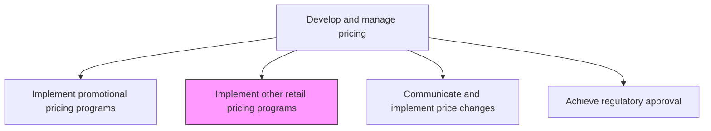
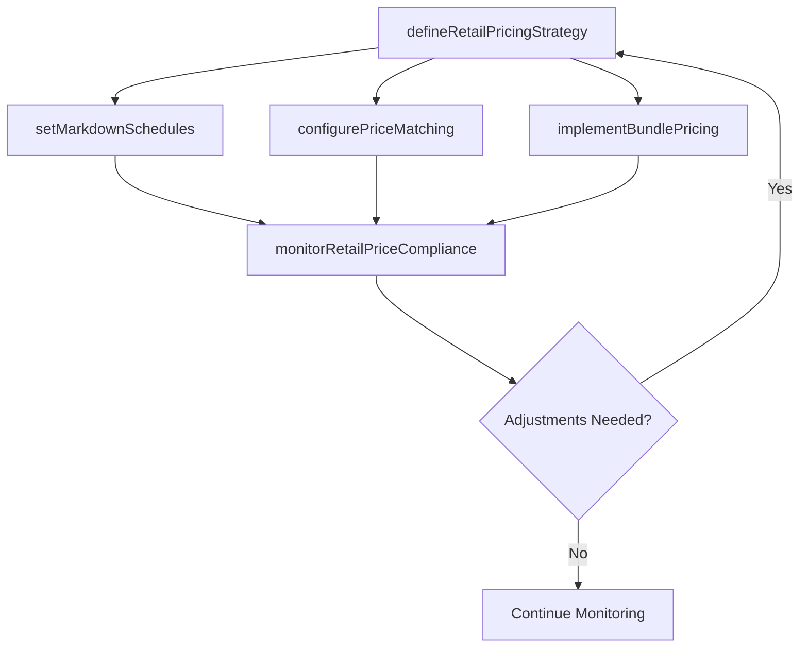

# Implement other retail pricing programs

> Business-as-Code definition for retail pricing program implementation. Models the management of everyday pricing, markdown strategies, competitive matching, and other point-of-sale pricing programs beyond promotional offers.

## Overview

Determining the optimum consumer pricing for each product or service at the point of sale, based on production and distribution costs and estimated sales volume.

## Process Hierarchy



## GraphDL

```yaml
implement:
  object: Other Retail Pricing Programs
  actor: RetailPricingManager
  result: ActiveRetailPricingProgram
```

## Actions

| Action | Description |
|--------|-------------|
| defineRetailPricingStrategy | Establish everyday low price, competitive matching, or dynamic pricing approaches for retail channels |
| setMarkdownSchedules | Define planned markdown cadences and clearance pricing for aging inventory |
| configurePriceMatching | Establish competitor price-match policies, thresholds, and verification procedures |
| implementBundlePricing | Create multi-product bundle prices and cross-sell incentive structures |
| monitorRetailPriceCompliance | Track retail partner adherence to minimum advertised price and pricing agreements |

## Events

| Event | Description |
|-------|-------------|
| retailPricingStrategyDefined | Retail pricing approach and rules established |
| markdownSchedulesSet | Planned markdown cadences and clearance pricing defined |
| priceMatchingConfigured | Competitor price-match policies and procedures activated |
| bundlePricingImplemented | Multi-product bundle pricing structures deployed |
| retailPriceComplianceMonitored | Retail partner pricing compliance assessed |

## Searches

| Search | Description |
|--------|-------------|
| getRetailPricingPrograms | Retrieve active retail pricing programs by type or channel |
| getMarkdownSchedule | Query planned markdowns by product or category |
| getPriceMatchRequests | Look up pending and processed price-match requests |
| getRetailComplianceReport | Access retail partner pricing compliance data |

## Process Flow



## RACI Matrix

| Activity | Responsible | Accountable | Consulted | Informed |
|----------|-------------|-------------|-----------|----------|
| defineRetailPricingStrategy | RetailPricingManager | PricingManager | Sales | Merchandising |
| setMarkdownSchedules | RetailPricingManager | VP Marketing | Finance | InventoryManagement |
| monitorRetailPriceCompliance | PricingAnalyst | RetailPricingManager | Legal | ChannelPartners |

## Related Processes

| Process | Relationship |
|---------|-------------|
| 3.3.4.9 Implement promotional pricing programs | Parallel - promotional and retail pricing programs coordinate |
| 3.3.4.6 Execute pricing plan | Upstream - retail pricing operates within the overall pricing framework |
| 3.3.4.11 Communicate and implement price changes | Downstream - retail pricing changes flow through communication channels |

## Related Departments

| Department | Role |
|-----------|------|
| Pricing | Designs retail pricing strategies and markdown schedules |
| Merchandising | Validates pricing against inventory levels and sell-through targets |
| Retail Operations | Implements pricing at point of sale |
| Finance | Monitors margin impact of retail pricing programs |

## Related Occupations

| Occupation | Involvement |
|-----------|-------------|
| Retail Pricing Manager | Leads retail pricing program design and implementation |
| Merchandise Planner | Coordinates pricing with inventory and assortment plans |
| Pricing Analyst | Analyzes retail pricing performance and compliance |

## KPIs

| KPI | Description | Unit |
|-----|-------------|------|
| Sell-Through Rate | Percentage of inventory sold at planned retail price versus markdown | % |
| Markdown Rate | Average discount depth across markdown pricing events | % |
| Price Match Volume | Number of price-match requests processed per period | Count |
| Retail Price Compliance | Percentage of retail partners pricing within agreed guidelines | % |

## Usage

```typescript
import { implementOtherRetailPricingPrograms } from '@headlessly/implement-other-retail-pricing-programs'

const retailPricing = implementOtherRetailPricingPrograms()

// Set markdown schedule for seasonal inventory
const markdowns = await retailPricing.setMarkdownSchedules({
  category: 'seasonal-apparel',
  schedule: [
    { weeksAfterLaunch: 8, discount: 0.20 },
    { weeksAfterLaunch: 12, discount: 0.40 },
    { weeksAfterLaunch: 16, discount: 0.60 }
  ]
})

// Implement bundle pricing for complementary products
const bundle = await retailPricing.implementBundlePricing({
  products: ['SKU-1001', 'SKU-1002', 'SKU-1003'],
  bundlePrice: 149.99,
  individualTotal: 179.97,
  channels: ['e-commerce', 'retail-stores']
})
```
