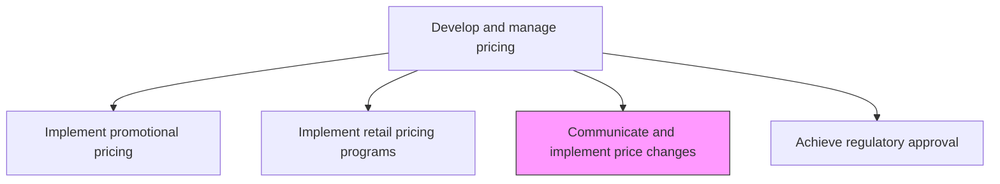
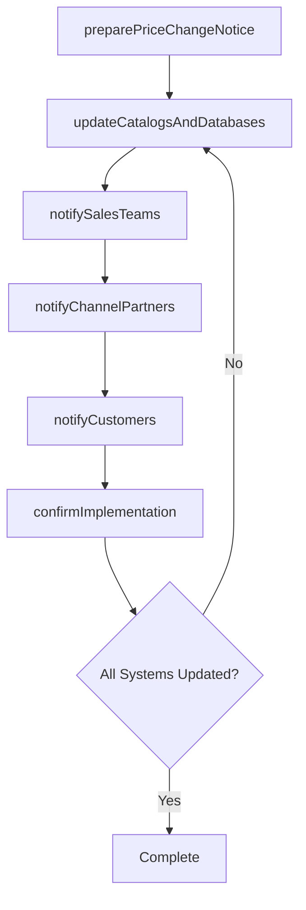

# Communicate and implement price changes

> Business-as-Code definition for price change communication and implementation. Models the end-to-end process of updating prices in catalogs and systems, then disseminating changes to all stakeholders across distribution and marketing channels.

## Overview

Assigning new prices or pricing adjustments to products or services to replace the original base prices. Update the prices in product catalogs and databases, and disseminate the information through all involved distribution and marketing channels.

## Process Hierarchy



## GraphDL

```yaml
communicate:
  object: And Implement Price Changes
  actor: PricingManager
  result: ImplementedPriceChange
```

## Actions

| Action | Description |
|--------|-------------|
| preparePriceChangeNotice | Draft communications detailing price changes, effective dates, and rationale |
| updateCatalogsAndDatabases | Apply new prices to product catalogs, price lists, and master data systems |
| notifySalesTeams | Brief internal sales teams on price changes, talk tracks, and customer impact |
| notifyChannelPartners | Communicate price updates to distributors, resellers, and marketplace partners |
| notifyCustomers | Inform affected customers of price changes with appropriate lead time |
| confirmImplementation | Verify prices are correctly updated across all channels and systems |

## Events

| Event | Description |
|-------|-------------|
| priceChangeNoticePrepared | Price change communications drafted and approved |
| catalogsAndDatabasesUpdated | New prices applied to all product catalogs and data systems |
| salesTeamsNotified | Internal sales teams briefed on price changes |
| channelPartnersNotified | Distributors and resellers informed of price updates |
| customersNotified | Affected customers communicated about price changes |
| implementationConfirmed | Price update verified across all channels and systems |

## Searches

| Search | Description |
|--------|-------------|
| getPriceChangeNotices | Retrieve price change communications by product or effective date |
| getPendingImplementations | Query price changes approved but not yet implemented |
| getImplementationStatus | Check the implementation status of a price change across channels |
| getStakeholderNotifications | Look up notification delivery status by stakeholder group |

## Process Flow



## RACI Matrix

| Activity | Responsible | Accountable | Consulted | Informed |
|----------|-------------|-------------|-----------|----------|
| preparePriceChangeNotice | PricingManager | VP Marketing | Legal | MarketingComms |
| updateCatalogsAndDatabases | ITSystems | PricingManager | E-Commerce | Finance |
| notifyChannelPartners | ChannelManager | PricingManager | Sales | Legal |
| confirmImplementation | PricingAnalyst | PricingManager | IT | Finance |

## Related Processes

| Process | Relationship |
|---------|-------------|
| 3.3.4.6 Execute pricing plan | Upstream - pricing execution triggers change communications |
| 3.3.4.8 Refine pricing as needed | Upstream - pricing refinements generate change notifications |
| 3.2.6 Develop marketing communication strategy | Upstream - communication guidelines govern pricing announcements |

## Related Departments

| Department | Role |
|-----------|------|
| Pricing | Leads price change communication and implementation |
| IT | Updates pricing in enterprise systems and commerce platforms |
| Sales | Receives briefings and communicates changes to customers |
| Channel Management | Notifies and supports distribution partners |

## Related Occupations

| Occupation | Involvement |
|-----------|-------------|
| Pricing Manager | Orchestrates price change communication and implementation |
| Channel Manager | Communicates pricing updates to distribution partners |
| Systems Administrator | Implements pricing updates in enterprise systems |

## KPIs

| KPI | Description | Unit |
|-----|-------------|------|
| Implementation Lead Time | Days between price change approval and full implementation | Days |
| Stakeholder Notification Rate | Percentage of affected stakeholders notified before effective date | % |
| System Accuracy Rate | Percentage of systems reflecting correct new prices at effective date | % |
| Customer Complaint Rate | Number of pricing complaints per 1,000 price changes | Count |

## Usage

```typescript
import { communicateAndImplementPriceChanges } from '@headlessly/communicate-and-implement-price-changes'

const priceChange = communicateAndImplementPriceChanges()

// Prepare price change notice for a product line adjustment
const notice = await priceChange.preparePriceChangeNotice({
  products: ['platform-pro', 'platform-team'],
  changeType: 'price-increase',
  percentageChange: 0.08,
  effectiveDate: '2026-04-01',
  rationale: 'annual-cost-adjustment'
})

// Update catalogs and notify stakeholders
const implementation = await priceChange.updateCatalogsAndDatabases({
  noticeId: notice.id,
  systems: ['erp', 'e-commerce', 'cpq', 'price-list-portal'],
  notifyStakeholders: ['sales', 'channel-partners', 'customers']
})
```
