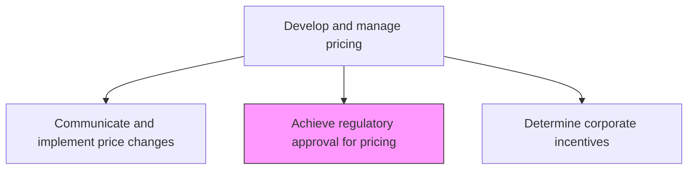
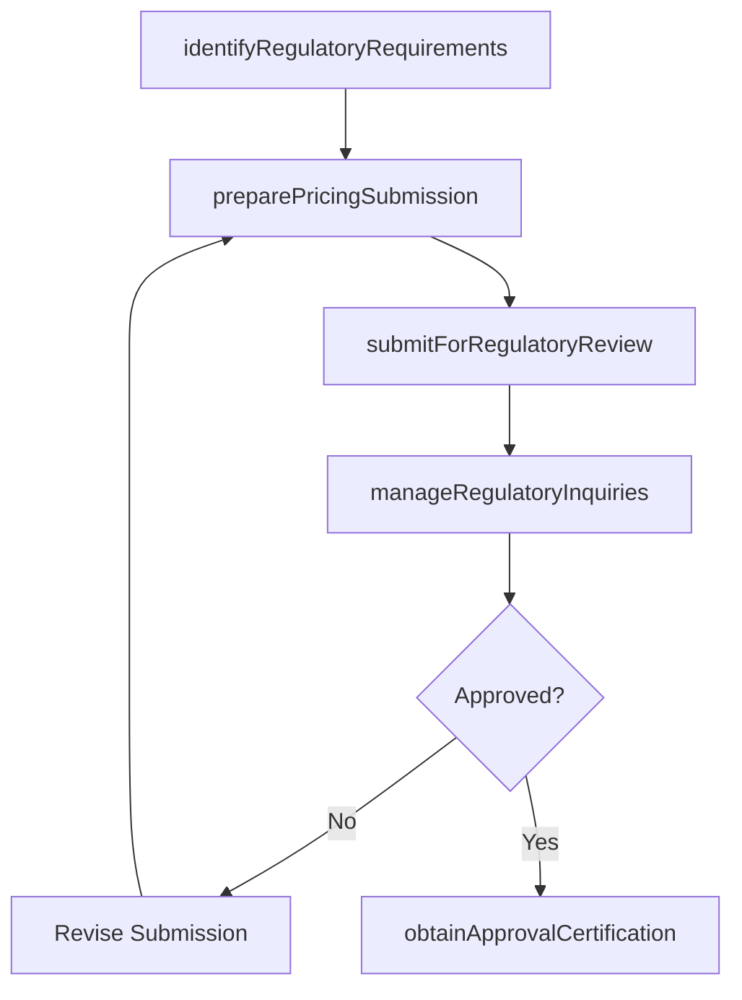

# Achieve regulatory approval for pricing

> Business-as-Code definition for pricing regulatory approval. Models the process of securing internal governance sign-off and governmental approvals required for licensed, regulated, or reimbursable products and services.

## Overview

Obtaining internal price approvals and governmental approvals that are required for licensed products and for products that can be reimbursed by the government.

## Process Hierarchy



## GraphDL

```yaml
achieve:
  object: Regulatory Approval For Pricing
  actor: RegulatoryAffairsManager
  result: PricingApprovalCertification
```

## Actions

| Action | Description |
|--------|-------------|
| identifyRegulatoryRequirements | Determine which products require governmental or licensing pricing approvals |
| preparePricingSubmission | Compile cost justifications, market analyses, and supporting documentation for regulators |
| submitForRegulatoryReview | File pricing submissions with relevant governmental or licensing authorities |
| manageRegulatoryInquiries | Respond to regulator questions, provide supplemental data, and negotiate terms |
| obtainApprovalCertification | Receive formal pricing approval and document compliance certification |

## Events

| Event | Description |
|-------|-------------|
| regulatoryRequirementsIdentified | Products requiring pricing approvals cataloged |
| pricingSubmissionPrepared | Documentation and justification package compiled |
| submissionFiled | Pricing submission sent to regulatory authority |
| regulatoryInquiriesManaged | Regulator questions addressed and supplemental data provided |
| approvalCertificationObtained | Formal pricing approval received and documented |

## Searches

| Search | Description |
|--------|-------------|
| getRegulatoryRequirements | Retrieve pricing regulatory requirements by product or jurisdiction |
| getSubmissionStatus | Query the status of pending pricing submissions |
| getApprovalHistory | Look up pricing approvals obtained by product or period |
| getComplianceCertifications | Access current pricing compliance certifications |

## Process Flow



## RACI Matrix

| Activity | Responsible | Accountable | Consulted | Informed |
|----------|-------------|-------------|-----------|----------|
| identifyRegulatoryRequirements | RegulatoryAffairsManager | PricingManager | Legal | ProductManagement |
| preparePricingSubmission | RegulatoryAffairsAnalyst | RegulatoryAffairsManager | Finance | PricingAnalyst |
| manageRegulatoryInquiries | RegulatoryAffairsManager | VP Legal | PricingManager | ExecutiveTeam |

## Related Processes

| Process | Relationship |
|---------|-------------|
| 3.3.4.6 Execute pricing plan | Upstream - pricing execution may require regulatory approval before activation |
| 3.3.4.11 Communicate and implement price changes | Downstream - approved pricing flows to implementation |
| 3.2.2.4 Approve pricing strategies, policies, and targets | Upstream - internal pricing approval precedes regulatory submission |

## Related Departments

| Department | Role |
|-----------|------|
| Regulatory Affairs | Leads pricing submission and regulatory engagement |
| Legal | Provides legal guidance and reviews regulatory submissions |
| Pricing | Supplies cost justifications and pricing methodologies |
| Finance | Validates financial data supporting pricing submissions |

## Related Occupations

| Occupation | Involvement |
|-----------|-------------|
| Regulatory Affairs Manager | Leads the pricing approval process with governmental authorities |
| Regulatory Affairs Analyst | Prepares submission documentation and manages inquiries |
| Pricing Manager | Provides pricing methodology and cost justification data |

## KPIs

| KPI | Description | Unit |
|-----|-------------|------|
| Approval Cycle Time | Average time from submission to regulatory approval | Days |
| First-Submission Approval Rate | Percentage of pricing submissions approved without revision | % |
| Compliance Coverage | Percentage of regulated products with current pricing approvals | % |
| Regulatory Inquiry Response Time | Average time to respond to regulator inquiries | Days |

## Usage

```typescript
import { achieveRegulatoryApprovalForPricing } from '@headlessly/achieve-regulatory-approval-for-pricing'

const regulatory = achieveRegulatoryApprovalForPricing()

// Prepare pricing submission for a regulated product
const submission = await regulatory.preparePricingSubmission({
  productId: 'MED-DEVICE-001',
  jurisdiction: 'FDA',
  proposedPrice: 1250.00,
  costJustification: 'full-cost-analysis',
  supportingDocuments: ['cost-model', 'market-comparison', 'clinical-data']
})

// Submit for regulatory review
const review = await regulatory.submitForRegulatoryReview({
  submissionId: submission.id,
  authority: 'CMS',
  requestedEffectiveDate: '2026-07-01'
})
```
