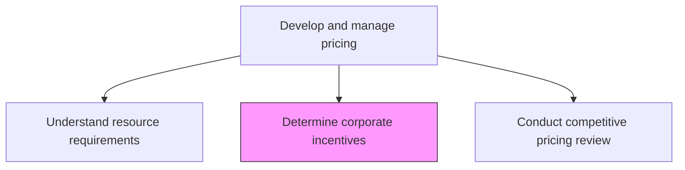
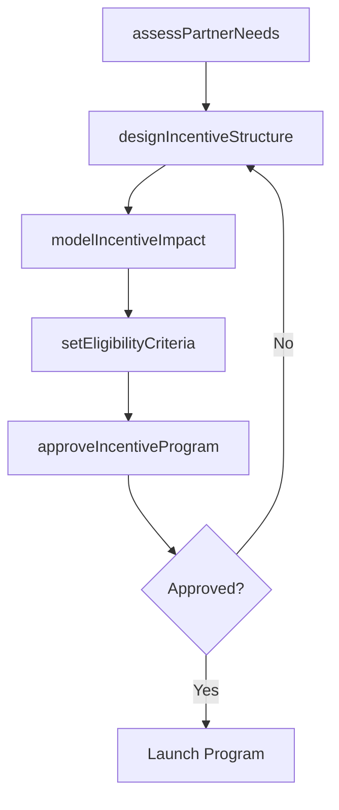

# Determine corporate incentives

> Business-as-Code definition for corporate incentive planning. Models the design of financial inducements for distributors, resellers, and vendors to prioritize the organization's products.

## Overview

Introducing financial inducements, such as discounts, to distributors, resellers or vendors as a motivation to prioritize selling company's products or services over those of its competitors.

## Process Hierarchy



## GraphDL

```yaml
determine:
  object: Corporate Incentives
  actor: ChannelPricingManager
  result: CorporateIncentivePlan
```

## Actions

| Action | Description |
|--------|-------------|
| assessPartnerNeeds | Evaluate what financial motivations distributors and resellers need to prioritize the product |
| designIncentiveStructure | Create discount tiers, volume rebates, and performance bonuses for channel partners |
| modelIncentiveImpact | Calculate the financial impact of proposed incentives on margins and revenue |
| setEligibilityCriteria | Define qualifications and thresholds for receiving corporate incentives |
| approveIncentiveProgram | Obtain executive approval for the incentive program budget and structure |

## Events

| Event | Description |
|-------|-------------|
| partnerNeedsAssessed | Channel partner incentive needs evaluated |
| incentiveStructureDesigned | Discount tiers and rebate programs designed |
| incentiveImpactModeled | Financial impact analysis of incentives completed |
| eligibilityCriteriaSet | Partner qualification rules for incentives published |
| incentiveProgramApproved | Corporate incentive program approved and activated |

## Searches

| Search | Description |
|--------|-------------|
| getIncentivePrograms | Retrieve active corporate incentive programs by partner type |
| getPartnerIncentives | Query specific incentive details for a partner |
| getIncentiveROI | Access return on investment data for incentive programs |

## Process Flow



## RACI Matrix

| Activity | Responsible | Accountable | Consulted | Informed |
|----------|-------------|-------------|-----------|----------|
| assessPartnerNeeds | ChannelPricingManager | VP Sales | PartnerManagers | Finance |
| designIncentiveStructure | ChannelPricingManager | PricingManager | Finance | Legal |
| modelIncentiveImpact | PricingAnalyst | PricingManager | Finance | CMO |
| approveIncentiveProgram | PricingManager | CMO | CFO | ExecutiveTeam |

## Related Processes

| Process | Relationship |
|---------|-------------|
| 3.3.4.4 Determine pricing based on volume/unit forecast | Parallel - incentives and volume pricing work together |
| 3.3.6 Manage trade pricing, promotions and allowances | Downstream - incentives feed trade promotion management |
| 3.2.4 Define and manage channel strategy | Upstream - channel strategy shapes incentive design |

## Related Departments

| Department | Role |
|-----------|------|
| Pricing | Leads incentive design and financial modeling |
| Channel Management | Provides partner needs and manages relationships |
| Finance | Validates financial impact and budget allocation |
| Legal | Reviews incentive terms and compliance |

## Related Occupations

| Occupation | Involvement |
|-----------|-------------|
| Channel Pricing Manager | Designs and manages corporate incentive programs |
| Pricing Analyst | Models financial impact of incentive structures |
| Partner Manager | Communicates incentive programs to channel partners |

## KPIs

| KPI | Description | Unit |
|-----|-------------|------|
| Incentive Program ROI | Revenue increase attributable to incentive programs versus cost | Ratio |
| Partner Participation Rate | Percentage of eligible partners actively engaged with incentives | % |
| Sell-Through Lift | Increase in partner sell-through rates after incentive launch | % |
| Incentive Cost as Revenue Percentage | Total incentive payouts as percentage of channel revenue | % |

## Usage

```typescript
import { determineCorporateIncentives } from '@headlessly/determine-corporate-incentives'

const incentives = determineCorporateIncentives()

// Design incentive structure for channel partners
const structure = await incentives.designIncentiveStructure({
  partnerTypes: ['distributor', 'reseller', 'var'],
  incentiveTypes: ['volume-rebate', 'early-payment-discount', 'performance-bonus'],
  budgetCap: 2000000
})

// Model financial impact of proposed incentives
const impact = await incentives.modelIncentiveImpact({
  programId: structure.id,
  scenarios: ['conservative', 'expected', 'optimistic'],
  metrics: ['margin-impact', 'revenue-lift', 'partner-retention']
})
```
