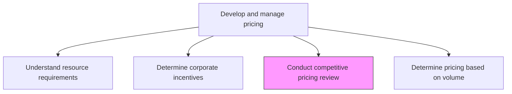
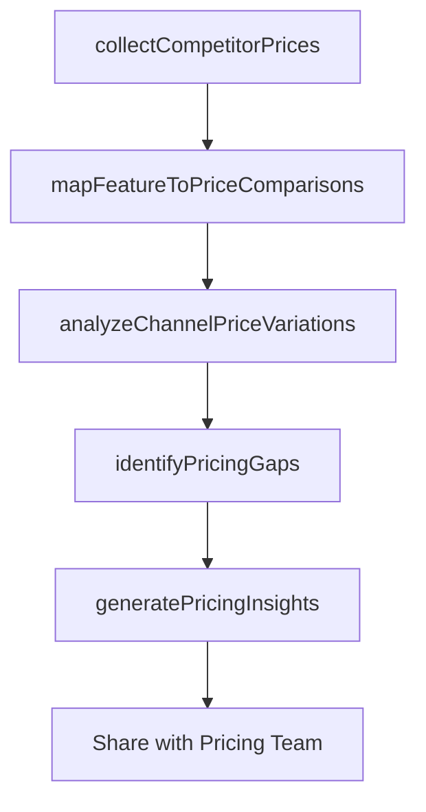

# Conduct competitive pricing review (online, offline etc.)

> Business-as-Code definition for competitive pricing intelligence. Models the systematic review of competitor pricing across online and offline channels to inform pricing strategy and positioning.

## Overview

Systematically monitoring and analyzing competitor pricing across all sales channels including e-commerce, retail, wholesale, and direct sales. Compare product features, price points, and value positioning to identify pricing gaps, opportunities, and threats that inform the organization's pricing decisions.

## Process Hierarchy



## GraphDL

```yaml
conduct:
  object: Competitive Pricing Review (online, Offline Etc.)
  actor: PricingAnalyst
  result: CompetitivePricingReport
```

## Actions

| Action | Description |
|--------|-------------|
| collectCompetitorPrices | Gather competitor pricing data from online, offline, and third-party sources |
| mapFeatureToPriceComparisons | Compare product features and specifications at each price point across competitors |
| analyzeChannelPriceVariations | Identify pricing differences across online, retail, and wholesale channels |
| identifyPricingGaps | Detect opportunities where competitor pricing leaves room for positioning |
| generatePricingInsights | Produce actionable recommendations based on competitive pricing analysis |

## Events

| Event | Description |
|-------|-------------|
| competitorPricesCollected | Competitor pricing data gathered from all monitored sources |
| featurePriceComparisonsMapped | Feature-to-price comparison matrix completed |
| channelPriceVariationsAnalyzed | Cross-channel pricing analysis finalized |
| pricingGapsIdentified | Pricing opportunities and threats documented |
| pricingInsightsGenerated | Competitive pricing recommendations published |

## Searches

| Search | Description |
|--------|-------------|
| getCompetitorPrices | Retrieve competitor pricing data by product category or channel |
| getPriceComparisons | Query feature-to-price comparison data |
| getPricingGaps | Access identified pricing opportunities and threats |

## Process Flow



## RACI Matrix

| Activity | Responsible | Accountable | Consulted | Informed |
|----------|-------------|-------------|-----------|----------|
| collectCompetitorPrices | PricingAnalyst | PricingManager | CompetitiveIntelligence | Sales |
| mapFeatureToPriceComparisons | PricingAnalyst | PricingManager | ProductManagement | Marketing |
| generatePricingInsights | PricingAnalyst | PricingManager | Sales | CMO |

## Related Processes

| Process | Relationship |
|---------|-------------|
| 3.3.4.1 Understand resource requirements | Parallel - cost data combined with competitive pricing informs decisions |
| 3.3.4.4 Determine pricing based on volume/unit forecast | Downstream - competitive data shapes volume pricing |
| 1.1.1.1 Identify competitors | Upstream - competitor identification drives pricing review scope |

## Related Departments

| Department | Role |
|-----------|------|
| Pricing | Leads competitive pricing analysis and recommendations |
| Competitive Intelligence | Provides competitor data and market monitoring |
| Sales | Reports field-level competitive pricing encounters |
| Product Management | Maps feature comparisons across competitors |

## Related Occupations

| Occupation | Involvement |
|-----------|-------------|
| Pricing Analyst | Conducts pricing data collection and analysis |
| Competitive Intelligence Analyst | Monitors competitor pricing changes |
| Product Marketing Manager | Provides feature-to-price positioning context |

## KPIs

| KPI | Description | Unit |
|-----|-------------|------|
| Competitive Coverage | Percentage of key competitors with active price monitoring | % |
| Price Position Index | Organization's price position relative to market average | Index |
| Review Frequency | How often competitive pricing reviews are conducted | Per Quarter |
| Insight Adoption Rate | Percentage of pricing recommendations acted upon | % |

## Usage

```typescript
import { conductCompetitivePricingReview } from '@headlessly/conduct-competitive-pricing-review-online-offline-etc'

const review = conductCompetitivePricingReview()

// Collect competitor prices across channels
const prices = await review.collectCompetitorPrices({
  competitors: ['competitor-a', 'competitor-b', 'competitor-c'],
  channels: ['website', 'amazon', 'retail-stores'],
  productCategories: ['enterprise-platform', 'developer-tools']
})

// Identify pricing gaps and opportunities
const gaps = await review.identifyPricingGaps({
  reviewData: prices.id,
  ownProducts: ['platform-standard', 'platform-enterprise'],
  analysis: ['underpriced-features', 'premium-opportunity', 'price-match-needed']
})
```
