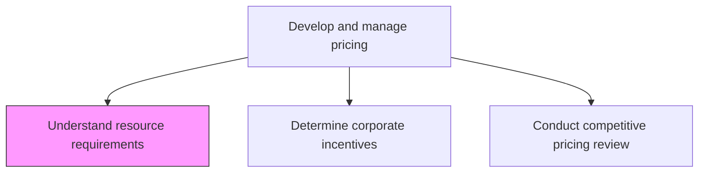
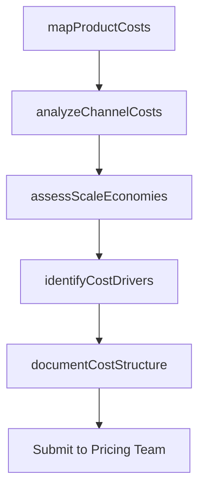

# Understand resource requirements for each product/service and delivery channel/method

> Business-as-Code definition for resource requirement analysis. Models the assessment of production, distribution, and delivery costs per product/service and channel to inform pricing decisions.

## Overview

Determining the production and distribution costs for each product or service, and each channel or method as factors in determining overall pricing.

## Process Hierarchy



## GraphDL

```yaml
understand:
  object: Resource Requirements For Each Product/service And Delivery Channel/method
  actor: PricingAnalyst
  result: ResourceCostAnalysis
```

## Actions

| Action | Description |
|--------|-------------|
| mapProductCosts | Identify all production, material, and labor costs for each product or service |
| analyzeChannelCosts | Calculate distribution, fulfillment, and support costs per delivery channel |
| assessScaleEconomies | Evaluate how costs change with volume across products and channels |
| documentCostStructure | Create detailed cost structure documentation for pricing inputs |
| identifyCostDrivers | Pinpoint the primary factors driving costs for each product-channel combination |

## Events

| Event | Description |
|-------|-------------|
| productCostsMapped | Production and material costs documented for each product |
| channelCostsAnalyzed | Per-channel delivery and distribution costs calculated |
| scaleEconomiesAssessed | Volume-based cost curves established |
| costStructureDocumented | Comprehensive cost structure published for pricing team |
| costDriversIdentified | Key cost drivers documented for each product-channel pair |

## Searches

| Search | Description |
|--------|-------------|
| getCostStructure | Retrieve cost breakdown by product, service, or channel |
| getChannelCosts | Query distribution and delivery costs per channel |
| getCostDrivers | Access primary cost drivers by product-channel combination |

## Process Flow



## RACI Matrix

| Activity | Responsible | Accountable | Consulted | Informed |
|----------|-------------|-------------|-----------|----------|
| mapProductCosts | PricingAnalyst | PricingManager | ProductManagement | Finance |
| analyzeChannelCosts | PricingAnalyst | PricingManager | Operations | ChannelManagers |
| documentCostStructure | PricingAnalyst | PricingManager | Finance | CMO |

## Related Processes

| Process | Relationship |
|---------|-------------|
| 3.3.4.4 Determine pricing based on volume/unit forecast | Downstream - resource costs feed volume pricing models |
| 3.3.4.3 Conduct competitive pricing review | Parallel - costs and competitive data together inform pricing |
| 3.2.2 Define pricing strategy | Upstream - pricing strategy guides cost analysis scope |

## Related Departments

| Department | Role |
|-----------|------|
| Pricing | Leads resource cost analysis for pricing decisions |
| Finance | Validates cost calculations and margin targets |
| Operations | Provides production and distribution cost data |
| Product Management | Supplies product specifications and cost drivers |

## Related Occupations

| Occupation | Involvement |
|-----------|-------------|
| Pricing Analyst | Conducts cost analysis and documents cost structures |
| Operations Analyst | Provides distribution and fulfillment cost data |
| Financial Analyst | Validates cost assumptions and margin calculations |

## KPIs

| KPI | Description | Unit |
|-----|-------------|------|
| Cost Coverage | Percentage of products with documented cost structures | % |
| Cost Accuracy | Variance between estimated and actual costs | % |
| Cost-to-Serve by Channel | Average cost to serve customers per delivery channel | Currency |
| Margin Visibility | Percentage of product-channel combinations with calculated margins | % |

## Usage

```typescript
import { understandResourceRequirements } from '@headlessly/understand-resource-requirements-for-each-product-service-and-delivery-channel-method'

const resources = understandResourceRequirements()

// Map product costs for pricing analysis
const costs = await resources.mapProductCosts({
  products: ['platform-standard', 'platform-enterprise', 'api-access'],
  costCategories: ['production', 'hosting', 'support', 'overhead']
})

// Analyze channel delivery costs
const channelCosts = await resources.analyzeChannelCosts({
  channels: ['direct-sales', 'partner', 'self-serve'],
  includeFixedCosts: true,
  volumeScenarios: [100, 1000, 10000]
})
```
