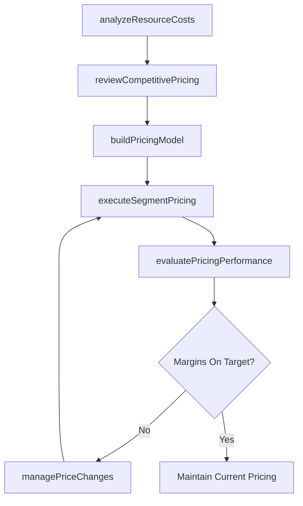

# Develop and manage pricing

> Business-as-Code definition for pricing development and management. Models the complete pricing lifecycle from cost analysis and competitive review through pricing execution, performance evaluation, promotional pricing, and regulatory compliance.

## Overview

Determining and maintaining a pricing mechanism based on forecasted sales and that enables a pricing equilibrium for the lifecycles of products/services. Create a pricing mechanism, factoring in attributes relating to the market, customers, sales, and the cost of production. Implement this pricing mechanism over all products/services. Analyze its performance, and adjust accordingly.

## Process Hierarchy

```mermaid
graph TD
    A[Develop and manage pricing]
    A --> B[Understand resource requirements for each product/service and delivery channel/method]
    A --> C[Determine corporate incentives]
    A --> D[Conduct competitive pricing review (online, offline etc.)]
    A --> E[Determine pricing based on volume/unit forecast]
    A --> F[Determine customer segment specific pricing]
    A --> G[Execute pricing plan]
    A --> H[Evaluate pricing performance]
    A --> I[Refine pricing as needed]
    A --> J[Implement promotional pricing programs]
    A --> K[Implement other retail pricing programs]
    A --> L[Communicate and implement price changes]
    A --> M[Achieve regulatory approval for pricing]
```

## GraphDL

```yaml
develop:
  object: And Manage Pricing
  actor: PricingManager
  result: PricingPlan
```

## Actions

| Action | Description |
|--------|-------------|
| analyzeResourceCosts | Determine production and delivery costs for each product and channel |
| reviewCompetitivePricing | Benchmark pricing against competitors across online and offline channels |
| buildPricingModel | Create pricing framework based on costs, demand forecasts, and margins |
| executeSegmentPricing | Implement customer-segment-specific pricing tiers and rules |
| evaluatePricingPerformance | Measure pricing effectiveness against revenue and margin targets |
| managePriceChanges | Communicate and implement pricing adjustments across channels |

## Events

| Event | Description |
|-------|-------------|
| resourceCostsAnalyzed | Product cost and delivery expense analysis completed |
| competitivePricingReviewed | Competitive pricing benchmark report delivered |
| pricingModelBuilt | Pricing framework approved for implementation |
| segmentPricingExecuted | Customer-segment pricing applied across product portfolio |
| pricingPerformanceEvaluated | Pricing effectiveness metrics reported |
| priceChangesManaged | Price adjustments communicated and implemented |

## Searches

| Search | Description |
|--------|-------------|
| getPriceList | Retrieve current pricing by product, segment, or channel |
| getCompetitiveBenchmark | Access competitive pricing comparison data |
| getPricingPerformance | Query pricing metrics including margin, elasticity, and conversion |
| getPriceChangeHistory | Retrieve historical price changes and their impact on revenue |

## Process Flow



## RACI Matrix

| Activity | Responsible | Accountable | Consulted | Informed |
|----------|-------------|-------------|-----------|----------|
| analyzeResourceCosts | CostAnalyst | PricingManager | Finance | ProductManagement |
| reviewCompetitivePricing | PricingAnalyst | PricingManager | MarketResearch | Sales |
| buildPricingModel | PricingManager | CMO | Finance | Sales |
| executeSegmentPricing | PricingManager | VP Marketing | Sales | CustomerSuccess |
| evaluatePricingPerformance | PricingAnalyst | PricingManager | Finance | ExecutiveTeam |

## Sub-Processes

| ID | Name | Description |
|----|------|-------------|
| 3.3.4.1 | Understand resource requirements for each product/service and delivery channel/method | Determining the production and distribution costs for each product or service, and each channel or m |
| 3.3.4.2 | Determine corporate incentives | Introducing financial inducements, such as discounts, to distributors, resellers or vendors as a mot |
| 3.3.4.3 | Conduct competitive pricing review (online, offline etc.) | Benchmarking the organization's pricing against competitors across online and offline channels to identify positioning gaps and pricing opportunities. |
| 3.3.4.4 | Determine pricing based on volume/unit forecast | Establishing a dynamic pricing mechanism for the organization's offerings that is supported by the n |
| 3.3.4.5 | Determine customer segment specific pricing | Establishing differentiated pricing tiers and structures for distinct customer segments based on purchase volume, contract terms, and strategic value. |
| 3.3.4.6 | Execute pricing plan | Implementing the pricing mechanism to determine prices for all individual offerings in the organizat |
| 3.3.4.7 | Evaluate pricing performance | Examining the efficiency of pricing with the objective of identifying any divergence from the equili |
| 3.3.4.8 | Refine pricing as needed | Refining the pricing mechanism to create equitable prices for all products/services with the objecti |
| 3.3.4.9 | Implement promotional pricing programs | Managing schemes that offer lower pricing for a limited time as a promotional and sales incentive wh |
| 3.3.4.10 | Implement other retail pricing programs | Determining the optimum consumer pricing for each product or service at the point of sale, based on  |
| 3.3.4.11 | Communicate and implement price changes | Assigning new prices or pricing adjustments to products or services to replace the original base pri |
| 3.3.4.12 | Achieve regulatory approval for pricing | Obtaining internal price approvals and governmental approvals that are required for licensed product |

## Related Processes

| Process | Relationship |
|---------|-------------|
| 3.2.2 Define pricing strategy | Upstream - pricing strategy guides operational pricing |
| 3.3.5 Develop and manage promotional activities | Parallel - promotional pricing must align with base pricing |
| 3.3.6 Manage trade pricing, promotions and allowances | Parallel - trade pricing coordinates with consumer pricing |
| 3.4.4 Establish overall sales budgets | Downstream - pricing feeds revenue projections for budgets |

## Related Departments

| Department | Role |
|-----------|------|
| Pricing | Develops and manages pricing models and price lists |
| Finance | Validates margin targets and approves pricing frameworks |
| Sales | Provides market feedback and manages customer-facing pricing |
| Product Management | Defines product positioning that influences pricing tiers |
| Legal | Ensures pricing compliance with regulatory requirements |

## Related Occupations

| Occupation | Involvement |
|-----------|-------------|
| Pricing Manager | Designs pricing models and manages price execution |
| Pricing Analyst | Conducts competitive analysis and monitors pricing performance |
| Revenue Operations Manager | Integrates pricing with sales systems and forecasts |
| Product Marketing Manager | Aligns pricing with product positioning |

## KPIs

| KPI | Description | Unit |
|-----|-------------|------|
| Gross Margin | Revenue minus cost of goods sold as percentage of revenue | % |
| Price Realization | Actual price achieved versus list price | % |
| Price Elasticity | Percentage change in demand for each percentage change in price | Ratio |
| Competitive Price Index | Company pricing relative to competitive average | Index |
| Pricing Cycle Time | Average time to implement a pricing change | Days |

## Usage

```typescript
import { developAndManagePricing } from '@headlessly/develop-and-manage-pricing'

const pricing = developAndManagePricing()

// Review competitive pricing landscape
const benchmark = await pricing.reviewCompetitivePricing({
  products: ['platform-standard', 'platform-enterprise'],
  competitors: ['competitor-a', 'competitor-b'],
  channels: ['direct', 'partner', 'marketplace']
})

// Evaluate pricing performance
const performance = await pricing.evaluatePricingPerformance({
  period: 'Q1-2026',
  metrics: ['margin', 'priceRealization', 'elasticity']
})
```
