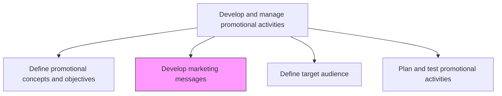
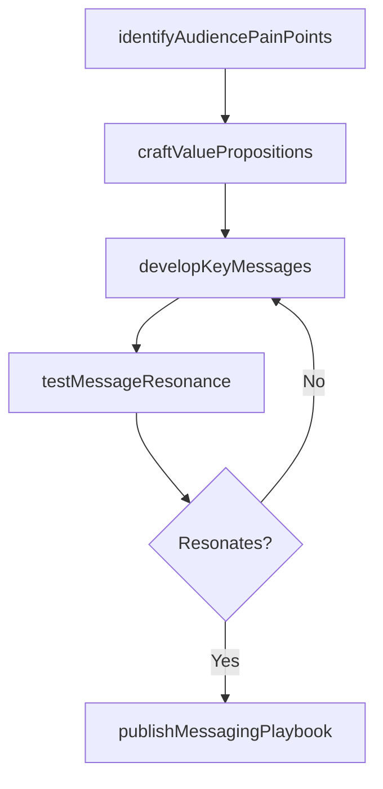

# Develop marketing messages

> Business-as-Code definition for marketing message development. Models the crafting of segment-specific value propositions, key messages, and positioning statements that resonate with target audiences.

## Overview

Developing the central messages for a segment of its customers. Craft concise statements that position the value proposition of individual products/services around the pressing concerns in the market, thereby showing how the organization's offerings are the right fit for the customers.

## Process Hierarchy



## GraphDL

```yaml
develop:
  object: Marketing Messages
  actor: ProductMarketingManager
  result: MessagingFramework
```

## Actions

| Action | Description |
|--------|-------------|
| identifyAudiencePainPoints | Research customer concerns, challenges, and buying triggers for each segment |
| craftValuePropositions | Develop concise statements articulating how products solve segment-specific problems |
| developKeyMessages | Create primary and supporting messages for each product-segment combination |
| testMessageResonance | Validate message effectiveness through surveys, focus groups, or A/B testing |
| publishMessagingPlaybook | Distribute approved messaging framework to sales, marketing, and partner teams |

## Events

| Event | Description |
|-------|-------------|
| audiencePainPointsIdentified | Customer challenges and buying triggers researched per segment |
| valuePropositionsCrafted | Segment-specific value proposition statements developed |
| keyMessagesDeveloped | Primary and supporting messages created for products and segments |
| messageResonanceTested | Message effectiveness validated through testing |
| messagingPlaybookPublished | Approved messaging framework distributed to teams |

## Searches

| Search | Description |
|--------|-------------|
| getMessagingFramework | Retrieve approved messages by product, segment, or campaign |
| getMessageTestResults | Query A/B test and focus group results for messaging variants |
| getValuePropositions | Look up value proposition statements by product or audience |
| getMessagingPlaybook | Access the current messaging playbook for a product or brand |

## Process Flow



## RACI Matrix

| Activity | Responsible | Accountable | Consulted | Informed |
|----------|-------------|-------------|-----------|----------|
| identifyAudiencePainPoints | ProductMarketingManager | VP Marketing | Sales | MarketResearch |
| craftValuePropositions | ProductMarketingManager | CMO | BrandManager | Creative |
| testMessageResonance | MarketResearchAnalyst | ProductMarketingManager | DataScience | CampaignManagers |
| publishMessagingPlaybook | ProductMarketingManager | VP Marketing | Sales | ChannelPartners |

## Related Processes

| Process | Relationship |
|---------|-------------|
| 3.3.5.3 Define target audience | Parallel - audience definition shapes messaging strategy |
| 3.3.5.1 Define promotional concepts and objectives | Upstream - promotional objectives guide message development |
| 3.2.6.8 Define communication guidelines and mechanisms | Upstream - communication guidelines constrain message tone and format |

## Related Departments

| Department | Role |
|-----------|------|
| Product Marketing | Leads message development and positioning strategy |
| Market Research | Provides audience insights and tests message resonance |
| Sales | Provides customer feedback and validates messaging relevance |
| Creative Services | Translates messages into visual and verbal creative assets |

## Related Occupations

| Occupation | Involvement |
|-----------|-------------|
| Product Marketing Manager | Develops messaging frameworks and value propositions |
| Copywriter | Crafts message copy for campaigns and collateral |
| Market Research Analyst | Tests and validates message effectiveness |

## KPIs

| KPI | Description | Unit |
|-----|-------------|------|
| Message Resonance Score | Average audience rating of message relevance and impact | Score (1-10) |
| Message Adoption Rate | Percentage of sales and marketing teams using approved messaging | % |
| Conversion Lift from Messaging | Improvement in conversion rate attributable to updated messaging | % |
| Messaging Coverage | Percentage of products with current approved messaging frameworks | % |

## Usage

```typescript
import { developMarketingMessages } from '@headlessly/develop-marketing-messages'

const messaging = developMarketingMessages()

// Craft value propositions for a product launch
const props = await messaging.craftValuePropositions({
  product: 'enterprise-platform-v3',
  segments: ['enterprise-cto', 'mid-market-ops', 'developer'],
  competitiveAdvantages: ['speed-to-deploy', 'total-cost-of-ownership', 'integration-depth']
})

// Test message resonance with target audience
const test = await messaging.testMessageResonance({
  messages: props.keyMessages,
  audience: 'enterprise-cto',
  method: 'survey',
  sampleSize: 500
})
```
