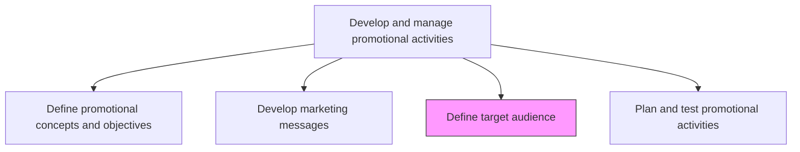
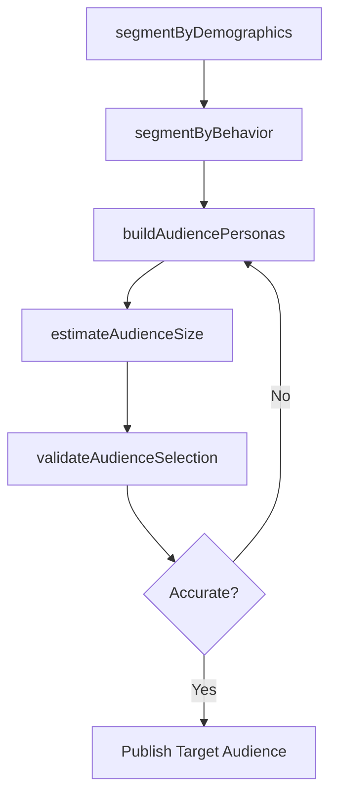

# Define target audience

> Business-as-Code definition for target audience definition. Models the identification and profiling of specific customer groups for promotional campaigns using segmentation, demographic, and behavioral analysis.

## Overview

Determining the appropriate audience to direct marketing efforts at. Identify the particular group of customers to target. Discover the appropriate customer groups at a micro-level. Use techniques such as segmentation analysis, whereby the entire population is sliced according to certain demographic or behavioral attributes.

## Process Hierarchy



## GraphDL

```yaml
define:
  object: Target Audience
  actor: MarketingAnalyst
  result: TargetAudienceProfile
```

## Actions

| Action | Description |
|--------|-------------|
| segmentByDemographics | Divide the addressable market by age, income, geography, company size, and other firmographic attributes |
| segmentByBehavior | Classify audience groups by purchase history, engagement patterns, and buying triggers |
| buildAudiencePersonas | Create detailed persona profiles combining demographic and behavioral attributes |
| estimateAudienceSize | Quantify the addressable and reachable population for each target audience |
| validateAudienceSelection | Test audience targeting accuracy through pilot campaigns or lookalike modeling |

## Events

| Event | Description |
|-------|-------------|
| demographicSegmentsCreated | Market divided into demographic and firmographic segments |
| behavioralSegmentsCreated | Audience groups classified by behavior and engagement patterns |
| audiencePersonasBuilt | Detailed persona profiles developed for target audiences |
| audienceSizeEstimated | Addressable population quantified for each audience segment |
| audienceSelectionValidated | Target audience accuracy confirmed through testing |

## Searches

| Search | Description |
|--------|-------------|
| getAudienceSegments | Retrieve audience segments by demographic or behavioral criteria |
| getPersonaProfiles | Query persona profiles for a specific campaign or product |
| getAudienceSize | Look up estimated audience size by segment or geography |
| getTargetingPerformance | Access historical targeting accuracy and engagement data |

## Process Flow



## RACI Matrix

| Activity | Responsible | Accountable | Consulted | Informed |
|----------|-------------|-------------|-----------|----------|
| segmentByDemographics | MarketingAnalyst | MarketingPlanningManager | MarketResearch | Sales |
| buildAudiencePersonas | ProductMarketingManager | VP Marketing | CRM | CustomerSuccess |
| validateAudienceSelection | DataScientist | MarketingAnalyst | DigitalMarketing | CampaignManagers |

## Related Processes

| Process | Relationship |
|---------|-------------|
| 3.3.5.2 Develop marketing messages | Downstream - messages are tailored to defined target audiences |
| 3.3.5.1 Define promotional concepts and objectives | Upstream - promotional objectives guide audience selection |
| 3.1.2 Determine market segments | Upstream - market segmentation provides the foundation for audience targeting |

## Related Departments

| Department | Role |
|-----------|------|
| Marketing | Leads audience segmentation and persona development |
| Data Science | Builds predictive models and validates targeting accuracy |
| CRM | Provides customer data for segmentation analysis |
| Sales | Validates audience profiles against field experience |

## Related Occupations

| Occupation | Involvement |
|-----------|-------------|
| Marketing Analyst | Conducts segmentation analysis and audience profiling |
| Product Marketing Manager | Develops audience personas and validates targeting |
| Data Scientist | Builds lookalike models and validates audience selection |

## KPIs

| KPI | Description | Unit |
|-----|-------------|------|
| Targeting Accuracy | Percentage of campaign reach that lands on the intended audience | % |
| Audience Coverage | Percentage of total addressable market covered by defined audiences | % |
| Persona Freshness | Time since last audience persona update | Months |
| Segment Response Rate | Average campaign response rate by target audience segment | % |

## Usage

```typescript
import { defineTargetAudience } from '@headlessly/define-target-audience'

const audience = defineTargetAudience()

// Build audience personas for a product campaign
const personas = await audience.buildAudiencePersonas({
  product: 'enterprise-platform',
  dimensions: ['company-size', 'industry', 'job-role', 'buying-stage'],
  dataSource: 'crm-and-web-analytics'
})

// Estimate addressable audience size
const size = await audience.estimateAudienceSize({
  personaId: personas[0].id,
  geographies: ['north-america', 'europe'],
  channels: ['linkedin', 'programmatic-display', 'email']
})
```
