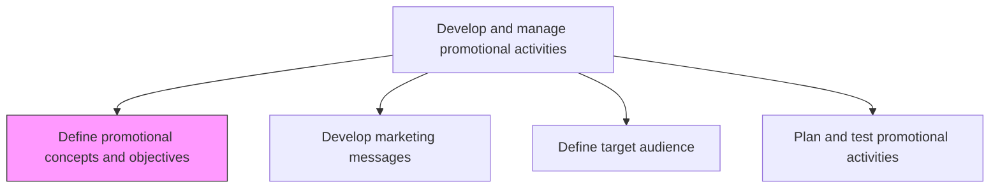
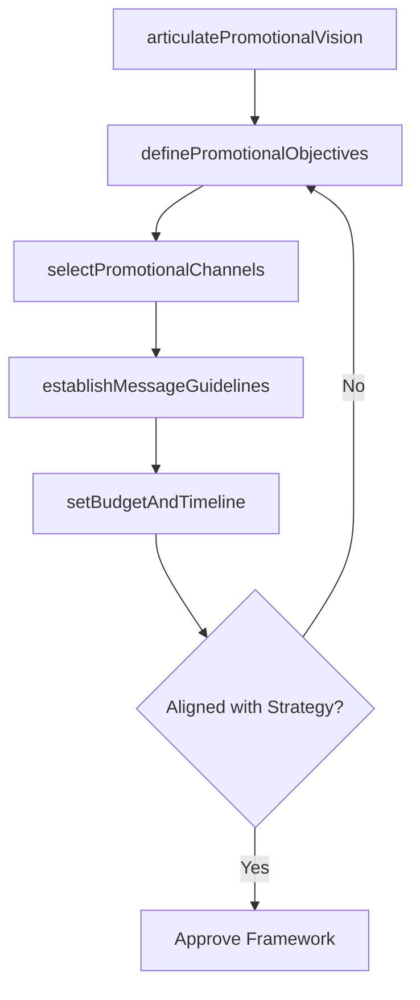

# Define promotional concepts and objectives

> Business-as-Code definition for promotional strategy planning. Models the creation of a conceptual framework and measurable objectives that guide all promotional activities and ensure consistency across campaigns.

## Overview

Outlining a conceptual framework for all promotional activity in order to create an overarching aspiration and ensure consistency. Create a plan for running promotional programs and designing the associated activities in order to increase visibility or sales. Determine how the organization quantifies what it wishes to achieve from these activities, what sort of messages the organization comfortable publicizing, what channels the organization wishes to employ, etc.

## Process Hierarchy



## GraphDL

```yaml
define:
  object: Promotional Concepts And Objectives
  actor: PromotionsManager
  result: PromotionalFramework
```

## Actions

| Action | Description |
|--------|-------------|
| articulatePromotionalVision | Establish the overarching promotional aspiration aligned with brand and marketing strategy |
| definePromotionalObjectives | Set specific, measurable objectives for promotional programs including reach, engagement, and conversion targets |
| selectPromotionalChannels | Identify the channels and media to employ for promotional activities |
| establishMessageGuidelines | Define the tone, themes, and boundaries for promotional messaging |
| setBudgetAndTimeline | Allocate budget and establish timelines for planned promotional campaigns |

## Events

| Event | Description |
|-------|-------------|
| promotionalVisionArticulated | Overarching promotional aspiration and strategy documented |
| promotionalObjectivesDefined | Measurable promotional objectives established for each campaign |
| promotionalChannelsSelected | Target channels and media identified for promotional deployment |
| messageGuidelinesEstablished | Messaging tone, themes, and boundaries approved |
| budgetAndTimelineSet | Promotional budget allocated and campaign timelines confirmed |

## Searches

| Search | Description |
|--------|-------------|
| getPromotionalObjectives | Retrieve promotional objectives by campaign or time period |
| getPromotionalChannels | Query selected channels and their allocation for promotions |
| getPromotionalBudget | Access budget allocation and spend data for promotional activities |

## Process Flow



## RACI Matrix

| Activity | Responsible | Accountable | Consulted | Informed |
|----------|-------------|-------------|-----------|----------|
| articulatePromotionalVision | PromotionsManager | MarketingDirector | BrandManager | CMO |
| definePromotionalObjectives | PromotionsManager | MarketingDirector | Sales | Finance |
| selectPromotionalChannels | MediaPlanner | PromotionsManager | DigitalMarketing | ChannelManagers |
| setBudgetAndTimeline | PromotionsManager | MarketingDirector | Finance | ExecutiveTeam |

## Related Processes

| Process | Relationship |
|---------|-------------|
| 3.3.5.2 Develop marketing messages | Downstream - message development follows concept definition |
| 3.3.5.3 Define target audience | Parallel - audience definition shapes promotional concepts |
| 3.3.2.1 Confirm marketing alignment to business strategy | Upstream - business strategy alignment guides promotional objectives |

## Related Departments

| Department | Role |
|-----------|------|
| Marketing | Leads promotional concept development and objective setting |
| Brand Management | Ensures promotional concepts align with brand guidelines |
| Sales | Provides input on promotional needs from customer-facing perspective |
| Finance | Approves promotional budget allocations |

## Related Occupations

| Occupation | Involvement |
|-----------|-------------|
| Promotions Manager | Defines promotional concepts, objectives, and channel strategy |
| Media Planner | Recommends channels and media for promotional deployment |
| Brand Manager | Reviews promotional concepts for brand consistency |

## KPIs

| KPI | Description | Unit |
|-----|-------------|------|
| Objective Achievement Rate | Percentage of promotional objectives met within campaign period | % |
| Promotional ROI | Return on investment for promotional activities | Ratio |
| Channel Coverage | Number of channels activated for promotional campaigns | Count |
| Framework Approval Cycle | Time from concept development to framework approval | Days |

## Usage

```typescript
import { definePromotionalConceptsAndObjectives } from '@headlessly/define-promotional-concepts-and-objectives'

const promoFramework = definePromotionalConceptsAndObjectives()

// Define promotional objectives for a campaign
const objectives = await promoFramework.definePromotionalObjectives({
  campaign: 'q2-product-launch',
  objectives: [
    { type: 'reach', target: 500000, period: '30-days' },
    { type: 'engagement', target: 0.05, metric: 'click-through-rate' },
    { type: 'conversion', target: 2000, metric: 'new-trials' }
  ]
})

// Select promotional channels
const channels = await promoFramework.selectPromotionalChannels({
  campaignId: objectives.campaignId,
  channels: ['social-media', 'email', 'search-ads', 'content-marketing'],
  budgetAllocation: { social: 0.35, email: 0.2, search: 0.3, content: 0.15 }
})
```
