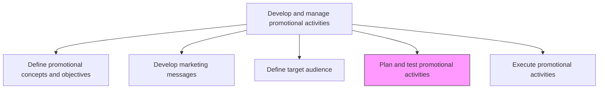
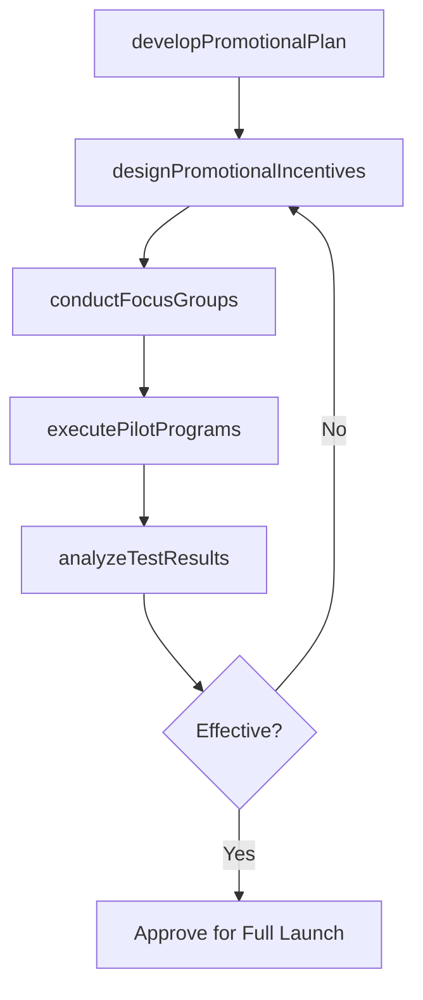

# Plan and test promotional activities

> Business-as-Code definition for promotional activity planning and testing. Models the development of promotional execution plans and validation of their effectiveness through pilot programs, focus groups, and controlled experiments.

## Overview

Developing a scheme for executing the promotional programs and campaigns, and testing these on sample audiences. Create a program plan, and carry out trials for promotional activities. Develop a scheme for how, when, where, and by whom the promotional schemes and campaigns will be deployed. Design incentives that convince or tempt the consumer to take up the organization's offerings. Conduct focus groups and pilot programs that reach out to a smaller number of people from among the target audiences to validate effectiveness.

## Process Hierarchy



## GraphDL

```yaml
plan:
  object: And Test Promotional Activities
  actor: CampaignManager
  result: ValidatedPromotionalPlan
```

## Actions

| Action | Description |
|--------|-------------|
| developPromotionalPlan | Create detailed execution plan specifying timing, channels, responsibilities, and resource allocation |
| designPromotionalIncentives | Create offers, discounts, or rewards that motivate target audiences to engage |
| conductFocusGroups | Run qualitative research sessions with sample audiences to gauge promotional concept appeal |
| executePilotPrograms | Deploy promotions to a limited audience segment to measure real-world effectiveness |
| analyzeTestResults | Evaluate pilot and focus group data to determine which promotional approaches to scale |

## Events

| Event | Description |
|-------|-------------|
| promotionalPlanDeveloped | Detailed promotional execution plan created and documented |
| promotionalIncentivesDesigned | Promotional offers and incentive structures finalized |
| focusGroupsConducted | Qualitative feedback collected from sample audience sessions |
| pilotProgramsExecuted | Controlled promotional tests completed with limited audience |
| testResultsAnalyzed | Pilot and focus group outcomes evaluated and recommendations produced |

## Searches

| Search | Description |
|--------|-------------|
| getPromotionalPlans | Retrieve promotional execution plans by campaign or time period |
| getPilotResults | Query results from pilot promotional programs |
| getFocusGroupInsights | Access qualitative insights from promotional focus groups |

## Process Flow



## RACI Matrix

| Activity | Responsible | Accountable | Consulted | Informed |
|----------|-------------|-------------|-----------|----------|
| developPromotionalPlan | CampaignManager | MarketingDirector | PromotionsManager | Sales |
| designPromotionalIncentives | CampaignManager | PromotionsManager | Finance | Legal |
| conductFocusGroups | MarketResearchAnalyst | CampaignManager | ProductMarketing | Creative |
| analyzeTestResults | MarketingAnalyst | CampaignManager | DataScience | CMO |

## Related Processes

| Process | Relationship |
|---------|-------------|
| 3.3.5.1 Define promotional concepts and objectives | Upstream - promotional concepts guide plan development |
| 3.3.5.5 Execute promotional activities | Downstream - validated plans are executed at full scale |
| 3.3.5.3 Define target audience | Upstream - audience definitions determine pilot audience selection |

## Related Departments

| Department | Role |
|-----------|------|
| Marketing | Leads promotional planning and coordinates testing activities |
| Market Research | Conducts focus groups and analyzes qualitative feedback |
| Sales | Provides field input on promotional incentive appeal |
| Finance | Reviews promotional cost projections and incentive budgets |

## Related Occupations

| Occupation | Involvement |
|-----------|-------------|
| Campaign Manager | Develops promotional plans and oversees testing programs |
| Market Research Analyst | Designs and conducts focus groups and pilot evaluations |
| Marketing Analyst | Analyzes test data and produces performance recommendations |

## KPIs

| KPI | Description | Unit |
|-----|-------------|------|
| Pilot Conversion Rate | Percentage of pilot audience that engaged with the promotion | % |
| Focus Group Approval Score | Average favorability rating from focus group participants | Score (1-10) |
| Plan-to-Launch Cycle Time | Time from plan approval to full-scale promotional launch | Days |
| Test-to-Scale Success Rate | Percentage of pilot promotions that proceed to full launch | % |

## Usage

```typescript
import { planAndTestPromotionalActivities } from '@headlessly/plan-and-test-promotional-activities'

const promoPlanning = planAndTestPromotionalActivities()

// Develop a promotional plan for a product launch
const plan = await promoPlanning.developPromotionalPlan({
  campaign: 'summer-sale-2026',
  channels: ['email', 'social-media', 'in-store'],
  timeline: { start: '2026-06-01', end: '2026-06-30' },
  budget: 150000
})

// Execute a pilot program with limited audience
const pilot = await promoPlanning.executePilotPrograms({
  planId: plan.id,
  audiencePercent: 5,
  channels: ['email'],
  duration: '7-days',
  metrics: ['open-rate', 'click-rate', 'conversion-rate']
})
```
