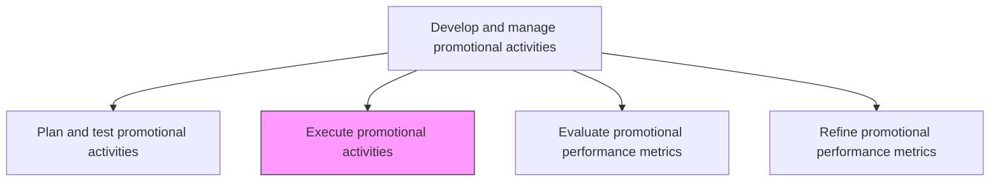
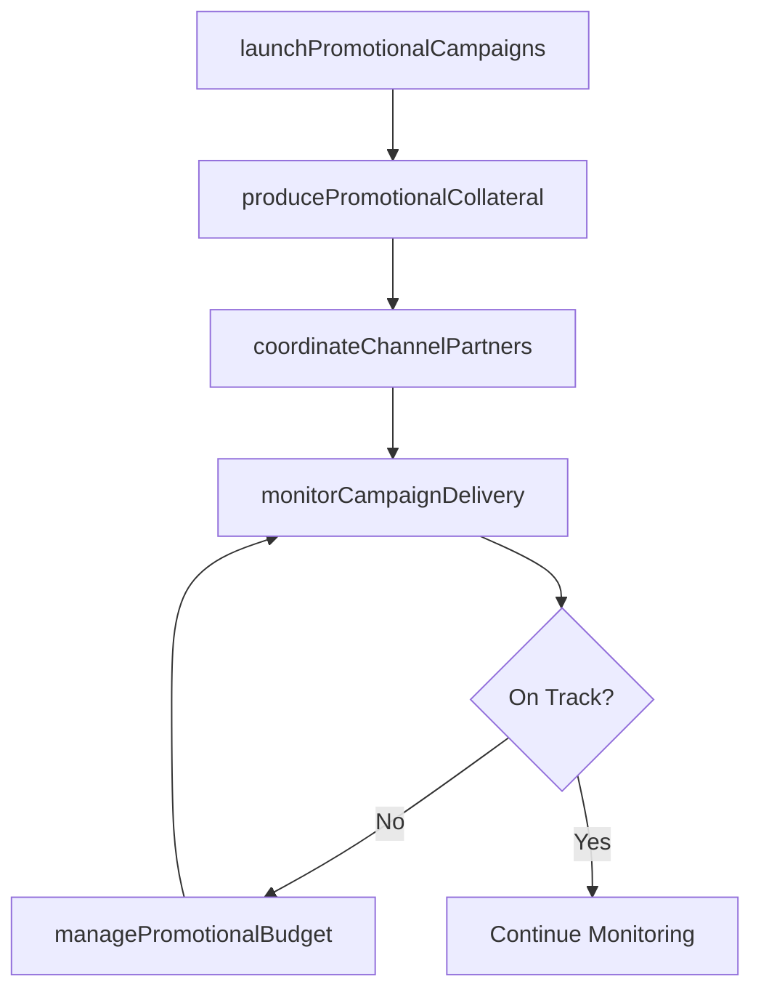

# Execute promotional activities

> Business-as-Code definition for promotional activity execution. Models the deployment and management of promotional campaigns across channels, including collateral distribution, partner coordination, and real-time campaign monitoring.

## Overview

Executing promotional programs in the market for reaching out to the desired customer segments. Implement the promotional schemes and campaigns. Create collaterals for the dissemination of information about the product, product line, brand, or company to the target audiences in an effective manner. Leverage relationships with distributors, vendors, and retailers. Consider enlisting professional services such as design, PR, and advertising firms.

## Process Hierarchy



## GraphDL

```yaml
execute:
  object: Promotional Activities
  actor: CampaignManager
  result: ExecutedPromotionalCampaign
```

## Actions

| Action | Description |
|--------|-------------|
| launchPromotionalCampaigns | Activate promotional programs across all designated channels and markets |
| producePromotionalCollateral | Create and distribute marketing materials, digital assets, and promotional content |
| coordinateChannelPartners | Brief distributors, vendors, and retailers on promotional execution requirements |
| monitorCampaignDelivery | Track real-time campaign deployment ensuring collateral reaches target audiences |
| managePromotionalBudget | Monitor spend against budget and reallocate resources based on campaign performance |

## Events

| Event | Description |
|-------|-------------|
| promotionalCampaignsLaunched | Promotional programs activated across all designated channels |
| promotionalCollateralProduced | Marketing materials and digital assets produced and distributed |
| channelPartnersCoordinated | Distribution partners briefed and executing promotional activities |
| campaignDeliveryMonitored | Real-time deployment tracking confirmed campaign reach |
| promotionalBudgetManaged | Spend tracked and resources reallocated as needed |

## Searches

| Search | Description |
|--------|-------------|
| getActiveCampaigns | Retrieve currently running promotional campaigns and their status |
| getCampaignDeliveryMetrics | Query real-time delivery data for active promotions |
| getPromotionalCollateral | Access promotional materials and assets by campaign |

## Process Flow



## RACI Matrix

| Activity | Responsible | Accountable | Consulted | Informed |
|----------|-------------|-------------|-----------|----------|
| launchPromotionalCampaigns | CampaignManager | MarketingDirector | DigitalMarketing | Sales |
| producePromotionalCollateral | CreativeManager | CampaignManager | BrandManager | ChannelManagers |
| coordinateChannelPartners | ChannelManager | CampaignManager | Sales | PartnerManagers |
| monitorCampaignDelivery | MarketingOperations | CampaignManager | DataAnalytics | CMO |

## Related Processes

| Process | Relationship |
|---------|-------------|
| 3.3.5.4 Plan and test promotional activities | Upstream - validated plans drive execution |
| 3.3.5.6 Evaluate promotional performance metrics | Downstream - execution data feeds performance evaluation |
| 3.3.3.9 Develop and execute advertising | Parallel - advertising and promotions are coordinated |

## Related Departments

| Department | Role |
|-----------|------|
| Marketing | Leads campaign execution and coordinates cross-channel deployment |
| Creative Services | Produces promotional collateral and digital assets |
| Channel Management | Coordinates promotional execution with distribution partners |
| Sales | Executes promotions with customers and reports field results |

## Related Occupations

| Occupation | Involvement |
|-----------|-------------|
| Campaign Manager | Oversees end-to-end promotional execution across channels |
| Creative Manager | Manages collateral production and creative asset delivery |
| Channel Manager | Coordinates promotional deployment with external partners |

## KPIs

| KPI | Description | Unit |
|-----|-------------|------|
| Campaign Reach | Total audience exposed to promotional activities | Count |
| Channel Activation Rate | Percentage of designated channels actively running promotions | % |
| Budget Utilization | Percentage of promotional budget spent versus allocated | % |
| On-Time Launch Rate | Percentage of campaigns launched on the scheduled date | % |

## Usage

```typescript
import { executePromotionalActivities } from '@headlessly/execute-promotional-activities'

const promoExecution = executePromotionalActivities()

// Launch promotional campaigns across channels
const campaign = await promoExecution.launchPromotionalCampaigns({
  campaignId: 'summer-sale-2026',
  channels: ['email', 'social-media', 'display-ads', 'in-store'],
  launchDate: '2026-06-01',
  audienceSegments: ['high-value-customers', 'lapsed-customers']
})

// Monitor campaign delivery in real-time
const delivery = await promoExecution.monitorCampaignDelivery({
  campaignId: campaign.id,
  metrics: ['impressions', 'clicks', 'conversions', 'spend'],
  alertThresholds: { underperformance: 0.7, overspend: 1.1 }
})
```
