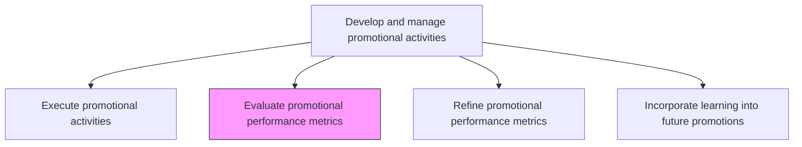
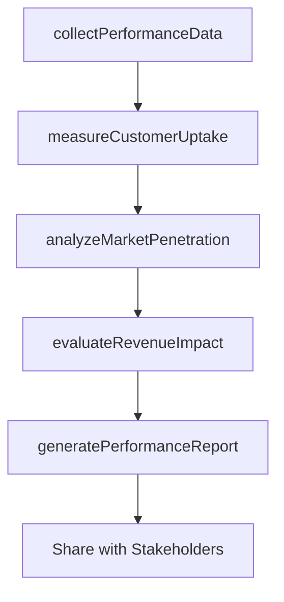

# Evaluate promotional performance metrics

> Business-as-Code definition for promotional performance evaluation. Models the measurement, analysis, and reporting of promotional campaign effectiveness through customer uptake, market penetration, and revenue impact metrics.

## Overview

Evaluating the success of promotional programs through metrics that track the impact of these activities. Examine the performance of promotional activities. Measure the success of these programs through metrics representative of customer uptake, market penetration, sustenance of impact created, revenue growth through offerings marketed, etc. Measure through primary data collection. Analyze through various statistical techniques to generate insights.

## Process Hierarchy



## GraphDL

```yaml
evaluate:
  object: Promotional Performance Metrics
  actor: MarketingAnalyst
  result: PromotionalPerformanceReport
```

## Actions

| Action | Description |
|--------|-------------|
| collectPerformanceData | Gather quantitative data on campaign reach, engagement, conversion, and revenue from all channels |
| measureCustomerUptake | Calculate the rate at which target audiences engaged with and responded to promotions |
| analyzeMarketPenetration | Assess the degree to which promotions expanded market share or entered new segments |
| evaluateRevenueImpact | Determine the incremental revenue attributable to promotional activities |
| generatePerformanceReport | Produce comprehensive performance analysis with insights and recommendations |

## Events

| Event | Description |
|-------|-------------|
| performanceDataCollected | Quantitative campaign data gathered from all channels and sources |
| customerUptakeMeasured | Audience engagement and response rates calculated |
| marketPenetrationAnalyzed | Market share impact of promotions assessed |
| revenueImpactEvaluated | Incremental revenue contribution from promotions determined |
| performanceReportGenerated | Comprehensive promotional performance report published |

## Searches

| Search | Description |
|--------|-------------|
| getPromotionalPerformance | Retrieve performance metrics for promotional campaigns by period or type |
| getCampaignROI | Query return on investment data for specific campaigns |
| getUptakeMetrics | Access customer engagement and conversion metrics by campaign |

## Process Flow



## RACI Matrix

| Activity | Responsible | Accountable | Consulted | Informed |
|----------|-------------|-------------|-----------|----------|
| collectPerformanceData | MarketingAnalyst | MarketingDirector | DataEngineering | CampaignManagers |
| measureCustomerUptake | MarketingAnalyst | PromotionsManager | CRM | Sales |
| evaluateRevenueImpact | MarketingAnalyst | MarketingDirector | Finance | CMO |
| generatePerformanceReport | MarketingAnalyst | MarketingDirector | PromotionsManager | ExecutiveTeam |

## Related Processes

| Process | Relationship |
|---------|-------------|
| 3.3.5.5 Execute promotional activities | Upstream - execution data is the input for evaluation |
| 3.3.5.7 Refine promotional performance metrics | Downstream - evaluation findings drive metric refinement |
| 3.3.10.2 Assess brand/product marketing plan performance | Parallel - promotional metrics feed overall marketing assessment |

## Related Departments

| Department | Role |
|-----------|------|
| Marketing Analytics | Leads data collection, analysis, and performance reporting |
| Marketing | Provides campaign context and reviews performance findings |
| Finance | Validates revenue attribution and ROI calculations |
| Sales | Provides customer-level feedback on promotional effectiveness |

## Related Occupations

| Occupation | Involvement |
|-----------|-------------|
| Marketing Analyst | Collects data, runs analyses, and produces performance reports |
| Data Scientist | Applies statistical techniques to measure promotional impact |
| Promotions Manager | Reviews performance results and identifies improvement areas |

## KPIs

| KPI | Description | Unit |
|-----|-------------|------|
| Promotional ROI | Return on investment for promotional activities | Ratio |
| Customer Uptake Rate | Percentage of target audience that engaged with the promotion | % |
| Market Penetration Lift | Incremental market share gained through promotions | % |
| Revenue Attribution | Revenue directly attributable to promotional campaigns | Currency |

## Usage

```typescript
import { evaluatePromotionalPerformanceMetrics } from '@headlessly/evaluate-promotional-performance-metrics'

const promoEval = evaluatePromotionalPerformanceMetrics()

// Collect performance data across all active campaigns
const data = await promoEval.collectPerformanceData({
  campaigns: ['summer-sale-2026', 'loyalty-drive-q2'],
  metrics: ['reach', 'engagement', 'conversion', 'revenue'],
  period: { start: '2026-06-01', end: '2026-06-30' }
})

// Generate a comprehensive performance report
const report = await promoEval.generatePerformanceReport({
  dataId: data.id,
  comparisons: ['year-over-year', 'budget-vs-actual'],
  includeRecommendations: true
})
```
