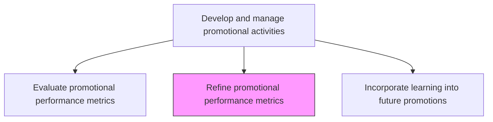
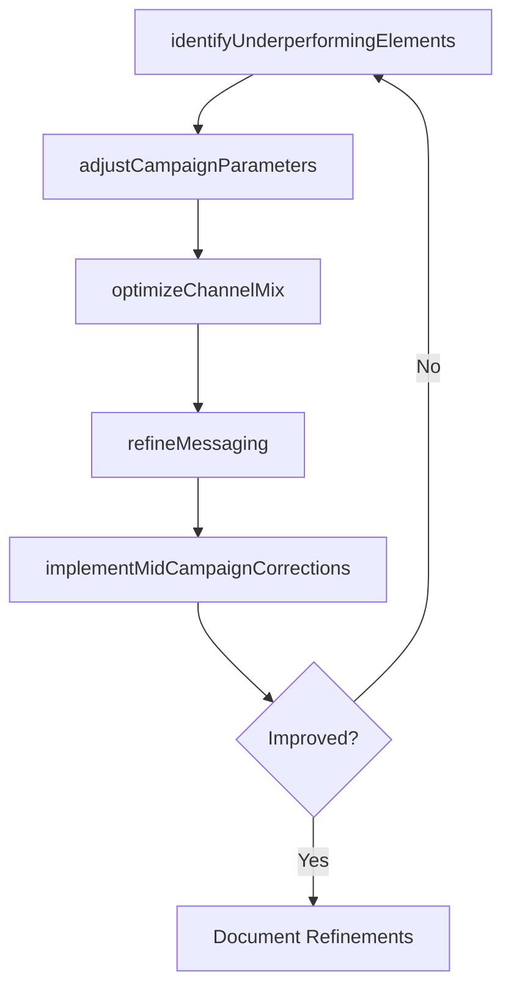

# Refine promotional performance metrics

> Business-as-Code definition for promotional metric refinement. Models the optimization of promotional activities by applying performance insights to adjust campaign parameters, messaging, and channel allocation for improved impact.

## Overview

Fine-tuning promotional activities by employing the insights gleaned from the quantitative, as well as any qualitative, performance evaluations. Change certain attributes of the schemes, campaigns, and programs deployed in order to increase the impact generated, in terms of measures already agreed upon such as customer uptake, market penetration, sustenance of impact created, and revenue growth through offerings marketed.

## Process Hierarchy



## GraphDL

```yaml
refine:
  object: Promotional Performance Metrics
  actor: PromotionsManager
  result: RefinedPromotionalStrategy
```

## Actions

| Action | Description |
|--------|-------------|
| identifyUnderperformingElements | Pinpoint specific campaign attributes, channels, or messages that are not meeting targets |
| adjustCampaignParameters | Modify timing, frequency, spend allocation, or targeting criteria to improve results |
| optimizeChannelMix | Reallocate budget across channels based on performance data to maximize reach and conversion |
| refineMessaging | Update promotional messaging based on audience response and engagement patterns |
| implementMidCampaignCorrections | Deploy adjustments to active campaigns without disrupting overall program flow |

## Events

| Event | Description |
|-------|-------------|
| underperformingElementsIdentified | Specific weak campaign attributes or channels flagged for improvement |
| campaignParametersAdjusted | Campaign timing, targeting, or spend modified based on performance data |
| channelMixOptimized | Budget reallocation across channels completed based on ROI analysis |
| messagingRefined | Promotional messaging updated based on audience response data |
| midCampaignCorrectionsImplemented | Live campaign adjustments deployed successfully |

## Searches

| Search | Description |
|--------|-------------|
| getUnderperformingCampaigns | Retrieve campaigns performing below target thresholds |
| getChannelPerformanceComparison | Query performance metrics across channels for optimization decisions |
| getRefinementHistory | Access historical adjustments made to campaigns and their impact |

## Process Flow



## RACI Matrix

| Activity | Responsible | Accountable | Consulted | Informed |
|----------|-------------|-------------|-----------|----------|
| identifyUnderperformingElements | MarketingAnalyst | PromotionsManager | CampaignManagers | MarketingDirector |
| adjustCampaignParameters | CampaignManager | PromotionsManager | MediaPlanner | Finance |
| optimizeChannelMix | MediaPlanner | PromotionsManager | DigitalMarketing | CMO |
| implementMidCampaignCorrections | CampaignManager | PromotionsManager | MarketingOperations | Sales |

## Related Processes

| Process | Relationship |
|---------|-------------|
| 3.3.5.6 Evaluate promotional performance metrics | Upstream - evaluation data drives refinement decisions |
| 3.3.5.8 Incorporate learning into future promotions | Downstream - refinement insights feed future planning |
| 3.3.5.5 Execute promotional activities | Parallel - refinements are applied to active campaigns |

## Related Departments

| Department | Role |
|-----------|------|
| Marketing | Leads refinement strategy and coordinates campaign adjustments |
| Marketing Analytics | Provides performance data and identifies improvement opportunities |
| Media Planning | Optimizes channel allocation and spend based on performance |
| Creative Services | Updates messaging and creative assets for refined campaigns |

## Related Occupations

| Occupation | Involvement |
|-----------|-------------|
| Promotions Manager | Oversees campaign refinement decisions and approvals |
| Marketing Analyst | Identifies underperforming elements and recommends adjustments |
| Media Planner | Optimizes channel mix and budget allocation |

## KPIs

| KPI | Description | Unit |
|-----|-------------|------|
| Performance Improvement Rate | Percentage improvement in key metrics after refinement | % |
| Refinement Cycle Time | Time from performance flag to adjustment implementation | Days |
| Channel Optimization Lift | Incremental performance gain from channel mix changes | % |
| Cost-Per-Acquisition Reduction | Decrease in customer acquisition cost after refinements | % |

## Usage

```typescript
import { refinePromotionalPerformanceMetrics } from '@headlessly/refine-promotional-performance-metrics'

const refinement = refinePromotionalPerformanceMetrics()

// Identify underperforming campaign elements
const issues = await refinement.identifyUnderperformingElements({
  campaignId: 'summer-sale-2026',
  thresholds: { conversionRate: 0.02, clickRate: 0.03, roi: 1.5 },
  dimensions: ['channel', 'segment', 'creative-variant']
})

// Optimize channel mix based on performance data
const optimized = await refinement.optimizeChannelMix({
  campaignId: 'summer-sale-2026',
  currentBudget: 150000,
  optimizationGoal: 'maximize-conversions',
  constraints: { minChannelSpend: 10000 }
})
```
