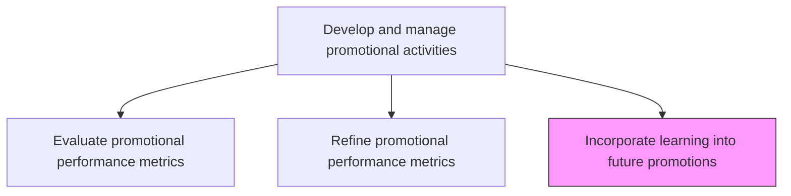
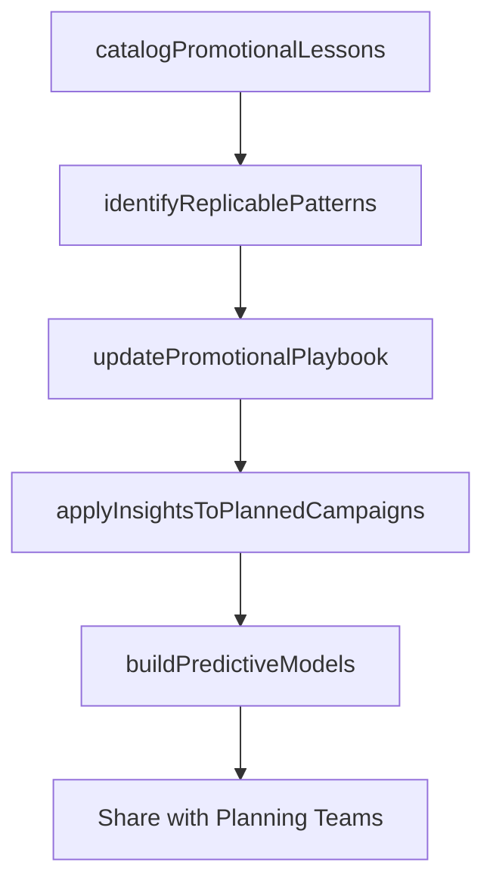

# Incorporate learning into future/planned consumer promotions

> Business-as-Code definition for promotional knowledge management. Models the capture, codification, and application of lessons learned from past promotional activities to improve the design and execution of future campaigns.

## Overview

Incorporating the understanding developed by studying promotional activities as well as refining them. Include the best practices and value-enhancing attributes identified in Refine promotional activities [10171] into similarly planned schemes, programs, and campaigns. Adjust promotional activities to further increase the effectiveness of the overall promotional efforts.

## Process Hierarchy



## GraphDL

```yaml
incorporate:
  object: Learning Into Future/planned Consumer Promotions
  actor: PromotionsManager
  result: PromotionalLearningRepository
```

## Actions

| Action | Description |
|--------|-------------|
| catalogPromotionalLessons | Document key findings, best practices, and pitfalls from completed promotional campaigns |
| identifyReplicablePatterns | Extract successful tactics, messaging approaches, and channel strategies for reuse |
| updatePromotionalPlaybook | Revise standard operating procedures and playbooks based on accumulated learnings |
| applyInsightsToPlannedCampaigns | Integrate proven approaches and avoid known pitfalls in upcoming promotional plans |
| buildPredictiveModels | Create data-driven models that forecast promotional outcomes based on historical patterns |

## Events

| Event | Description |
|-------|-------------|
| promotionalLessonsCataloged | Key findings and best practices documented from completed campaigns |
| replicablePatternsIdentified | Successful tactics and strategies extracted for future reuse |
| promotionalPlaybookUpdated | Standard promotional procedures revised with new learnings |
| insightsAppliedToPlans | Historical insights integrated into upcoming campaign designs |
| predictiveModelsBuilt | Forecasting models created from historical promotional data |

## Searches

| Search | Description |
|--------|-------------|
| getPromotionalLessons | Retrieve documented learnings by campaign type, channel, or outcome |
| getBestPractices | Query proven promotional tactics and strategies |
| getPredictiveForecasts | Access forecasted outcomes for planned promotional configurations |

## Process Flow



## RACI Matrix

| Activity | Responsible | Accountable | Consulted | Informed |
|----------|-------------|-------------|-----------|----------|
| catalogPromotionalLessons | MarketingAnalyst | PromotionsManager | CampaignManagers | MarketingDirector |
| identifyReplicablePatterns | PromotionsManager | MarketingDirector | DataScience | Creative |
| updatePromotionalPlaybook | PromotionsManager | MarketingDirector | Sales | ChannelManagers |
| buildPredictiveModels | DataScientist | PromotionsManager | MarketingAnalyst | CMO |

## Related Processes

| Process | Relationship |
|---------|-------------|
| 3.3.5.7 Refine promotional performance metrics | Upstream - refinement insights are the primary input |
| 3.3.5.1 Define promotional concepts and objectives | Downstream - learnings improve future concept development |
| 3.3.5.4 Plan and test promotional activities | Downstream - historical patterns improve planning accuracy |

## Related Departments

| Department | Role |
|-----------|------|
| Marketing | Leads learning capture and playbook updates |
| Marketing Analytics | Provides data analysis and builds predictive models |
| Sales | Contributes field-level observations on promotional effectiveness |
| Data Science | Develops forecasting models from historical promotional data |

## Related Occupations

| Occupation | Involvement |
|-----------|-------------|
| Promotions Manager | Oversees knowledge capture and playbook maintenance |
| Marketing Analyst | Documents learnings and identifies replicable patterns |
| Data Scientist | Builds predictive models from historical campaign data |

## KPIs

| KPI | Description | Unit |
|-----|-------------|------|
| Learning Capture Rate | Percentage of completed campaigns with documented lessons learned | % |
| Playbook Currency | Time since last promotional playbook update | Months |
| Prediction Accuracy | Accuracy of predictive models in forecasting campaign outcomes | % |
| Year-over-Year Promotional Improvement | Improvement in average promotional ROI compared to prior year | % |

## Usage

```typescript
import { incorporateLearningIntoFuturePlannedConsumerPromotions } from '@headlessly/incorporate-learning-into-future-planned-consumer-promotions'

const learning = incorporateLearningIntoFuturePlannedConsumerPromotions()

// Catalog lessons from completed campaigns
const lessons = await learning.catalogPromotionalLessons({
  campaigns: ['spring-launch-2025', 'holiday-promo-2025', 'loyalty-drive-q1'],
  dimensions: ['messaging', 'channel-mix', 'timing', 'incentive-structure'],
  includeQuantitativeResults: true
})

// Apply insights to upcoming campaign plans
const enhanced = await learning.applyInsightsToPlannedCampaigns({
  plannedCampaign: 'summer-sale-2026',
  relevantLessons: lessons.topInsights,
  applyBestPractices: true,
  avoidKnownPitfalls: true
})
```
