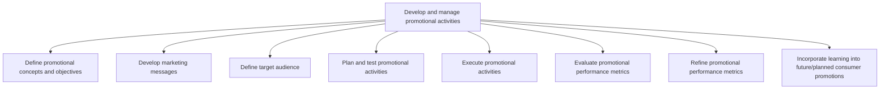
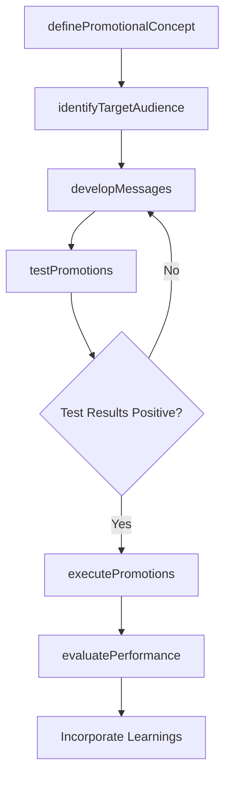

# Develop and manage promotional activities

> Business-as-Code definition for promotional activity management. Models the lifecycle from concept definition and audience targeting through message development, campaign testing, execution, performance evaluation, and continuous optimization.

## Overview

Conceptualizing, testing, and executing product/service/brand promotions. Once a promotion has launched, this process continues as the organization tweaks parts of the promotion or chooses to use ideas or lessons learned during the promotion in future activities. The promotion's performance according to organizational measures is also evaluated in this process. Determine early on whether you need third party help with promotion. Purchase lists, consult with social media experts, hire seasonal staff, or pay for additional research.

## Process Hierarchy



## GraphDL

```yaml
develop:
  object: And Manage Promotional Activities
  actor: PromotionsManager
  result: PromotionalCampaignResults
```

## Actions

| Action | Description |
|--------|-------------|
| definePromotionalConcept | Outline promotion objectives, themes, and success criteria |
| developMessages | Craft marketing messages tailored to target segments |
| identifyTargetAudience | Define and segment the audience for each promotional campaign |
| testPromotions | Plan and run A/B tests and pilot programs before full launch |
| executePromotions | Launch promotional activities across selected channels |
| evaluatePerformance | Measure promotional effectiveness against defined metrics |

## Events

| Event | Description |
|-------|-------------|
| promotionalConceptDefined | Promotion objectives and creative concepts approved |
| messagesDeveloped | Marketing messages finalized for target segments |
| targetAudienceIdentified | Promotional audience segments defined and sized |
| promotionsTested | A/B tests and pilots completed with results |
| promotionsExecuted | Promotional campaigns launched in market |
| performanceEvaluated | Promotional performance metrics analyzed and reported |

## Searches

| Search | Description |
|--------|-------------|
| getPromotionCatalog | Retrieve active and historical promotions by type or channel |
| getPromotionPerformance | Query performance metrics for a specific promotion |
| getAudienceSegments | Access target audience definitions and engagement data |
| getPromotionLearnings | Retrieve insights and lessons from completed promotions |

## Process Flow



## RACI Matrix

| Activity | Responsible | Accountable | Consulted | Informed |
|----------|-------------|-------------|-----------|----------|
| definePromotionalConcept | PromotionsManager | MarketingDirector | Sales | Finance |
| developMessages | CopyWriter | PromotionsManager | BrandManager | Legal |
| identifyTargetAudience | MarketingAnalyst | PromotionsManager | Sales | CustomerSuccess |
| testPromotions | CampaignManager | PromotionsManager | DataScience | CreativeTeam |
| evaluatePerformance | MarketingAnalyst | MarketingDirector | Finance | ExecutiveTeam |

## Sub-Processes

| ID | Name | Description |
|----|------|-------------|
| 3.3.5.1 | Define promotional concepts and objectives | Outlining a conceptual framework for all promotional activity in order to create an overarching aspi |
| 3.3.5.2 | Develop marketing messages | Developing the central messages for a segment of its customers. Craft concise statements that positi |
| 3.3.5.3 | Define target audience | Determining the appropriate audience to direct marketing efforts at. Identify the particular group o |
| 3.3.5.4 | Plan and test promotional activities | Developing a scheme for executing the promotional programs and campaigns, and testing these on sampl |
| 3.3.5.5 | Execute promotional activities | Executing promotional programs in the market for reaching out to the desired customer segments. Impl |
| 3.3.5.6 | Evaluate promotional performance metrics | Evaluating the success of promotional programs through metrics that track the impact of these activi |
| 3.3.5.7 | Refine promotional performance metrics | Fine-tuning promotional activities by employing the insights gleaned from the quantitative, as well  |
| 3.3.5.8 | Incorporate learning into future/planned consumer promotions | Incorporating the understanding developed by studying promotional activities as well as refining the |

## Related Processes

| Process | Relationship |
|---------|-------------|
| 3.3.3 Design and execute brand and product marketing programs | Parallel - brand programs complement promotional activities |
| 3.3.4 Develop and manage pricing | Parallel - promotional pricing must align with base pricing |
| 3.3.6 Manage trade pricing, promotions and allowances | Parallel - trade promotions coordinate with consumer promotions |
| 3.2.6 Develop marketing communication strategy | Upstream - communication strategy guides promotional messaging |

## Related Departments

| Department | Role |
|-----------|------|
| Marketing | Designs and manages promotional campaigns |
| Creative Services | Produces promotional content and assets |
| Sales | Provides field feedback and coordinates with sales cycles |
| Digital Marketing | Executes digital and social media promotions |
| Analytics | Measures promotion performance and provides optimization insights |

## Related Occupations

| Occupation | Involvement |
|-----------|-------------|
| Promotions Manager | Plans and coordinates all promotional activities |
| Campaign Manager | Executes promotional campaigns across channels |
| Marketing Analyst | Evaluates promotional performance and derives insights |
| Copywriter | Develops promotional messaging and creative content |

## KPIs

| KPI | Description | Unit |
|-----|-------------|------|
| Promotion Response Rate | Percentage of audience responding to promotion | % |
| Incremental Revenue | Additional revenue attributable to promotional activity | USD |
| Cost Per Response | Total promotion cost divided by number of responses | USD |
| Promotion ROI | Revenue generated relative to promotional spend | Ratio |
| Repeat Purchase Rate | Percentage of promotion customers making subsequent purchases | % |

## Usage

```typescript
import { developAndManagePromotionalActivities } from '@headlessly/develop-and-manage-promotional-activities'

const promotions = developAndManagePromotionalActivities()

// Define a product launch promotion
const concept = await promotions.definePromotionalConcept({
  name: 'platform-v3-early-access',
  type: 'limited-time-offer',
  discountPercent: 25,
  duration: { days: 14 }
})

// Test the promotion with a pilot audience
const testResult = await promotions.testPromotions({
  promotionId: concept.id,
  testGroup: { segment: 'existing-customers', sampleSize: 1000 }
})
```
