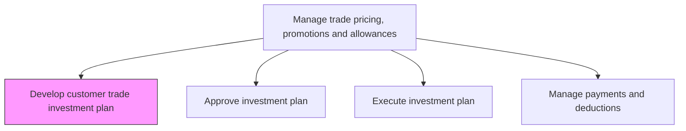
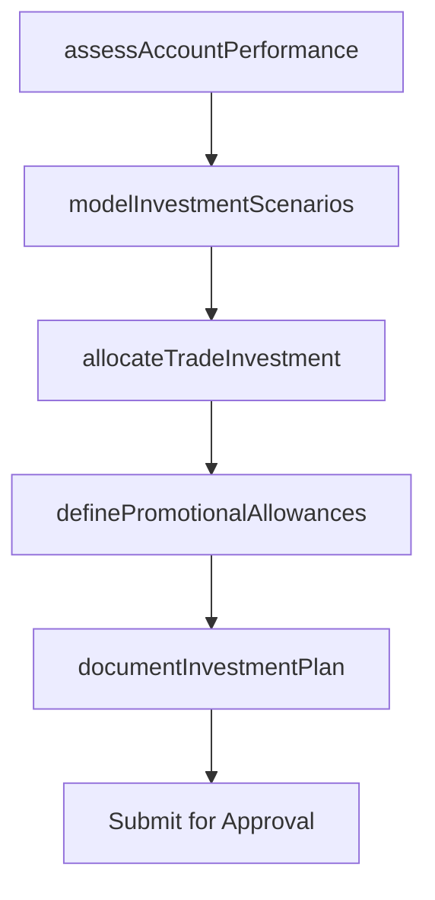

# Develop customer trade investment plan

> Business-as-Code definition for trade investment planning. Models the creation of investment plans that allocate trade spending across customer accounts, channels, and promotional programs to maximize return on trade investment.

## Overview

Creating a structured plan for allocating trade spending across retail and distribution partners. Define investment levels, promotional allowances, and co-marketing budgets for each key account based on historical performance, growth potential, and strategic importance. Balance trade investment across customer tiers to maximize sell-through, market share, and mutual profitability.

## Process Hierarchy



## GraphDL

```yaml
develop:
  object: Customer Trade Investment Plan
  actor: TradeMarketingManager
  result: TradeInvestmentPlan
```

## Actions

| Action | Description |
|--------|-------------|
| assessAccountPerformance | Evaluate historical trade spend ROI and sales performance for each key account |
| allocateTradeInvestment | Distribute trade spending budget across accounts based on potential and strategic value |
| definePromotionalAllowances | Establish co-op advertising, slotting fees, and promotional allowance levels per account |
| modelInvestmentScenarios | Project expected returns under different trade investment allocation scenarios |
| documentInvestmentPlan | Formalize the trade investment plan with account-level detail and approval requirements |

## Events

| Event | Description |
|-------|-------------|
| accountPerformanceAssessed | Historical trade performance evaluated for all key accounts |
| tradeInvestmentAllocated | Budget distributed across accounts and programs |
| promotionalAllowancesDefined | Co-op, slotting, and promotional allowance levels established |
| investmentScenariosModeled | ROI projections completed for investment allocation options |
| investmentPlanDocumented | Trade investment plan formalized and ready for approval |

## Searches

| Search | Description |
|--------|-------------|
| getTradeInvestmentPlan | Retrieve current trade investment plan by account or period |
| getAccountAllocation | Query trade spending allocation for a specific account |
| getInvestmentROI | Access return on trade investment data by account or program |

## Process Flow



## RACI Matrix

| Activity | Responsible | Accountable | Consulted | Informed |
|----------|-------------|-------------|-----------|----------|
| assessAccountPerformance | TradeMarketingAnalyst | TradeMarketingManager | Sales | Finance |
| allocateTradeInvestment | TradeMarketingManager | VP Sales | Finance | KeyAccountManagers |
| definePromotionalAllowances | TradeMarketingManager | VP Sales | Legal | ChannelManagers |
| documentInvestmentPlan | TradeMarketingManager | VP Sales | Finance | CMO |

## Related Processes

| Process | Relationship |
|---------|-------------|
| 3.3.6.2 Approve investment plan | Downstream - developed plan is submitted for approval |
| 3.3.4.2 Determine corporate incentives | Upstream - corporate incentive strategy guides trade investment |
| 3.3.6.6 Analyze customer profitability | Parallel - profitability data informs investment allocation |

## Related Departments

| Department | Role |
|-----------|------|
| Trade Marketing | Leads investment plan development and account allocation |
| Sales | Provides account-level performance data and growth forecasts |
| Finance | Validates budget availability and investment ROI projections |
| Key Account Management | Contributes account-specific needs and growth opportunities |

## Related Occupations

| Occupation | Involvement |
|-----------|-------------|
| Trade Marketing Manager | Develops and owns the trade investment plan |
| Trade Marketing Analyst | Analyzes account performance and models investment scenarios |
| Key Account Manager | Provides account-level input and negotiates trade terms |

## KPIs

| KPI | Description | Unit |
|-----|-------------|------|
| Trade Investment ROI | Revenue return per dollar of trade investment | Ratio |
| Account Coverage | Percentage of key accounts with defined trade investment plans | % |
| Plan Accuracy | Variance between planned and actual trade investment spend | % |
| Investment-to-Revenue Ratio | Trade investment as percentage of account revenue | % |

## Usage

```typescript
import { developCustomerTradeInvestmentPlan } from '@headlessly/develop-customer-trade-investment-plan'

const tradePlan = developCustomerTradeInvestmentPlan()

// Assess account performance for investment planning
const performance = await tradePlan.assessAccountPerformance({
  accounts: ['retailer-a', 'distributor-b', 'wholesale-c'],
  period: 'last-12-months',
  metrics: ['sell-through', 'trade-roi', 'market-share-contribution']
})

// Allocate trade investment across accounts
const allocation = await tradePlan.allocateTradeInvestment({
  totalBudget: 5000000,
  accounts: performance.rankedAccounts,
  allocationMethod: 'performance-weighted',
  minimumInvestment: 50000
})
```
