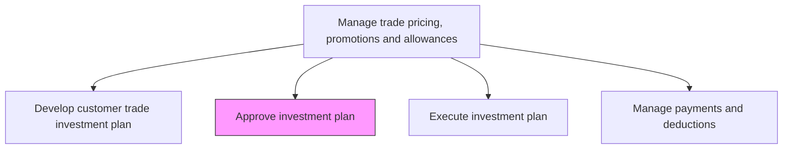
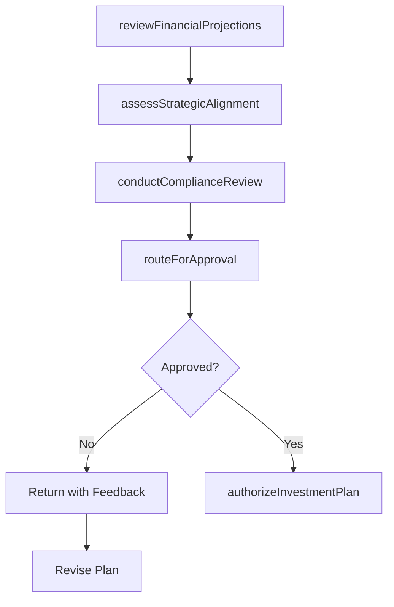

# Approve investment plan

> Business-as-Code definition for trade investment plan approval. Models the review, validation, and authorization workflow for customer trade investment plans including financial scrutiny, compliance checks, and executive sign-off.

## Overview

Reviewing and authorizing the customer trade investment plan through a structured approval process. Validate financial projections, ensure alignment with corporate strategy and budget constraints, conduct compliance reviews, and obtain executive authorization before trade spending commitments are made to channel partners and retail accounts.

## Process Hierarchy



## GraphDL

```yaml
approve:
  object: Investment Plan
  actor: VP Sales
  result: ApprovedInvestmentPlan
```

## Actions

| Action | Description |
|--------|-------------|
| reviewFinancialProjections | Validate ROI projections, budget alignment, and margin impact of the proposed trade investment |
| assessStrategicAlignment | Confirm that the investment plan supports corporate growth priorities and channel strategy |
| conductComplianceReview | Verify that proposed trade terms comply with legal, regulatory, and anti-trust requirements |
| routeForApproval | Submit the investment plan through the appropriate approval hierarchy based on spend levels |
| authorizeInvestmentPlan | Grant final executive approval and release budget for trade investment execution |

## Events

| Event | Description |
|-------|-------------|
| financialProjectionsReviewed | ROI and budget alignment validated for the trade investment plan |
| strategicAlignmentAssessed | Investment plan confirmed as aligned with corporate strategy |
| complianceReviewConducted | Legal and regulatory compliance verified for trade terms |
| approvalRouted | Investment plan submitted through the approval workflow |
| investmentPlanAuthorized | Executive approval granted and budget released |

## Searches

| Search | Description |
|--------|-------------|
| getApprovalStatus | Retrieve current approval status of trade investment plans |
| getPendingApprovals | Query investment plans awaiting review or approval |
| getApprovalHistory | Access historical approval records and decision rationale |

## Process Flow



## RACI Matrix

| Activity | Responsible | Accountable | Consulted | Informed |
|----------|-------------|-------------|-----------|----------|
| reviewFinancialProjections | FinancialAnalyst | CFO | TradeMarketingManager | VP Sales |
| assessStrategicAlignment | VP Sales | CMO | StrategyDirector | TradeMarketingManager |
| conductComplianceReview | Legal | GeneralCounsel | TradeMarketingManager | Finance |
| authorizeInvestmentPlan | VP Sales | CMO | CFO | ExecutiveTeam |

## Related Processes

| Process | Relationship |
|---------|-------------|
| 3.3.6.1 Develop customer trade investment plan | Upstream - the developed plan is the input for approval |
| 3.3.6.3 Execute investment plan | Downstream - approved plan is released for execution |
| 9.5.1 Plan and manage capital projects | Parallel - trade investments follow similar capital approval processes |

## Related Departments

| Department | Role |
|-----------|------|
| Finance | Reviews financial projections and validates budget alignment |
| Legal | Conducts compliance review of trade terms and conditions |
| Sales Leadership | Assesses strategic fit and authorizes investment commitments |
| Trade Marketing | Presents the plan and addresses review feedback |

## Related Occupations

| Occupation | Involvement |
|-----------|-------------|
| VP Sales | Provides final authorization for trade investment plans |
| Financial Analyst | Validates ROI projections and budget impact |
| Legal Counsel | Reviews compliance of trade terms and allowances |

## KPIs

| KPI | Description | Unit |
|-----|-------------|------|
| Approval Cycle Time | Average time from plan submission to final authorization | Days |
| First-Pass Approval Rate | Percentage of investment plans approved without revision | % |
| Budget Compliance Rate | Percentage of approved plans within budget parameters | % |
| Approval Bottleneck Index | Average time spent at each approval stage | Days |

## Usage

```typescript
import { approveInvestmentPlan } from '@headlessly/approve-investment-plan'

const approval = approveInvestmentPlan()

// Review financial projections for a trade investment plan
const review = await approval.reviewFinancialProjections({
  planId: 'trade-invest-2026-q3',
  validations: ['roi-threshold', 'budget-alignment', 'margin-impact'],
  thresholds: { minROI: 2.0, maxBudgetVariance: 0.05 }
})

// Route plan for executive approval
const routing = await approval.routeForApproval({
  planId: 'trade-invest-2026-q3',
  approvers: ['vp-sales', 'cfo'],
  urgency: 'standard',
  deadline: '2026-06-15'
})
```
