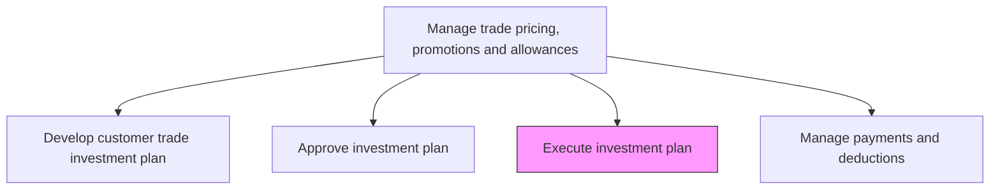
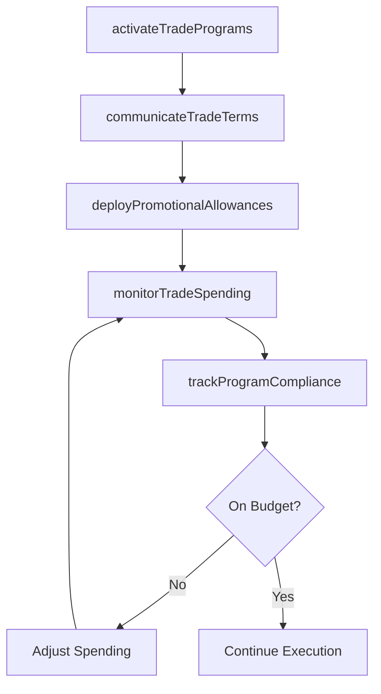

# Execute investment plan

> Business-as-Code definition for trade investment plan execution. Models the deployment of approved trade spending across accounts, tracking of promotional allowances, and monitoring of trade program performance.

## Overview

Implementing the approved customer trade investment plan by activating trade programs, deploying promotional allowances, and managing the day-to-day execution of trade spending commitments. Coordinate with sales teams and channel partners to ensure trade investments are deployed according to plan, promotional materials are distributed, and trade terms are properly communicated and enforced.

## Process Hierarchy



## GraphDL

```yaml
execute:
  object: Investment Plan
  actor: TradeMarketingManager
  result: ExecutedTradeProgram
```

## Actions

| Action | Description |
|--------|-------------|
| activateTradePrograms | Launch approved trade promotion programs with channel partners and retail accounts |
| deployPromotionalAllowances | Distribute co-op funds, slotting fees, and promotional allowances to qualifying accounts |
| communicateTradeTerms | Brief sales teams and account managers on trade program details, terms, and conditions |
| monitorTradeSpending | Track actual trade spending against plan and flag variances requiring attention |
| trackProgramCompliance | Verify that channel partners are fulfilling their obligations under trade agreements |

## Events

| Event | Description |
|-------|-------------|
| tradeProgramsActivated | Trade promotion programs launched with designated accounts |
| promotionalAllowancesDeployed | Co-op and promotional funds distributed to qualifying partners |
| tradeTermsCommunicated | Sales teams and account managers briefed on trade program details |
| tradeSpendingMonitored | Actual spending tracked and variances flagged |
| programComplianceTracked | Partner compliance with trade agreement terms verified |

## Searches

| Search | Description |
|--------|-------------|
| getActiveTradePrograms | Retrieve currently active trade promotion programs |
| getTradeSpendingStatus | Query actual versus planned trade spending by account |
| getComplianceStatus | Access partner compliance status for trade programs |

## Process Flow



## RACI Matrix

| Activity | Responsible | Accountable | Consulted | Informed |
|----------|-------------|-------------|-----------|----------|
| activateTradePrograms | TradeMarketingManager | VP Sales | KeyAccountManagers | Finance |
| deployPromotionalAllowances | TradeMarketingOperations | TradeMarketingManager | Finance | AccountsPayable |
| monitorTradeSpending | TradeMarketingAnalyst | TradeMarketingManager | Finance | VP Sales |
| trackProgramCompliance | TradeMarketingAnalyst | TradeMarketingManager | Legal | Sales |

## Related Processes

| Process | Relationship |
|---------|-------------|
| 3.3.6.2 Approve investment plan | Upstream - approved plan triggers execution |
| 3.3.6.4 Manage payments and deductions | Downstream - execution generates payment obligations |
| 3.3.6.5 Evaluate and manage event performance | Downstream - execution data feeds event performance evaluation |

## Related Departments

| Department | Role |
|-----------|------|
| Trade Marketing | Leads trade program activation and spending oversight |
| Sales | Executes trade programs with key accounts |
| Finance | Monitors trade spending against budget |
| Accounts Payable | Processes trade-related payments and allowances |

## Related Occupations

| Occupation | Involvement |
|-----------|-------------|
| Trade Marketing Manager | Oversees program activation and spending compliance |
| Key Account Manager | Executes trade terms with assigned accounts |
| Trade Marketing Analyst | Monitors spending and tracks program compliance |

## KPIs

| KPI | Description | Unit |
|-----|-------------|------|
| Budget Adherence | Percentage of trade spending within approved budget | % |
| Program Activation Rate | Percentage of planned trade programs successfully launched | % |
| Partner Compliance Rate | Percentage of partners meeting trade agreement obligations | % |
| Execution Timeliness | Percentage of trade programs activated on schedule | % |

## Usage

```typescript
import { executeInvestmentPlan } from '@headlessly/execute-investment-plan'

const tradeExecution = executeInvestmentPlan()

// Activate trade programs for key accounts
const programs = await tradeExecution.activateTradePrograms({
  planId: 'trade-invest-2026-q3',
  accounts: ['retailer-a', 'distributor-b'],
  programTypes: ['co-op-advertising', 'volume-rebate', 'display-allowance'],
  startDate: '2026-07-01'
})

// Monitor trade spending against plan
const spending = await tradeExecution.monitorTradeSpending({
  planId: 'trade-invest-2026-q3',
  period: 'current-quarter',
  alertThreshold: 0.1,
  groupBy: 'account'
})
```
