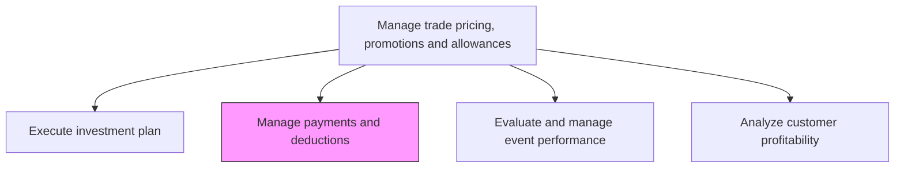
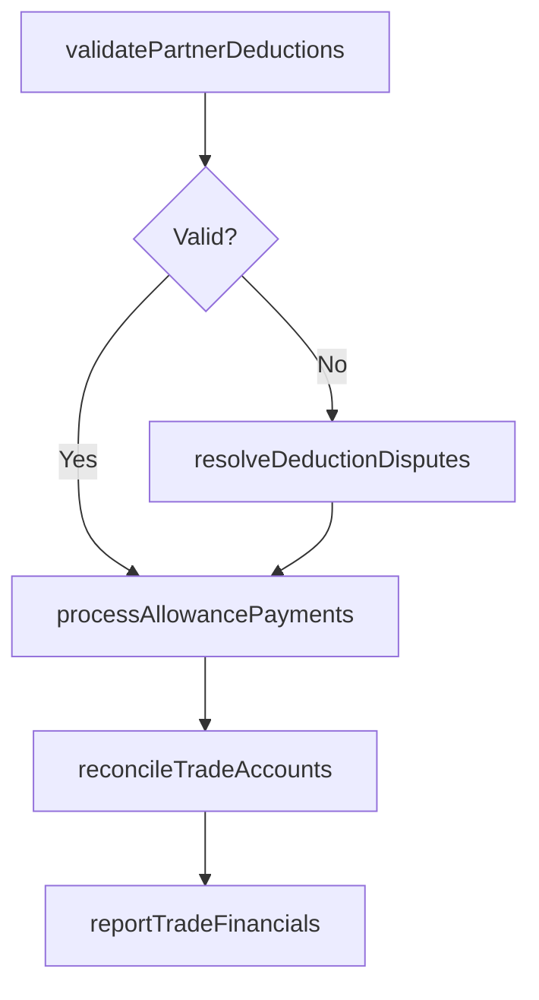

# Manage payments and deductions

> Business-as-Code definition for trade payment and deduction management. Models the processing, validation, and reconciliation of trade-related payments, deductions, and claims from channel partners.

## Overview

Processing and reconciling trade-related payments, deductions, and claims from channel partners and retail accounts. Validate that deductions taken by partners match approved trade agreements, resolve disputed claims, process earned allowances and rebate payments, and maintain accurate records of all trade financial transactions.

## Process Hierarchy



## GraphDL

```yaml
manage:
  object: Payments And Deductions
  actor: TradeFinanceManager
  result: ReconciledTradeAccount
```

## Actions

| Action | Description |
|--------|-------------|
| validatePartnerDeductions | Verify that deductions taken by channel partners match approved trade agreement terms |
| processAllowancePayments | Calculate and issue earned co-op, rebate, and promotional allowance payments |
| resolveDeductionDisputes | Investigate and resolve disputed deductions through documentation review and partner negotiation |
| reconcileTradeAccounts | Match trade payments and deductions against approved programs to ensure accurate accounting |
| reportTradeFinancials | Generate financial reports on trade spending, deductions, and outstanding claims |

## Events

| Event | Description |
|-------|-------------|
| partnerDeductionsValidated | Channel partner deductions verified against approved trade terms |
| allowancePaymentsProcessed | Earned allowance and rebate payments issued to partners |
| deductionDisputesResolved | Disputed deductions investigated and settled |
| tradeAccountsReconciled | Trade payments and deductions matched against approved programs |
| tradeFinancialsReported | Trade financial reports generated and distributed |

## Searches

| Search | Description |
|--------|-------------|
| getDeductionStatus | Retrieve status of partner deductions by account or program |
| getOpenClaims | Query outstanding trade claims and disputes |
| getTradeAccountBalance | Access trade account reconciliation status by partner |

## Process Flow



## RACI Matrix

| Activity | Responsible | Accountable | Consulted | Informed |
|----------|-------------|-------------|-----------|----------|
| validatePartnerDeductions | TradeFinanceAnalyst | TradeFinanceManager | Sales | AccountsReceivable |
| processAllowancePayments | AccountsPayable | TradeFinanceManager | TradeMarketing | Finance |
| resolveDeductionDisputes | TradeFinanceAnalyst | TradeFinanceManager | Legal | KeyAccountManagers |
| reconcileTradeAccounts | TradeFinanceAnalyst | TradeFinanceManager | Finance | VP Sales |

## Related Processes

| Process | Relationship |
|---------|-------------|
| 3.3.6.3 Execute investment plan | Upstream - execution generates payment obligations |
| 3.3.6.6 Analyze customer profitability | Downstream - trade payment data feeds profitability analysis |
| 9.3.3 Process accounts payable | Parallel - trade payments flow through standard AP processes |

## Related Departments

| Department | Role |
|-----------|------|
| Trade Finance | Leads deduction validation and trade account reconciliation |
| Accounts Payable | Processes trade-related payments to partners |
| Accounts Receivable | Manages deductions taken against invoices |
| Sales | Assists with deduction dispute resolution and partner communication |

## Related Occupations

| Occupation | Involvement |
|-----------|-------------|
| Trade Finance Manager | Oversees payment processing and deduction management |
| Trade Finance Analyst | Validates deductions and reconciles trade accounts |
| Accounts Payable Specialist | Processes trade allowance payments |

## KPIs

| KPI | Description | Unit |
|-----|-------------|------|
| Deduction Resolution Time | Average time to validate or resolve partner deductions | Days |
| Invalid Deduction Rate | Percentage of partner deductions that fail validation | % |
| Reconciliation Accuracy | Percentage of trade accounts reconciled without discrepancies | % |
| Outstanding Claims Aging | Average age of unresolved trade claims | Days |

## Usage

```typescript
import { managePaymentsAndDeductions } from '@headlessly/manage-payments-and-deductions'

const tradePayments = managePaymentsAndDeductions()

// Validate partner deductions against approved trade terms
const validation = await tradePayments.validatePartnerDeductions({
  partnerId: 'retailer-a',
  deductions: [
    { invoiceId: 'INV-2026-001', amount: 15000, claimType: 'co-op-advertising' },
    { invoiceId: 'INV-2026-002', amount: 8000, claimType: 'volume-rebate' }
  ]
})

// Reconcile trade accounts
const reconciliation = await tradePayments.reconcileTradeAccounts({
  period: '2026-q2',
  accounts: ['retailer-a', 'distributor-b'],
  includeDisputed: true
})
```
