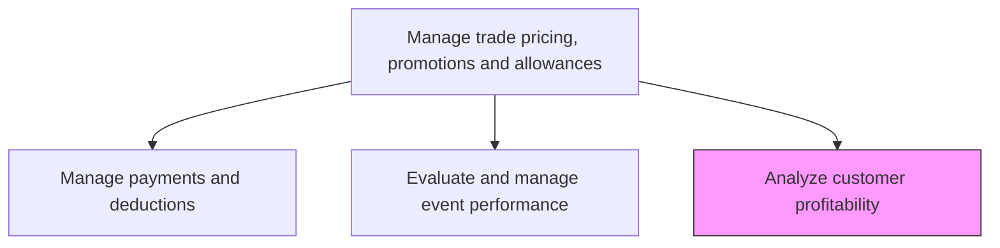
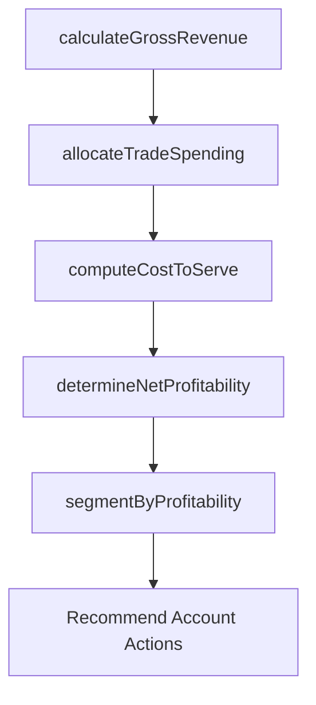

# Analyze customer profitability

> Business-as-Code definition for customer profitability analysis. Models the calculation and assessment of net profitability per customer account after accounting for trade spending, discounts, allowances, and cost-to-serve.

## Overview

Calculating the true profitability of each customer account by factoring in trade spending, promotional allowances, discounts, deductions, and cost-to-serve alongside revenue. Identify which accounts generate sustainable profit, which are marginally profitable, and which are unprofitable. Use profitability insights to guide future trade investment allocation, pricing decisions, and account strategy.

## Process Hierarchy



## GraphDL

```yaml
analyze:
  object: Customer Profitability
  actor: TradeFinanceAnalyst
  result: CustomerProfitabilityReport
```

## Actions

| Action | Description |
|--------|-------------|
| calculateGrossRevenue | Compile total revenue per customer account across all products and channels |
| allocateTradeSpending | Attribute trade investment, allowances, and promotional costs to individual customer accounts |
| computeCostToServe | Calculate the total cost to serve each customer including logistics, support, and administration |
| determineNetProfitability | Calculate net profit per account by subtracting all costs and trade investments from revenue |
| segmentByProfitability | Categorize customers into profitability tiers and identify accounts requiring strategic action |

## Events

| Event | Description |
|-------|-------------|
| grossRevenueCalculated | Total revenue compiled per customer account |
| tradeSpendingAllocated | Trade costs and allowances attributed to individual accounts |
| costToServeComputed | Per-account cost-to-serve calculations completed |
| netProfitabilityDetermined | Net profit calculated for each customer account |
| profitabilitySegmented | Customers categorized into profitability tiers |

## Searches

| Search | Description |
|--------|-------------|
| getCustomerProfitability | Retrieve net profitability data by customer account |
| getProfitabilityTrends | Query profitability trends over time for specific accounts |
| getUnprofitableAccounts | Access list of accounts below profitability thresholds |

## Process Flow



## RACI Matrix

| Activity | Responsible | Accountable | Consulted | Informed |
|----------|-------------|-------------|-----------|----------|
| calculateGrossRevenue | TradeFinanceAnalyst | TradeFinanceManager | AccountsReceivable | Sales |
| allocateTradeSpending | TradeFinanceAnalyst | TradeFinanceManager | TradeMarketing | Finance |
| determineNetProfitability | TradeFinanceAnalyst | TradeFinanceManager | Finance | VP Sales |
| segmentByProfitability | TradeFinanceManager | VP Sales | Marketing | ExecutiveTeam |

## Related Processes

| Process | Relationship |
|---------|-------------|
| 3.3.6.4 Manage payments and deductions | Upstream - trade payment data feeds profitability calculations |
| 3.3.6.1 Develop customer trade investment plan | Downstream - profitability data guides investment allocation |
| 3.3.7.1 Determine customer lifetime value | Parallel - profitability and CLV together inform customer strategy |

## Related Departments

| Department | Role |
|-----------|------|
| Trade Finance | Leads profitability analysis and cost attribution |
| Finance | Provides revenue data and validates cost calculations |
| Sales | Contributes account context and acts on profitability insights |
| Trade Marketing | Adjusts trade investment based on profitability findings |

## Related Occupations

| Occupation | Involvement |
|-----------|-------------|
| Trade Finance Analyst | Performs profitability calculations and account analysis |
| Financial Analyst | Validates revenue and cost data inputs |
| Key Account Manager | Acts on profitability insights to improve account economics |

## KPIs

| KPI | Description | Unit |
|-----|-------------|------|
| Net Customer Profit | Average net profit per customer after all trade costs | Currency |
| Profitable Account Ratio | Percentage of customer accounts that are net profitable | % |
| Trade Spend to Revenue Ratio | Trade investment as percentage of customer revenue | % |
| Profitability Improvement Rate | Year-over-year improvement in average customer profitability | % |

## Usage

```typescript
import { analyzeCustomerProfitability } from '@headlessly/analyze-customer-profitability'

const profitability = analyzeCustomerProfitability()

// Determine net profitability for key accounts
const netProfit = await profitability.determineNetProfitability({
  accounts: ['retailer-a', 'distributor-b', 'wholesale-c'],
  period: 'fiscal-year-2025',
  includeCosts: ['trade-spend', 'logistics', 'support', 'returns']
})

// Segment accounts by profitability tier
const segments = await profitability.segmentByProfitability({
  analysisId: netProfit.id,
  tiers: ['high-profit', 'moderate-profit', 'breakeven', 'unprofitable'],
  thresholds: { highProfit: 100000, moderate: 25000, breakeven: 0 }
})
```
