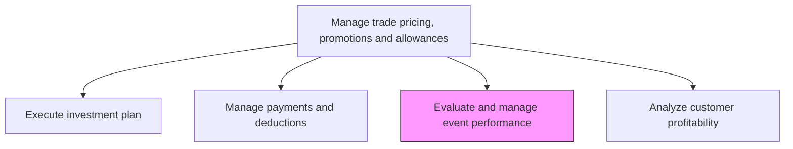
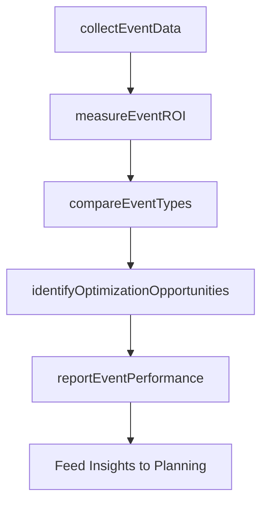

# Evaluate and manage event performance

> Business-as-Code definition for trade event performance management. Models the assessment of trade promotion events, measurement of ROI, and optimization of future event planning based on performance data.

## Overview

Measuring and managing the effectiveness of trade promotion events including in-store displays, trade shows, co-marketed campaigns, and promotional events. Collect event performance data, evaluate return on trade investment for individual events, identify high-performing and underperforming event types, and use insights to optimize future trade event planning and resource allocation.

## Process Hierarchy



## GraphDL

```yaml
evaluate:
  object: And Manage Event Performance
  actor: TradeMarketingAnalyst
  result: EventPerformanceReport
```

## Actions

| Action | Description |
|--------|-------------|
| collectEventData | Gather sales lift, foot traffic, and engagement data from trade promotion events |
| measureEventROI | Calculate return on investment for each trade event comparing costs to incremental revenue |
| compareEventTypes | Benchmark performance across different event categories and formats |
| identifyOptimizationOpportunities | Pinpoint event attributes that drive highest performance for future planning |
| reportEventPerformance | Produce event performance summaries with recommendations for future trade event strategy |

## Events

| Event | Description |
|-------|-------------|
| eventDataCollected | Trade event performance data gathered from all participating locations |
| eventROIMeasured | Return on investment calculated for each trade promotion event |
| eventTypesCompared | Performance benchmarked across event categories and formats |
| optimizationOpportunitiesIdentified | High-impact event attributes identified for future planning |
| eventPerformanceReported | Event performance summaries and recommendations published |

## Searches

| Search | Description |
|--------|-------------|
| getEventPerformance | Retrieve performance metrics for trade events by type or period |
| getEventROI | Query return on investment data for specific trade events |
| getEventBenchmarks | Access performance benchmarks across event categories |

## Process Flow



## RACI Matrix

| Activity | Responsible | Accountable | Consulted | Informed |
|----------|-------------|-------------|-----------|----------|
| collectEventData | TradeMarketingAnalyst | TradeMarketingManager | Sales | KeyAccountManagers |
| measureEventROI | TradeMarketingAnalyst | TradeMarketingManager | Finance | VP Sales |
| identifyOptimizationOpportunities | TradeMarketingManager | VP Sales | MarketResearch | CMO |
| reportEventPerformance | TradeMarketingAnalyst | TradeMarketingManager | Marketing | ExecutiveTeam |

## Related Processes

| Process | Relationship |
|---------|-------------|
| 3.3.6.3 Execute investment plan | Upstream - executed trade programs generate event data |
| 3.3.6.1 Develop customer trade investment plan | Downstream - event insights inform future investment planning |
| 3.3.5.6 Evaluate promotional performance metrics | Parallel - trade event metrics complement promotional evaluation |

## Related Departments

| Department | Role |
|-----------|------|
| Trade Marketing | Leads event performance analysis and optimization |
| Sales | Provides field-level event data and qualitative feedback |
| Finance | Validates ROI calculations and cost attribution |
| Market Research | Supports event impact analysis with market data |

## Related Occupations

| Occupation | Involvement |
|-----------|-------------|
| Trade Marketing Analyst | Collects event data and produces performance analyses |
| Trade Marketing Manager | Reviews event performance and guides optimization strategy |
| Key Account Manager | Provides partner-level event feedback and co-planning input |

## KPIs

| KPI | Description | Unit |
|-----|-------------|------|
| Event ROI | Average return on investment across trade promotion events | Ratio |
| Sales Lift per Event | Incremental sales generated per trade event versus baseline | % |
| Event Cost Efficiency | Average cost per unit of incremental sales from events | Currency |
| Event Optimization Rate | Percentage of events with year-over-year performance improvement | % |

## Usage

```typescript
import { evaluateAndManageEventPerformance } from '@headlessly/evaluate-and-manage-event-performance'

const eventPerf = evaluateAndManageEventPerformance()

// Measure ROI for trade promotion events
const roi = await eventPerf.measureEventROI({
  events: ['in-store-display-q2', 'trade-show-june', 'co-branded-campaign'],
  costs: { media: true, materials: true, labor: true },
  revenueAttribution: 'incremental-sales-lift'
})

// Compare event types for optimization
const comparison = await eventPerf.compareEventTypes({
  categories: ['in-store-display', 'trade-show', 'digital-co-op', 'sampling-event'],
  period: 'last-12-months',
  metrics: ['roi', 'sales-lift', 'cost-per-engagement']
})
```
