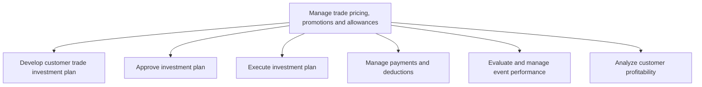
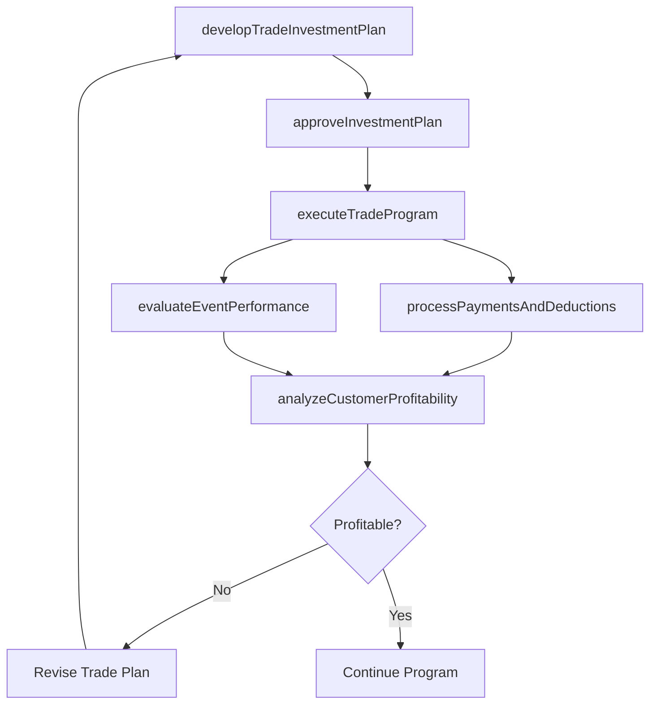

# Manage trade pricing, promotions and allowances

> Business-as-Code definition for trade pricing and promotion management. Models the planning, approval, execution, payment processing, and performance analysis of trade investments including volume discounts, promotional allowances, and customer-specific pricing programs.

## Overview

Managing the pricing, promotional programs, and allowances offered to trade customers including distributors, wholesalers, and retail partners. Develop investment plans that define trade spend allocations, obtain internal approvals, execute trade programs, process payments and deductions, evaluate trade event performance, and analyze customer profitability to optimize trade investment returns.

## Process Hierarchy



## GraphDL

```yaml
manage:
  object: Trade Pricing, Promotions And Allowances
  actor: TradeMarketingManager
  result: TradeInvestmentReport
```

## Actions

| Action | Description |
|--------|-------------|
| developTradeInvestmentPlan | Create trade spend allocation plans for each customer or channel |
| approveInvestmentPlan | Route trade investment plans through internal approval workflows |
| executeTradeProgram | Implement approved trade pricing, promotions, and allowance programs |
| processPaymentsAndDeductions | Handle trade payments, invoice deductions, and settlement claims |
| evaluateEventPerformance | Assess trade promotion effectiveness and return on investment |
| analyzeCustomerProfitability | Calculate net profitability by customer after trade deductions |

## Events

| Event | Description |
|-------|-------------|
| tradeInvestmentPlanDeveloped | Customer trade investment plan created and submitted |
| investmentPlanApproved | Trade investment plan received internal approval |
| tradeProgramExecuted | Trade pricing and promotional programs launched |
| paymentsProcessed | Trade payments and deductions settled |
| eventPerformanceEvaluated | Trade event ROI and effectiveness metrics reported |
| customerProfitabilityAnalyzed | Net customer profitability report delivered |

## Searches

| Search | Description |
|--------|-------------|
| getTradeInvestmentPlan | Retrieve trade investment plans by customer or channel |
| getTradeDeductions | Query trade deduction claims and settlement status |
| getTradeEventResults | Access trade promotion event performance data |
| getCustomerProfitability | Retrieve net profitability analysis by trade customer |

## Process Flow



## RACI Matrix

| Activity | Responsible | Accountable | Consulted | Informed |
|----------|-------------|-------------|-----------|----------|
| developTradeInvestmentPlan | TradeMarketingManager | VP Sales | Finance | Sales |
| approveInvestmentPlan | VP Sales | CFO | Legal | TradeMarketing |
| executeTradeProgram | TradeMarketingManager | VP Sales | SalesOperations | Finance |
| processPaymentsAndDeductions | AccountsPayableManager | CFO | TradeMarketing | Sales |
| analyzeCustomerProfitability | FinancialAnalyst | CFO | TradeMarketing | ExecutiveTeam |

## Sub-Processes

| ID | Name | Description |
|----|------|-------------|
| 3.3.6.1 | Develop customer trade investment plan | Creating trade spend allocation plans that define volume discounts, promotional allowances, and placement fees for each trade customer or channel. |
| 3.3.6.2 | Approve investment plan | Routing trade investment plans through internal approval workflows to secure authorization from sales, finance, and executive leadership. |
| 3.3.6.3 | Execute investment plan | Implementing approved trade pricing programs, promotional allowances, and volume incentive schedules across trade customer accounts. |
| 3.3.6.4 | Manage payments and deductions | Processing trade payments, reconciling invoice deductions, and settling allowance claims between the organization and trade customers. |
| 3.3.6.5 | Evaluate and manage event performance | Assessing trade promotion event effectiveness by measuring incremental volume, revenue lift, and return on trade investment. |
| 3.3.6.6 | Analyze customer profitability | Calculating net profitability by trade customer after accounting for trade spend, deductions, allowances, and cost of goods sold. |

## Related Processes

| Process | Relationship |
|---------|-------------|
| 3.3.4 Develop and manage pricing | Parallel - trade pricing must align with consumer pricing |
| 3.3.5 Develop and manage promotional activities | Parallel - trade and consumer promotions must be coordinated |
| 3.4.2 Develop sales partner/alliance relationships | Upstream - partner agreements define trade terms |
| 3.4.4 Establish overall sales budgets | Upstream - sales budgets fund trade investments |

## Related Departments

| Department | Role |
|-----------|------|
| Trade Marketing | Designs and manages trade investment programs |
| Finance | Approves trade spend and monitors profitability |
| Accounts Payable | Processes trade payments and deduction claims |
| Sales | Manages trade customer relationships and program execution |
| Revenue Management | Ensures trade pricing aligns with revenue targets |

## Related Occupations

| Occupation | Involvement |
|-----------|-------------|
| Trade Marketing Manager | Plans and executes trade investment programs |
| Revenue Analyst | Analyzes trade deductions and customer profitability |
| Account Manager | Manages trade customer relationships and program delivery |
| Financial Controller | Oversees trade payment accuracy and compliance |

## KPIs

| KPI | Description | Unit |
|-----|-------------|------|
| Trade Spend as Percentage of Revenue | Total trade investment relative to gross revenue | % |
| Trade Promotion ROI | Incremental revenue generated per dollar of trade spend | Ratio |
| Deduction Resolution Rate | Percentage of trade deductions resolved within SLA | % |
| Customer Net Profitability | Revenue minus trade spend and cost of goods per customer | USD |
| Trade Program Compliance | Percentage of trade programs executed per plan | % |

## Usage

```typescript
import { manageTradePricingPromotionsAndAllowances } from '@headlessly/manage-trade-pricing-promotions-and-allowances'

const trade = manageTradePricingPromotionsAndAllowances()

// Develop trade investment plan for a key retailer
const plan = await trade.developTradeInvestmentPlan({
  customer: 'major-retailer-001',
  period: 'FY2026',
  categories: ['volume-discounts', 'promotional-allowances', 'placement-fees'],
  totalBudget: 500000
})

// Analyze customer profitability after trade deductions
const profitability = await trade.analyzeCustomerProfitability({
  customerId: 'major-retailer-001',
  period: 'Q1-2026',
  includeDeductions: true
})
```
