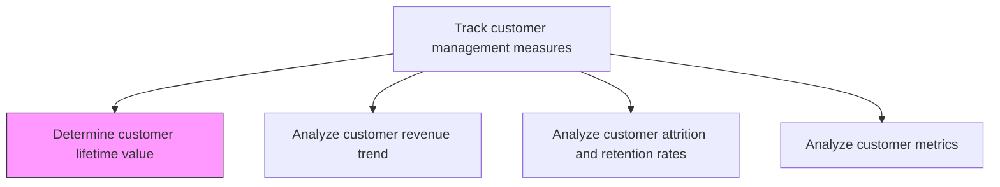
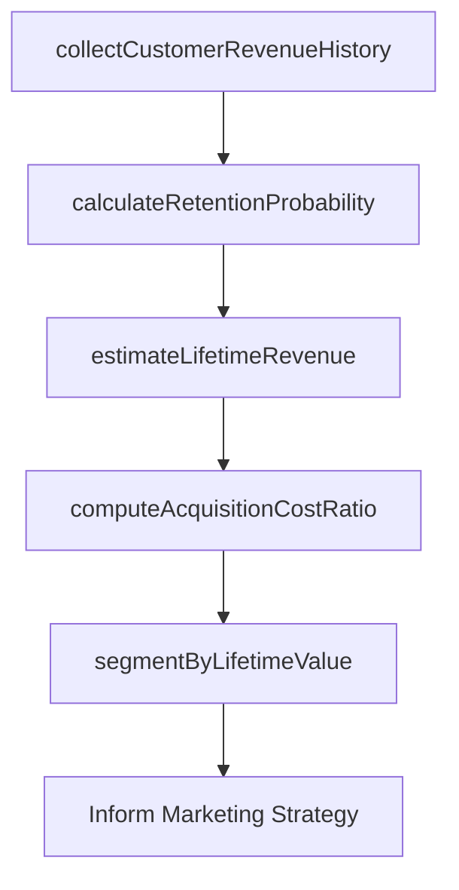

# Determine customer lifetime value

> Business-as-Code definition for customer lifetime value calculation. Models the estimation of the total revenue contribution a customer is expected to generate over the entire duration of their relationship with the organization.

## Overview

Estimating customer loyalty and the average contribution made by them to revenues, over their lifespan. Use metrics to quantify the commitment of customers to the offerings of the organization, such as measures of tendency to switch brands/providers, number/proportion of return customers, and the number of customers using multiple substitutable offerings.

## Process Hierarchy



## GraphDL

```yaml
determine:
  object: Customer Lifetime Value
  actor: CustomerAnalyticsManager
  result: CustomerLifetimeValueModel
```

## Actions

| Action | Description |
|--------|-------------|
| collectCustomerRevenueHistory | Gather historical revenue data per customer including purchase frequency, average order value, and tenure |
| calculateRetentionProbability | Model the likelihood of a customer remaining active over future periods |
| estimateLifetimeRevenue | Project total expected revenue per customer based on historical patterns and retention probability |
| computeAcquisitionCostRatio | Compare customer lifetime value against customer acquisition cost to assess investment efficiency |
| segmentByLifetimeValue | Categorize customers into value tiers to guide marketing investment and service levels |

## Events

| Event | Description |
|-------|-------------|
| customerRevenueHistoryCollected | Historical revenue data gathered for CLV calculation |
| retentionProbabilityCalculated | Customer retention likelihood modeled for future periods |
| lifetimeRevenueEstimated | Total expected revenue projected per customer |
| acquisitionCostRatioComputed | CLV-to-CAC ratio calculated for investment assessment |
| lifetimeValueSegmented | Customers categorized into value tiers |

## Searches

| Search | Description |
|--------|-------------|
| getCustomerCLV | Retrieve lifetime value estimate for a specific customer or segment |
| getCLVDistribution | Query the distribution of CLV across the customer base |
| getCLVTrends | Access CLV trends over time by segment or cohort |

## Process Flow



## RACI Matrix

| Activity | Responsible | Accountable | Consulted | Informed |
|----------|-------------|-------------|-----------|----------|
| collectCustomerRevenueHistory | CustomerAnalyticsAnalyst | CustomerAnalyticsManager | CRM | Finance |
| calculateRetentionProbability | DataScientist | CustomerAnalyticsManager | CustomerSuccess | Marketing |
| estimateLifetimeRevenue | DataScientist | CustomerAnalyticsManager | Finance | VP Marketing |
| segmentByLifetimeValue | CustomerAnalyticsManager | VP Marketing | Sales | CMO |

## Related Processes

| Process | Relationship |
|---------|-------------|
| 3.3.7.2 Analyze customer revenue trend | Parallel - revenue trends feed CLV projections |
| 3.3.7.3 Analyze customer attrition and retention rates | Upstream - retention rates are a key CLV input |
| 3.3.6.6 Analyze customer profitability | Parallel - CLV and profitability together guide customer strategy |

## Related Departments

| Department | Role |
|-----------|------|
| Customer Analytics | Leads CLV modeling and customer segmentation |
| Data Science | Builds predictive models for retention and revenue projection |
| Marketing | Uses CLV segments to allocate acquisition and retention budgets |
| Finance | Validates revenue projections and cost calculations |

## Related Occupations

| Occupation | Involvement |
|-----------|-------------|
| Customer Analytics Manager | Oversees CLV program and strategic application of insights |
| Data Scientist | Builds and maintains CLV prediction models |
| CRM Analyst | Provides customer data and validates model inputs |

## KPIs

| KPI | Description | Unit |
|-----|-------------|------|
| Average CLV | Mean lifetime value across the customer base | Currency |
| CLV-to-CAC Ratio | Lifetime value divided by acquisition cost | Ratio |
| High-Value Customer Percentage | Share of customers in the top CLV tier | % |
| CLV Prediction Accuracy | Accuracy of CLV predictions versus actual customer value | % |

## Usage

```typescript
import { determineCustomerLifetimeValue } from '@headlessly/determine-customer-lifetime-value'

const clv = determineCustomerLifetimeValue()

// Estimate lifetime revenue for customer segments
const estimates = await clv.estimateLifetimeRevenue({
  segments: ['enterprise', 'mid-market', 'smb'],
  model: 'probabilistic-cohort',
  horizon: '5-years',
  discountRate: 0.1
})

// Segment customers by lifetime value
const tiers = await clv.segmentByLifetimeValue({
  analysisId: estimates.id,
  tiers: ['platinum', 'gold', 'silver', 'bronze'],
  thresholds: { platinum: 500000, gold: 100000, silver: 25000, bronze: 0 }
})
```
