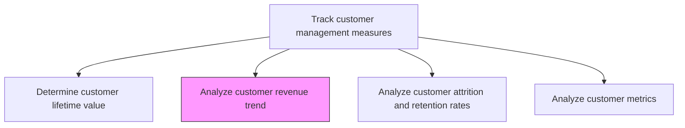
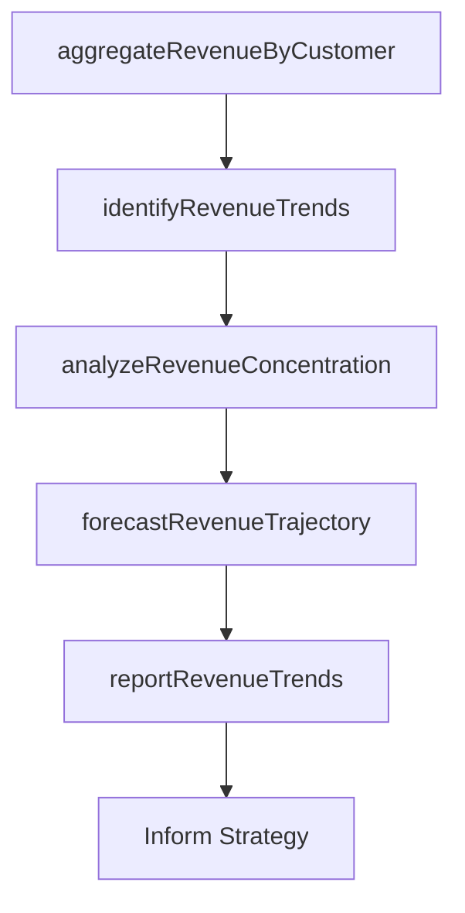

# Analyze customer revenue trend

> Business-as-Code definition for customer revenue trend analysis. Models the examination of revenue patterns across customer segments to identify growth trajectories, seasonal variations, and revenue concentration risks.

## Overview

Analyzing the revenue stream generated by the sale of the organization's products/services in order to identify trends therein. Examine data relating to the inflow of revenue from individual/groups of customers in order to identify patterns in the generation and sustenance of receivables. Conduct statistical analysis over the stream of revenue collected and the point of origin associated with each unit of sale through metrics such as the accounting rate of return, the GAAP revenue over a given period, and customer lifetime revenue.

## Process Hierarchy



## GraphDL

```yaml
analyze:
  object: Customer Revenue Trend
  actor: RevenueAnalyst
  result: CustomerRevenueTrendReport
```

## Actions

| Action | Description |
|--------|-------------|
| aggregateRevenueByCustomer | Compile revenue data by customer, segment, product, and time period |
| identifyRevenueTrends | Detect growth, decline, and seasonal patterns in customer revenue streams |
| analyzeRevenueConcentration | Assess revenue dependency on top accounts and identify concentration risks |
| forecastRevenueTrajectory | Project future revenue by customer segment based on historical trends |
| reportRevenueTrends | Produce revenue trend analysis with actionable insights for strategic planning |

## Events

| Event | Description |
|-------|-------------|
| revenueAggregated | Customer revenue data compiled by segment and period |
| revenueTrendsIdentified | Growth, decline, and seasonal patterns detected |
| revenueConcentrationAnalyzed | Revenue dependency and concentration risks assessed |
| revenueTrajectoryForecasted | Future revenue projections completed by segment |
| revenueTrendsReported | Revenue trend analysis published with recommendations |

## Searches

| Search | Description |
|--------|-------------|
| getRevenueTrend | Retrieve revenue trend data by customer, segment, or period |
| getRevenueConcentration | Query revenue concentration metrics across top accounts |
| getRevenueForecast | Access revenue projections by customer segment |

## Process Flow



## RACI Matrix

| Activity | Responsible | Accountable | Consulted | Informed |
|----------|-------------|-------------|-----------|----------|
| aggregateRevenueByCustomer | RevenueAnalyst | CustomerAnalyticsManager | Finance | Sales |
| identifyRevenueTrends | RevenueAnalyst | CustomerAnalyticsManager | DataScience | Marketing |
| forecastRevenueTrajectory | DataScientist | CustomerAnalyticsManager | Finance | VP Sales |
| reportRevenueTrends | CustomerAnalyticsManager | VP Marketing | Sales | CMO |

## Related Processes

| Process | Relationship |
|---------|-------------|
| 3.3.7.1 Determine customer lifetime value | Parallel - revenue trends feed CLV calculations |
| 3.3.7.4 Analyze customer metrics | Downstream - revenue trends contribute to broader metrics analysis |
| 3.3.7.6 Revise customer strategies based on metrics | Downstream - trend insights drive strategy revision |

## Related Departments

| Department | Role |
|-----------|------|
| Customer Analytics | Leads revenue trend analysis and reporting |
| Finance | Provides revenue data and validates financial calculations |
| Sales | Contributes account-level context and acts on trend insights |
| Data Science | Builds forecasting models for revenue projections |

## Related Occupations

| Occupation | Involvement |
|-----------|-------------|
| Revenue Analyst | Conducts revenue data analysis and trend identification |
| Data Scientist | Builds revenue forecasting models |
| Customer Analytics Manager | Oversees analysis program and strategic recommendations |

## KPIs

| KPI | Description | Unit |
|-----|-------------|------|
| Revenue Growth Rate | Year-over-year customer revenue growth | % |
| Revenue Concentration Index | Revenue share held by top 10% of accounts | % |
| Forecast Accuracy | Accuracy of revenue projections versus actual | % |
| Revenue per Customer | Average revenue generated per active customer | Currency |

## Usage

```typescript
import { analyzeCustomerRevenueTrend } from '@headlessly/analyze-customer-revenue-trend'

const revenueTrends = analyzeCustomerRevenueTrend()

// Identify revenue trends by customer segment
const trends = await revenueTrends.identifyRevenueTrends({
  segments: ['enterprise', 'mid-market', 'smb'],
  period: 'last-8-quarters',
  granularity: 'quarterly',
  metrics: ['total-revenue', 'average-order-value', 'purchase-frequency']
})

// Analyze revenue concentration risk
const concentration = await revenueTrends.analyzeRevenueConcentration({
  topAccountPercent: 10,
  riskThreshold: 0.4,
  period: 'last-12-months'
})
```
