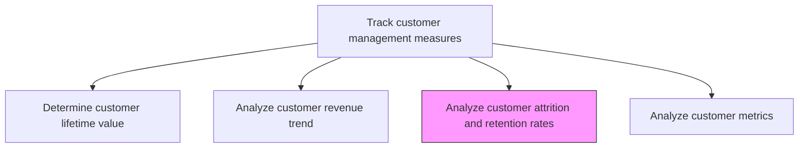
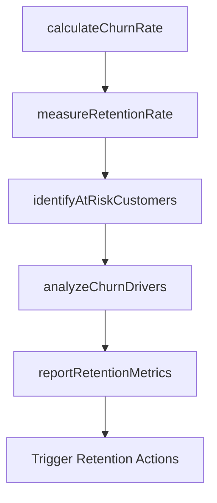

# Analyze customer attrition and retention rates

> Business-as-Code definition for customer churn and retention analysis. Models the measurement and investigation of customer attrition patterns and retention dynamics to identify at-risk customers and inform retention strategies.

## Overview

Calculating measures that capture the proportion of customers the organization is able to retain to those it is losing. Compute metrics such as the tendency to switch brands/providers and the proportion of return customers to comprehend the trends within the customer attrition and retention rates.

## Process Hierarchy



## GraphDL

```yaml
analyze:
  object: Customer Attrition And Retention Rates
  actor: CustomerAnalyticsManager
  result: AttritionRetentionReport
```

## Actions

| Action | Description |
|--------|-------------|
| calculateChurnRate | Compute the percentage of customers lost over a defined period by segment and cohort |
| measureRetentionRate | Calculate the proportion of customers retained across renewal cycles and subscription periods |
| identifyAtRiskCustomers | Build predictive models to flag customers showing early signals of potential departure |
| analyzeChurnDrivers | Investigate the root causes of customer attrition through surveys, usage data, and support tickets |
| reportRetentionMetrics | Produce retention and attrition dashboards with trend analysis and intervention recommendations |

## Events

| Event | Description |
|-------|-------------|
| churnRateCalculated | Customer attrition rates computed by segment and cohort |
| retentionRateMeasured | Customer retention proportions calculated across periods |
| atRiskCustomersIdentified | Predictive churn model flagged at-risk customers |
| churnDriversAnalyzed | Root causes of customer attrition investigated and documented |
| retentionMetricsReported | Retention dashboards and trend analysis published |

## Searches

| Search | Description |
|--------|-------------|
| getChurnRate | Retrieve churn rates by segment, cohort, or time period |
| getRetentionRate | Query customer retention rates by product or segment |
| getAtRiskCustomers | Access list of customers flagged by predictive churn models |

## Process Flow



## RACI Matrix

| Activity | Responsible | Accountable | Consulted | Informed |
|----------|-------------|-------------|-----------|----------|
| calculateChurnRate | CustomerAnalyticsAnalyst | CustomerAnalyticsManager | CRM | Sales |
| identifyAtRiskCustomers | DataScientist | CustomerAnalyticsManager | CustomerSuccess | Marketing |
| analyzeChurnDrivers | CustomerAnalyticsAnalyst | CustomerAnalyticsManager | Support | ProductManagement |
| reportRetentionMetrics | CustomerAnalyticsManager | VP Marketing | Sales | CMO |

## Related Processes

| Process | Relationship |
|---------|-------------|
| 3.3.7.1 Determine customer lifetime value | Parallel - retention rates are a critical CLV input |
| 3.3.7.4 Analyze customer metrics | Downstream - attrition data feeds broader customer metrics |
| 3.3.7.6 Revise customer strategies based on metrics | Downstream - retention insights drive strategy adjustments |

## Related Departments

| Department | Role |
|-----------|------|
| Customer Analytics | Leads churn analysis and predictive modeling |
| Customer Success | Acts on at-risk flags and drives retention interventions |
| Marketing | Uses retention data to design win-back campaigns |
| Product Management | Addresses product-related churn drivers |

## Related Occupations

| Occupation | Involvement |
|-----------|-------------|
| Customer Analytics Manager | Oversees attrition analysis and retention strategy |
| Data Scientist | Builds predictive churn models |
| Customer Success Manager | Executes retention interventions for at-risk accounts |

## KPIs

| KPI | Description | Unit |
|-----|-------------|------|
| Monthly Churn Rate | Percentage of customers lost per month | % |
| Net Retention Rate | Revenue retained from existing customers including expansion | % |
| At-Risk Detection Accuracy | Accuracy of predictive churn model in identifying actual churners | % |
| Win-Back Rate | Percentage of churned customers successfully re-acquired | % |

## Usage

```typescript
import { analyzeCustomerAttritionAndRetentionRates } from '@headlessly/analyze-customer-attrition-and-retention-rates'

const retention = analyzeCustomerAttritionAndRetentionRates()

// Calculate churn rate by segment
const churn = await retention.calculateChurnRate({
  segments: ['enterprise', 'mid-market', 'smb'],
  period: 'last-12-months',
  granularity: 'monthly',
  definition: 'no-activity-90-days'
})

// Identify at-risk customers
const atRisk = await retention.identifyAtRiskCustomers({
  model: 'gradient-boost-churn-v3',
  riskThreshold: 0.7,
  features: ['usage-decline', 'support-tickets', 'payment-delays', 'engagement-drop']
})
```
