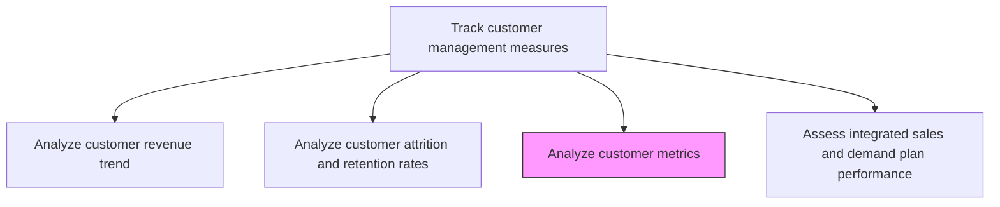
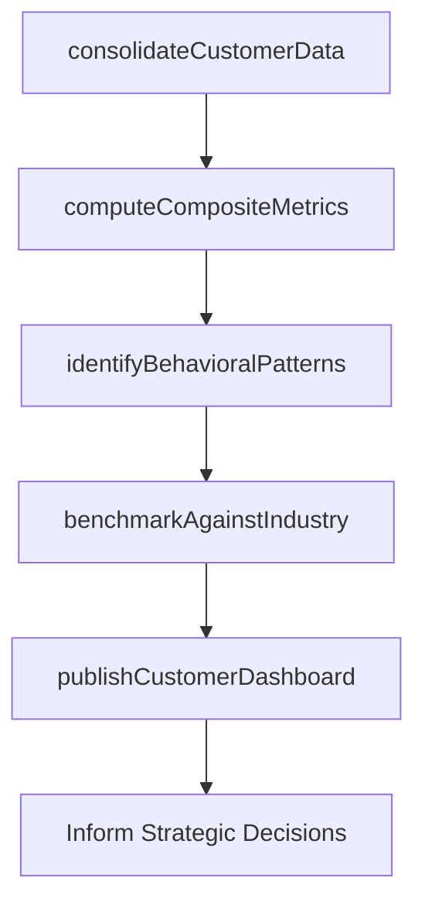

# Analyze customer metrics

> Business-as-Code definition for comprehensive customer metrics analysis. Models the holistic examination of customer behavioral data across loyalty, satisfaction, conversion, and engagement dimensions to generate strategic insights.

## Overview

Studying all measures of the customer's behavior and conduct toward the organization's offerings in order to glean insight and identify patterns into their decision making. Closely examine all categories of data sets over a customer base. Analyze data points related to customer loyalty, retention, value, conversion, level of satisfaction, attrition, etc. Flesh out measures for an all-encompassing analysis that provides a macro-level picture of the customer's behavior and mindset related to the organization's products/services.

## Process Hierarchy



## GraphDL

```yaml
analyze:
  object: Customer Metrics
  actor: CustomerInsightsManager
  result: CustomerMetricsDashboard
```

## Actions

| Action | Description |
|--------|-------------|
| consolidateCustomerData | Aggregate data from CRM, support, billing, and engagement systems into a unified customer view |
| computeCompositeMetrics | Calculate cross-dimensional scores combining loyalty, satisfaction, engagement, and value data |
| identifyBehavioralPatterns | Detect patterns in customer decision-making, usage, and engagement across the lifecycle |
| benchmarkAgainstIndustry | Compare customer metrics against industry benchmarks and best-in-class standards |
| publishCustomerDashboard | Distribute interactive dashboards and reports to stakeholders for strategic decision-making |

## Events

| Event | Description |
|-------|-------------|
| customerDataConsolidated | Customer data unified from all sources into single view |
| compositeMetricsComputed | Cross-dimensional customer scores calculated |
| behavioralPatternsIdentified | Decision-making and engagement patterns detected |
| industryBenchmarked | Customer metrics compared against industry standards |
| customerDashboardPublished | Interactive dashboards distributed to stakeholders |

## Searches

| Search | Description |
|--------|-------------|
| getCustomerMetrics | Retrieve composite customer metrics by segment or individual account |
| getBehavioralPatterns | Query identified customer behavioral patterns by type |
| getIndustryBenchmarks | Access industry benchmark comparisons for customer metrics |

## Process Flow



## RACI Matrix

| Activity | Responsible | Accountable | Consulted | Informed |
|----------|-------------|-------------|-----------|----------|
| consolidateCustomerData | DataEngineer | CustomerInsightsManager | CRM | IT |
| computeCompositeMetrics | CustomerAnalyticsAnalyst | CustomerInsightsManager | DataScience | Marketing |
| identifyBehavioralPatterns | DataScientist | CustomerInsightsManager | ProductManagement | Sales |
| publishCustomerDashboard | CustomerInsightsManager | VP Marketing | Sales | CMO |

## Related Processes

| Process | Relationship |
|---------|-------------|
| 3.3.7.2 Analyze customer revenue trend | Upstream - revenue trends are a key input metric |
| 3.3.7.3 Analyze customer attrition and retention rates | Upstream - retention data feeds composite metrics |
| 3.3.7.6 Revise customer strategies based on metrics | Downstream - comprehensive metrics inform strategy revision |

## Related Departments

| Department | Role |
|-----------|------|
| Customer Insights | Leads comprehensive metrics analysis and dashboard creation |
| Data Engineering | Builds data pipelines and maintains unified customer data |
| Marketing | Uses customer metrics to optimize campaigns and targeting |
| Product Management | Leverages usage and engagement data for product decisions |

## Related Occupations

| Occupation | Involvement |
|-----------|-------------|
| Customer Insights Manager | Oversees comprehensive customer metrics program |
| Data Scientist | Builds behavioral pattern models and composite scores |
| Business Intelligence Analyst | Creates dashboards and visualization of customer metrics |

## KPIs

| KPI | Description | Unit |
|-----|-------------|------|
| Customer Health Score | Composite score combining engagement, satisfaction, and financial metrics | Score (1-100) |
| Net Promoter Score | Customer willingness to recommend the organization | NPS (-100 to 100) |
| Customer Engagement Index | Composite measure of customer interaction across touchpoints | Index |
| Data Freshness | Percentage of customer records updated within the last 30 days | % |

## Usage

```typescript
import { analyzeCustomerMetrics } from '@headlessly/analyze-customer-metrics'

const metrics = analyzeCustomerMetrics()

// Compute composite customer metrics
const composite = await metrics.computeCompositeMetrics({
  dimensions: ['loyalty', 'satisfaction', 'engagement', 'value', 'advocacy'],
  segments: ['enterprise', 'mid-market', 'smb'],
  weightings: { loyalty: 0.25, satisfaction: 0.2, engagement: 0.2, value: 0.25, advocacy: 0.1 }
})

// Identify behavioral patterns across the customer base
const patterns = await metrics.identifyBehavioralPatterns({
  analysisType: 'clustering',
  features: ['purchase-frequency', 'support-usage', 'feature-adoption', 'nps-score'],
  minClusterSize: 50
})
```
