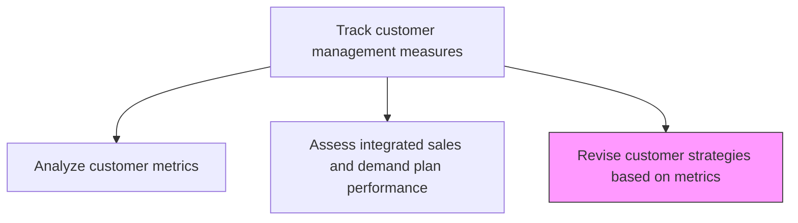
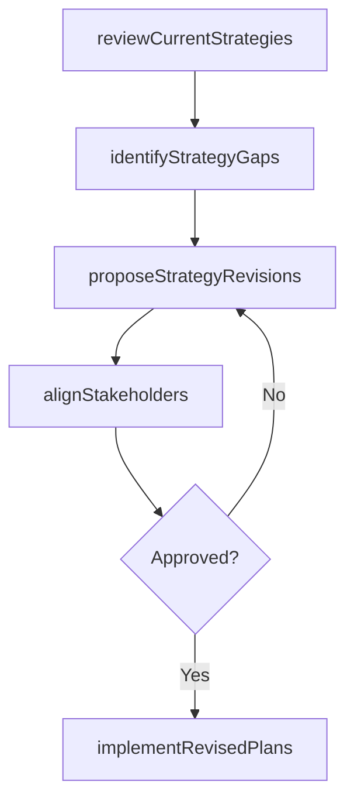

# Revise customer strategies, objectives, and plans based on metrics

> Business-as-Code definition for metrics-driven customer strategy revision. Models the systematic review and adjustment of customer acquisition, conversion, and retention strategies based on performance data and customer analytics.

## Overview

Reviewing and reappraising the strategies, objectives, and plans for all customer-centered processes. Revisit all customer-focused processes and activities--which relate to their acquisition, conversion, and retention--with the objective of revising them in light of customer analysis. Revise accordingly.

## Process Hierarchy



## GraphDL

```yaml
revise:
  object: Customer Strategies, Objectives, And Plans Based On Metrics
  actor: VP Marketing
  result: RevisedCustomerStrategy
```

## Actions

| Action | Description |
|--------|-------------|
| reviewCurrentStrategies | Assess existing customer acquisition, conversion, and retention strategies against current metrics |
| identifyStrategyGaps | Pinpoint areas where current strategies are underperforming based on metrics analysis |
| proposeStrategyRevisions | Develop recommended changes to customer strategies, objectives, and tactical plans |
| alignStakeholders | Present proposed revisions to stakeholders and build consensus for strategic changes |
| implementRevisedPlans | Deploy updated customer strategies and communicate changes across all customer-facing teams |

## Events

| Event | Description |
|-------|-------------|
| currentStrategiesReviewed | Existing customer strategies assessed against performance metrics |
| strategyGapsIdentified | Underperforming areas and improvement opportunities documented |
| strategyRevisionsProposed | Recommended changes to customer strategies formulated |
| stakeholdersAligned | Consensus achieved for strategic changes across departments |
| revisedPlansImplemented | Updated customer strategies deployed to all teams |

## Searches

| Search | Description |
|--------|-------------|
| getStrategyRevisions | Retrieve proposed or implemented strategy changes by area |
| getStrategyPerformance | Query performance metrics for current customer strategies |
| getRevisionHistory | Access historical strategy revisions and their outcomes |

## Process Flow



## RACI Matrix

| Activity | Responsible | Accountable | Consulted | Informed |
|----------|-------------|-------------|-----------|----------|
| reviewCurrentStrategies | CustomerAnalyticsManager | VP Marketing | Sales | CMO |
| identifyStrategyGaps | CustomerAnalyticsManager | VP Marketing | ProductManagement | Finance |
| proposeStrategyRevisions | VP Marketing | CMO | VP Sales | ExecutiveTeam |
| implementRevisedPlans | MarketingDirector | VP Marketing | Sales | CustomerSuccess |

## Related Processes

| Process | Relationship |
|---------|-------------|
| 3.3.7.4 Analyze customer metrics | Upstream - metrics analysis drives strategy revision |
| 3.3.7.5 Assess integrated sales and demand plan performance | Upstream - plan performance assessment informs revisions |
| 3.2.1 Define offering and customer value proposition | Downstream - revised strategy may require value proposition updates |

## Related Departments

| Department | Role |
|-----------|------|
| Marketing | Leads strategy revision process and implements updated plans |
| Sales | Provides field feedback and executes revised customer strategies |
| Customer Analytics | Supplies metrics data and performance analysis |
| Customer Success | Implements revised retention and engagement strategies |

## Related Occupations

| Occupation | Involvement |
|-----------|-------------|
| VP Marketing | Sponsors and approves customer strategy revisions |
| Customer Analytics Manager | Provides data-driven recommendations for strategy changes |
| Marketing Director | Implements revised strategies across marketing programs |

## KPIs

| KPI | Description | Unit |
|-----|-------------|------|
| Strategy Revision Impact | Performance improvement attributable to strategy changes | % |
| Revision Cycle Time | Time from metrics review to revised strategy implementation | Days |
| Stakeholder Alignment Score | Percentage of stakeholders who endorse proposed revisions | % |
| Strategy Currency | Time since last comprehensive customer strategy review | Months |

## Usage

```typescript
import { reviseCustomerStrategiesObjectivesAndPlansBasedOnMetrics } from '@headlessly/revise-customer-strategies-objectives-and-plans-based-on-metrics'

const strategyRevision = reviseCustomerStrategiesObjectivesAndPlansBasedOnMetrics()

// Review current strategies against metrics
const review = await strategyRevision.reviewCurrentStrategies({
  areas: ['acquisition', 'conversion', 'retention', 'expansion'],
  metricsSource: 'customer-analytics-dashboard',
  benchmarkPeriod: 'last-4-quarters'
})

// Propose strategy revisions
const revisions = await strategyRevision.proposeStrategyRevisions({
  reviewId: review.id,
  gapPriority: 'impact-weighted',
  constraints: { budget: 'current-fiscal-year', timeline: '90-days' }
})
```
