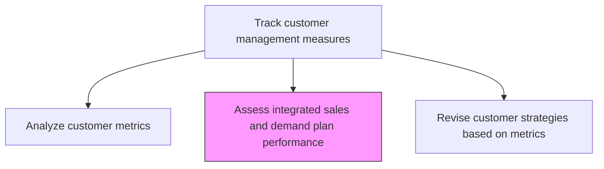
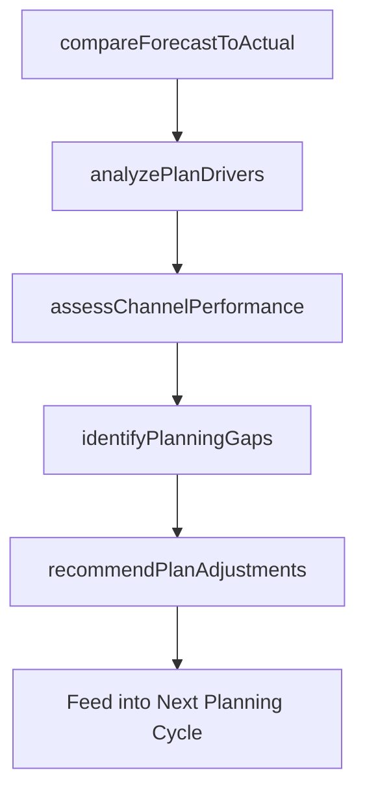

# Assess integrated sales and demand plan performance

> Business-as-Code definition for integrated sales and demand plan assessment. Models the evaluation of how well actual sales performance aligns with demand forecasts and sales plans to identify gaps and improve planning accuracy.

## Overview

Evaluating the alignment between actual sales results and the integrated sales and demand plan. Compare forecasted demand, planned sales targets, and actual performance to identify variances, understand their causes, and improve the accuracy of future planning cycles. Assess whether marketing activities, pricing decisions, and promotional programs effectively drove the expected demand.

## Process Hierarchy



## GraphDL

```yaml
assess:
  object: Integrated Sales And Demand Plan Performance
  actor: DemandPlanningManager
  result: SalesDemandPerformanceAssessment
```

## Actions

| Action | Description |
|--------|-------------|
| compareForecastToActual | Measure variance between demand forecasts and actual sales results by product and channel |
| analyzePlanDrivers | Investigate which marketing, pricing, and promotional activities contributed to or detracted from plan achievement |
| assessChannelPerformance | Evaluate how each sales channel performed against its planned targets |
| identifyPlanningGaps | Pinpoint systematic gaps in demand forecasting or sales planning methodologies |
| recommendPlanAdjustments | Propose changes to future demand plans, sales targets, and marketing investments based on findings |

## Events

| Event | Description |
|-------|-------------|
| forecastVarianceCalculated | Demand forecast versus actual sales variance computed |
| planDriversAnalyzed | Contributing and detracting factors to plan performance investigated |
| channelPerformanceAssessed | Channel-level performance against targets evaluated |
| planningGapsIdentified | Systematic planning methodology gaps documented |
| planAdjustmentsRecommended | Changes to future plans proposed and submitted |

## Searches

| Search | Description |
|--------|-------------|
| getForecastVariance | Retrieve forecast-to-actual variance by product, channel, or period |
| getChannelPerformance | Query channel-level sales performance against planned targets |
| getPlanningAccuracy | Access historical demand planning accuracy metrics |

## Process Flow



## RACI Matrix

| Activity | Responsible | Accountable | Consulted | Informed |
|----------|-------------|-------------|-----------|----------|
| compareForecastToActual | DemandPlanningAnalyst | DemandPlanningManager | Sales | Finance |
| analyzePlanDrivers | DemandPlanningAnalyst | DemandPlanningManager | Marketing | PricingManager |
| assessChannelPerformance | SalesOperationsAnalyst | VP Sales | ChannelManagers | Marketing |
| recommendPlanAdjustments | DemandPlanningManager | VP Sales | Marketing | CMO |

## Related Processes

| Process | Relationship |
|---------|-------------|
| 3.3.7.4 Analyze customer metrics | Upstream - customer metrics provide context for plan performance |
| 3.3.7.6 Revise customer strategies based on metrics | Downstream - assessment findings drive strategy revision |
| 4.1.1 Develop demand forecasts | Parallel - demand planning accuracy is evaluated and improved |

## Related Departments

| Department | Role |
|-----------|------|
| Demand Planning | Leads plan performance assessment and forecasting improvement |
| Sales Operations | Provides actual sales data and channel performance analysis |
| Marketing | Contributes campaign performance data for plan driver analysis |
| Finance | Validates revenue data and variance calculations |

## Related Occupations

| Occupation | Involvement |
|-----------|-------------|
| Demand Planning Manager | Oversees plan performance assessment and improvement recommendations |
| Demand Planning Analyst | Conducts forecast variance analysis and driver investigation |
| Sales Operations Analyst | Provides sales data and channel performance analysis |

## KPIs

| KPI | Description | Unit |
|-----|-------------|------|
| Forecast Accuracy | Percentage accuracy of demand forecasts versus actual sales | % |
| Plan Achievement Rate | Percentage of sales plan targets met within the period | % |
| Channel Variance | Average variance between planned and actual sales by channel | % |
| Planning Cycle Improvement | Period-over-period improvement in forecast accuracy | % |

## Usage

```typescript
import { assessIntegratedSalesAndDemandPlanPerformance } from '@headlessly/assess-integrated-sales-and-demand-plan-performance'

const planAssessment = assessIntegratedSalesAndDemandPlanPerformance()

// Compare forecast to actual sales results
const variance = await planAssessment.compareForecastToActual({
  period: '2026-q1',
  products: ['platform-standard', 'platform-enterprise'],
  channels: ['direct-sales', 'partner', 'self-serve'],
  granularity: 'monthly'
})

// Identify planning gaps and recommend adjustments
const recommendations = await planAssessment.recommendPlanAdjustments({
  varianceId: variance.id,
  focusAreas: ['demand-forecasting', 'channel-targets', 'marketing-attribution'],
  planningHorizon: 'next-quarter'
})
```
