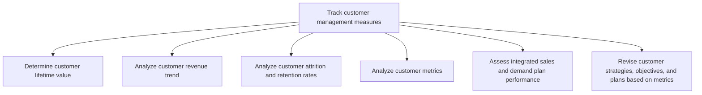
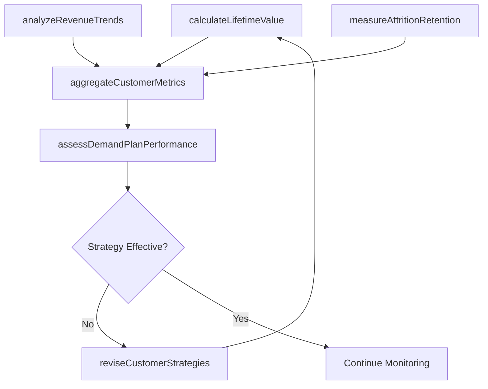

# Track customer management measures

> Business-as-Code definition for customer management metrics tracking. Models the measurement and analysis of customer lifetime value, revenue trends, attrition rates, and behavioral metrics to inform strategy revisions and demand planning.

## Overview

Collating all customer-centered metrics. The objective is to create a big-picture view of the customers' mindset and their behavior pertaining to the organization's offerings.

## Process Hierarchy



## GraphDL

```yaml
track:
  object: Customer Management Measures
  actor: CustomerAnalyticsManager
  result: CustomerMetricsDashboard
```

## Actions

| Action | Description |
|--------|-------------|
| calculateLifetimeValue | Compute customer lifetime value across cohorts and segments |
| analyzeRevenueTrends | Track and analyze customer revenue patterns over time |
| measureAttritionRetention | Calculate customer churn and retention rates by segment |
| aggregateCustomerMetrics | Consolidate all customer behavioral and transactional metrics |
| assessDemandPlanPerformance | Evaluate integrated sales and demand plan against actuals |
| reviseCustomerStrategies | Update strategies and plans based on metric-driven insights |

## Events

| Event | Description |
|-------|-------------|
| lifetimeValueCalculated | Customer lifetime value models updated |
| revenueTrendsAnalyzed | Customer revenue trend analysis completed |
| attritionRetentionMeasured | Churn and retention rates reported by segment |
| customerMetricsAggregated | Consolidated customer metrics dashboard published |
| demandPlanPerformanceAssessed | Sales and demand plan variance report delivered |
| customerStrategiesRevised | Customer strategies updated based on metric insights |

## Searches

| Search | Description |
|--------|-------------|
| getCustomerLTV | Retrieve customer lifetime value by segment or cohort |
| getRevenueTrends | Query customer revenue trends over specified periods |
| getChurnAnalysis | Access customer attrition data and churn predictors |
| getCustomerScorecard | Retrieve comprehensive customer metrics scorecard |

## Process Flow



## RACI Matrix

| Activity | Responsible | Accountable | Consulted | Informed |
|----------|-------------|-------------|-----------|----------|
| calculateLifetimeValue | CustomerAnalyticsManager | CMO | Finance | Sales |
| analyzeRevenueTrends | MarketingAnalyst | VP Marketing | Sales | Finance |
| measureAttritionRetention | CustomerAnalyticsManager | CMO | CustomerSuccess | Sales |
| assessDemandPlanPerformance | DemandPlanningAnalyst | VP Sales | Marketing | Operations |
| reviseCustomerStrategies | MarketingDirector | CMO | Sales | ExecutiveTeam |

## Sub-Processes

| ID | Name | Description |
|----|------|-------------|
| 3.3.7.1 | Determine customer lifetime value | Estimating customer loyalty and the average contribution made by them to revenues, over their lifesp |
| 3.3.7.2 | Analyze customer revenue trend | Analyzing the revenue stream generated by the sale of the organization's products/services in order  |
| 3.3.7.3 | Analyze customer attrition and retention rates | Calculating measures that capture the proportion of customers the organization is able to retain to  |
| 3.3.7.4 | Analyze customer metrics | Studying all measures of the customer's behavior and conduct toward the organization's offerings in  |
| 3.3.7.5 | Assess integrated sales and demand plan performance | Evaluating the alignment and effectiveness of integrated sales and demand plans by comparing forecast accuracy, pipeline velocity, and actual revenue against planned targets. |
| 3.3.7.6 | Revise customer strategies, objectives, and plans based on metrics | Reviewing and reappraising the strategies, objectives, and plans for all customer-centered processes |

## Related Processes

| Process | Relationship |
|---------|-------------|
| 3.3.8 Analyze and respond to customer insight | Downstream - metrics inform customer insight analysis |
| 3.2.7 Design and manage customer loyalty program | Parallel - loyalty metrics feed customer measurement |
| 3.5.2 Manage customers and accounts | Parallel - account data feeds customer metrics |
| 5.0 Manage Customer Service | Upstream - service interactions provide customer data |

## Related Departments

| Department | Role |
|-----------|------|
| Customer Analytics | Develops metrics models and produces dashboards |
| Marketing | Uses customer metrics to guide campaign strategy |
| Sales | Provides transactional data and acts on retention insights |
| Customer Success | Manages at-risk customers identified through metrics |
| Finance | Validates revenue trend data and LTV calculations |

## Related Occupations

| Occupation | Involvement |
|-----------|-------------|
| Customer Analytics Manager | Designs and manages customer measurement frameworks |
| Data Scientist | Builds predictive models for churn and LTV |
| Marketing Analyst | Interprets customer metrics for marketing decisions |
| CRM Administrator | Maintains data infrastructure for customer tracking |

## KPIs

| KPI | Description | Unit |
|-----|-------------|------|
| Customer Lifetime Value | Average revenue per customer over entire relationship | USD |
| Customer Retention Rate | Percentage of customers retained over a given period | % |
| Net Revenue Retention | Revenue from existing customers including expansions and churn | % |
| Customer Health Score | Composite score indicating customer satisfaction and engagement | Score (1-100) |
| Forecast Accuracy | Variance between customer demand forecast and actual | % |

## Usage

```typescript
import { trackCustomerManagementMeasures } from '@headlessly/track-customer-management-measures'

const measures = trackCustomerManagementMeasures()

// Calculate lifetime value by customer segment
const ltv = await measures.calculateLifetimeValue({
  segments: ['enterprise', 'mid-market', 'smb'],
  cohortPeriod: '2025',
  discountRate: 0.10
})

// Measure attrition and retention
const retention = await measures.measureAttritionRetention({
  period: 'last-12-months',
  breakdownBy: ['segment', 'industry', 'region']
})
```
