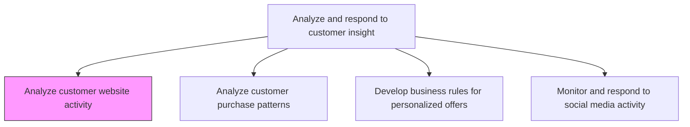
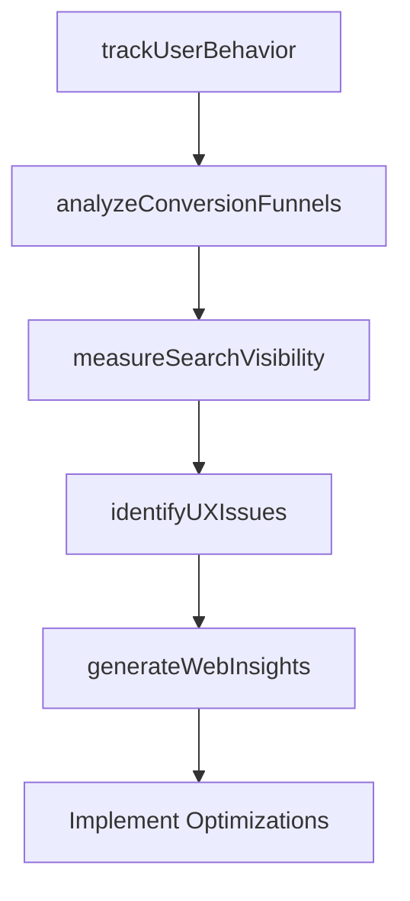

# Analyze customer website activity

> Business-as-Code definition for website analytics and user behavior analysis. Models the examination of customer digital behavior to optimize website experience, improve conversion funnels, and enhance search visibility.

## Overview

Examining user activity on company, vendor or reseller websites to improve traffic on and to the website, improve user experience on the website to simplify purchasing process and encourage repeat purchases, and to increase the site's visibility in search engine results. Various metrics can be used to measure user activity, such as number of users who are new, returning or unique, time spent on page, session duration, bounce rate, click through rate, conversion rate, and others.

## Process Hierarchy



## GraphDL

```yaml
analyze:
  object: Customer Website Activity
  actor: DigitalAnalyticsManager
  result: WebsiteActivityReport
```

## Actions

| Action | Description |
|--------|-------------|
| trackUserBehavior | Monitor page views, session duration, navigation paths, and interaction events across the website |
| analyzeConversionFunnels | Examine drop-off points and conversion rates through purchase and sign-up workflows |
| measureSearchVisibility | Track search engine rankings, organic traffic, and SEO performance metrics |
| identifyUXIssues | Detect usability problems through heatmaps, scroll depth, and error tracking data |
| generateWebInsights | Produce actionable recommendations for website optimization based on behavioral analysis |

## Events

| Event | Description |
|-------|-------------|
| userBehaviorTracked | Website interaction data collected and aggregated |
| conversionFunnelsAnalyzed | Funnel drop-off points and conversion rates calculated |
| searchVisibilityMeasured | SEO performance and organic traffic metrics compiled |
| uxIssuesIdentified | Usability problems detected through behavioral data analysis |
| webInsightsGenerated | Website optimization recommendations published |

## Searches

| Search | Description |
|--------|-------------|
| getWebsiteMetrics | Retrieve website performance metrics by page, section, or time period |
| getConversionData | Query conversion funnel data and drop-off analysis |
| getUserSegmentBehavior | Access behavioral data by user segment or traffic source |

## Process Flow



## RACI Matrix

| Activity | Responsible | Accountable | Consulted | Informed |
|----------|-------------|-------------|-----------|----------|
| trackUserBehavior | DigitalAnalyticsAnalyst | DigitalAnalyticsManager | WebDevelopment | Marketing |
| analyzeConversionFunnels | DigitalAnalyticsAnalyst | DigitalAnalyticsManager | UXDesign | ProductManagement |
| identifyUXIssues | UXResearcher | DigitalAnalyticsManager | WebDevelopment | ProductManagement |
| generateWebInsights | DigitalAnalyticsManager | VP DigitalMarketing | Marketing | CMO |

## Related Processes

| Process | Relationship |
|---------|-------------|
| 3.3.8.3 Analyze customer purchase patterns | Parallel - website data combined with purchase data reveals full journey |
| 3.3.8.5 Monitor and respond to social media activity | Parallel - social referral traffic analyzed alongside direct website activity |
| 3.3.5.6 Evaluate promotional performance metrics | Downstream - website metrics contribute to promotional evaluation |

## Related Departments

| Department | Role |
|-----------|------|
| Digital Analytics | Leads website behavior analysis and reporting |
| Web Development | Implements tracking and acts on optimization recommendations |
| UX Design | Uses behavioral data to improve user experience |
| SEO | Leverages search visibility data to improve organic rankings |

## Related Occupations

| Occupation | Involvement |
|-----------|-------------|
| Digital Analytics Manager | Oversees website analytics program and strategic insights |
| Digital Analytics Analyst | Conducts behavioral analysis and produces reports |
| UX Researcher | Uses website data to identify usability improvements |

## KPIs

| KPI | Description | Unit |
|-----|-------------|------|
| Conversion Rate | Percentage of website visitors who complete a desired action | % |
| Bounce Rate | Percentage of single-page sessions without further interaction | % |
| Average Session Duration | Mean time visitors spend on the website per session | Minutes |
| Organic Traffic Growth | Year-over-year growth in search engine referral traffic | % |

## Usage

```typescript
import { analyzeCustomerWebsiteActivity } from '@headlessly/analyze-customer-website-activity'

const webAnalytics = analyzeCustomerWebsiteActivity()

// Analyze conversion funnels
const funnels = await webAnalytics.analyzeConversionFunnels({
  funnels: ['trial-signup', 'purchase-checkout', 'demo-request'],
  period: 'last-30-days',
  segmentBy: ['traffic-source', 'device-type', 'geography']
})

// Identify UX issues through behavioral data
const issues = await webAnalytics.identifyUXIssues({
  pages: ['/pricing', '/checkout', '/signup'],
  signals: ['rage-clicks', 'form-abandonment', 'error-encounters'],
  minImpact: 100
})
```
