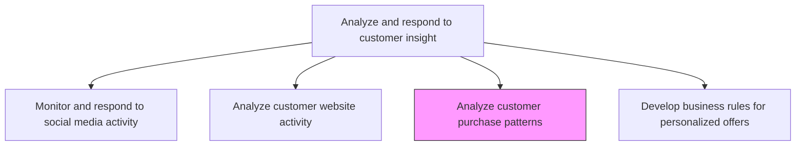
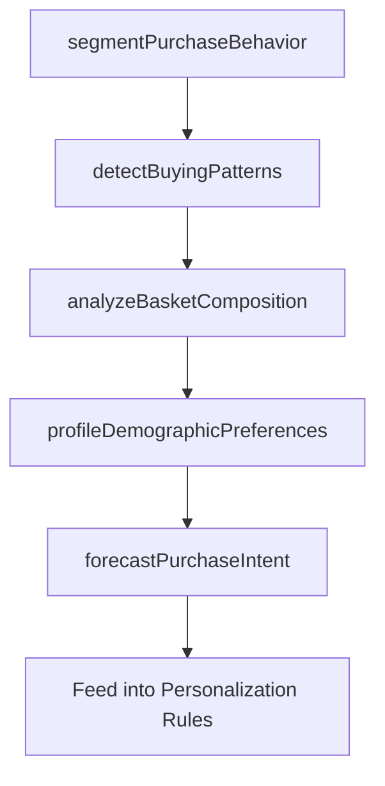

# Analyze customer purchase patterns

> Business-as-Code definition for customer purchase pattern analysis. Models the detection and categorization of purchasing behaviors to uncover buying habits, frequency patterns, and cross-sell opportunities across customer segments.

## Overview

Conducting analyses to uncover customer purchasing habits. Detect patterns and categorize users based on similar characteristics and behaviors, demographic information, geographic location, search history, etc.

## Process Hierarchy



## GraphDL

```yaml
analyze:
  object: Customer Purchase Patterns
  actor: CustomerInsightsAnalyst
  result: PurchasePatternReport
```

## Actions

| Action | Description |
|--------|-------------|
| segmentPurchaseBehavior | Cluster customers into behavioral segments based on purchase frequency, recency, and monetary value |
| detectBuyingPatterns | Identify recurring purchase sequences, seasonal trends, and cross-category affinities |
| analyzeBasketComposition | Examine product combinations within transactions to uncover bundling and cross-sell opportunities |
| profileDemographicPreferences | Map purchasing preferences to demographic, geographic, and psychographic attributes |
| forecastPurchaseIntent | Predict likelihood and timing of future purchases based on historical behavioral patterns |

## Events

| Event | Description |
|-------|-------------|
| purchaseBehaviorSegmented | Customers clustered into behavioral purchase segments |
| buyingPatternsDetected | Recurring purchase sequences and seasonal trends identified |
| basketCompositionAnalyzed | Product co-occurrence and bundling opportunities documented |
| demographicPreferencesProfiled | Purchase preferences mapped to customer attributes |
| purchaseIntentForecasted | Future purchase likelihood predictions generated |

## Searches

| Search | Description |
|--------|-------------|
| getPurchasePatterns | Retrieve identified purchase patterns by segment, category, or time period |
| getCustomerSegments | Query behavioral customer segments and their purchase characteristics |
| getCrossSellOpportunities | Access product affinity data and cross-sell recommendations |

## Process Flow



## RACI Matrix

| Activity | Responsible | Accountable | Consulted | Informed |
|----------|-------------|-------------|-----------|----------|
| segmentPurchaseBehavior | DataScientist | CustomerInsightsManager | CRM | Marketing |
| detectBuyingPatterns | CustomerInsightsAnalyst | CustomerInsightsManager | Sales | ProductManagement |
| analyzeBasketComposition | CustomerInsightsAnalyst | CustomerInsightsManager | Merchandising | ECommerce |
| forecastPurchaseIntent | DataScientist | CustomerInsightsManager | Marketing | Sales |

## Related Processes

| Process | Relationship |
|---------|-------------|
| 3.3.8.2 Analyze customer website activity | Upstream - digital behavior enriches purchase pattern analysis |
| 3.3.8.4 Develop business rules for personalized offers | Downstream - purchase patterns drive personalization rule creation |
| 3.3.7.4 Analyze customer metrics | Parallel - purchase data contributes to comprehensive customer metrics |

## Related Departments

| Department | Role |
|-----------|------|
| Customer Insights | Leads purchase pattern analysis and segmentation modeling |
| Data Science | Builds predictive models and clustering algorithms |
| Marketing | Uses purchase insights to target campaigns and offers |
| Merchandising | Leverages basket analysis for product placement and bundling |

## Related Occupations

| Occupation | Involvement |
|-----------|-------------|
| Customer Insights Analyst | Conducts purchase pattern analysis and produces reports |
| Data Scientist | Builds segmentation and predictive purchase models |
| Marketing Analyst | Translates purchase patterns into campaign targeting strategies |

## KPIs

| KPI | Description | Unit |
|-----|-------------|------|
| Pattern Detection Accuracy | Percentage of predicted purchase patterns that materialize | % |
| Segment Stability | Consistency of customer segment membership over time | % |
| Cross-Sell Lift | Revenue increase attributable to cross-sell recommendations from pattern analysis | % |
| Forecast Precision | Accuracy of purchase intent predictions against actual conversions | % |

## Usage

```typescript
import { analyzeCustomerPurchasePatterns } from '@headlessly/analyze-customer-purchase-patterns'

const purchaseAnalysis = analyzeCustomerPurchasePatterns()

// Segment customers by purchase behavior
const segments = await purchaseAnalysis.segmentPurchaseBehavior({
  dimensions: ['recency', 'frequency', 'monetary-value'],
  method: 'rfm-clustering',
  period: 'last-12-months',
  minTransactions: 3
})

// Detect buying patterns and cross-sell opportunities
const patterns = await purchaseAnalysis.detectBuyingPatterns({
  segmentId: segments[0].id,
  patternTypes: ['sequential', 'seasonal', 'cross-category'],
  minSupport: 0.05,
  minConfidence: 0.3
})
```
