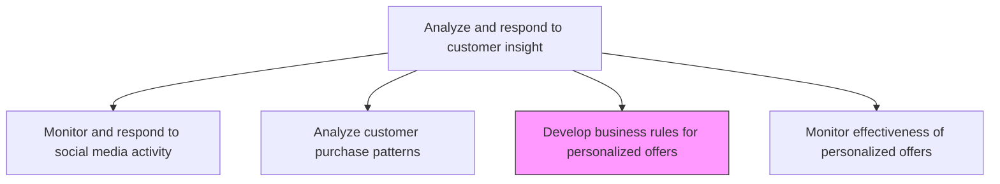
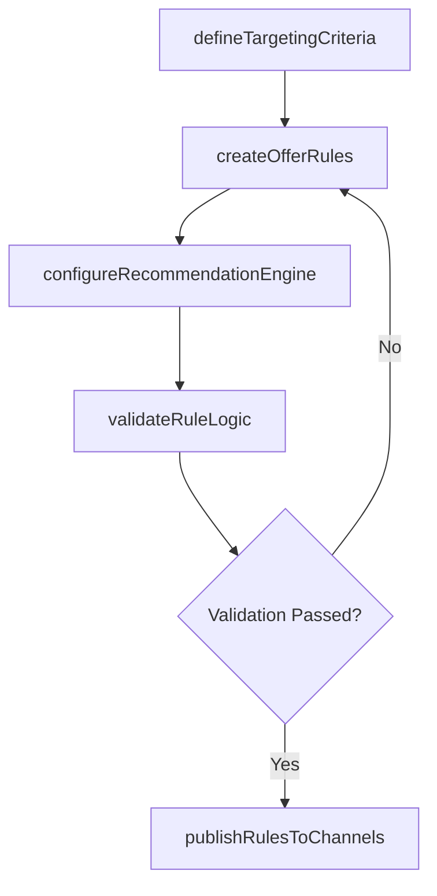

# Develop business rules to provide personalized offers

> Business-as-Code definition for personalization rule engine development. Models the creation of decision logic and targeting formulas that translate customer purchase patterns into personalized offers, recommendations, and targeted advertisements.

## Overview

Creating formulas for personalized offers, purchasing recommendations and targeted advertisements for customers on the basis of previously detected purchase patterns [16615].

## Process Hierarchy



## GraphDL

```yaml
develop:
  object: Business Rules To Provide Personalized Offers
  actor: PersonalizationManager
  result: PersonalizationRuleSet
```

## Actions

| Action | Description |
|--------|-------------|
| defineTargetingCriteria | Establish customer attributes, behaviors, and thresholds that trigger personalized offers |
| createOfferRules | Build conditional logic rules that match customer segments to specific offer types and content |
| configureRecommendationEngine | Set up product recommendation algorithms using collaborative filtering and content-based methods |
| validateRuleLogic | Test business rules against historical data to verify they produce expected targeting outcomes |
| publishRulesToChannels | Deploy validated personalization rules to email, web, mobile, and advertising platforms |

## Events

| Event | Description |
|-------|-------------|
| targetingCriteriaDefined | Customer targeting attributes and thresholds established |
| offerRulesCreated | Conditional personalization rules built and documented |
| recommendationEngineConfigured | Product recommendation algorithms set up and tuned |
| ruleLogicValidated | Business rules tested and verified against historical data |
| rulesPublishedToChannels | Personalization rules deployed across marketing channels |

## Searches

| Search | Description |
|--------|-------------|
| getPersonalizationRules | Retrieve active personalization rules by segment, channel, or offer type |
| getRulePerformance | Query historical performance metrics for specific business rules |
| getTargetingCriteria | Access targeting criteria definitions and threshold configurations |

## Process Flow



## RACI Matrix

| Activity | Responsible | Accountable | Consulted | Informed |
|----------|-------------|-------------|-----------|----------|
| defineTargetingCriteria | PersonalizationAnalyst | PersonalizationManager | CustomerInsights | Marketing |
| createOfferRules | PersonalizationAnalyst | PersonalizationManager | DataScience | Sales |
| configureRecommendationEngine | DataEngineer | PersonalizationManager | ProductManagement | ECommerce |
| publishRulesToChannels | MarketingOpsAnalyst | PersonalizationManager | ChannelManagers | CMO |

## Related Processes

| Process | Relationship |
|---------|-------------|
| 3.3.8.3 Analyze customer purchase patterns | Upstream - purchase patterns provide the foundation for rule creation |
| 3.3.8.5 Monitor effectiveness of personalized offers | Downstream - offer performance feeds back into rule refinement |
| 3.3.4.1 Develop pricing strategies and policies | Parallel - pricing rules coordinate with personalized offer rules |

## Related Departments

| Department | Role |
|-----------|------|
| Personalization | Leads business rule development and recommendation engine configuration |
| Data Science | Builds and tunes recommendation algorithms |
| Marketing Operations | Deploys rules across marketing automation platforms |
| Product Management | Provides product catalog data for recommendation matching |

## Related Occupations

| Occupation | Involvement |
|-----------|-------------|
| Personalization Manager | Oversees rule development strategy and channel deployment |
| Personalization Analyst | Builds and validates targeting rules and offer logic |
| Data Engineer | Configures recommendation engine infrastructure and data pipelines |

## KPIs

| KPI | Description | Unit |
|-----|-------------|------|
| Rule Coverage | Percentage of customer base addressed by active personalization rules | % |
| Rule Accuracy | Percentage of rule-triggered offers that match customer preferences | % |
| Time to Deploy | Average time from rule creation to channel deployment | Hours |
| Recommendation Relevance | Customer engagement rate with rule-driven product recommendations | % |

## Usage

```typescript
import { developBusinessRulesToProvidePersonalizedOffers } from '@headlessly/develop-business-rules-to-provide-personalized-offers'

const personalization = developBusinessRulesToProvidePersonalizedOffers()

// Create offer rules based on purchase pattern segments
const rules = await personalization.createOfferRules({
  segment: 'high-value-declining-engagement',
  offerTypes: ['discount', 'bundle', 'early-access'],
  triggers: ['cart-abandonment', 'browse-without-purchase', 'inactivity-30-days'],
  channels: ['email', 'web-banner', 'push-notification']
})

// Validate rules against historical conversion data
const validation = await personalization.validateRuleLogic({
  ruleSetId: rules.id,
  testDataset: 'last-6-months-transactions',
  expectedLift: 0.15,
  controlGroup: 'random-10-percent'
})
```
