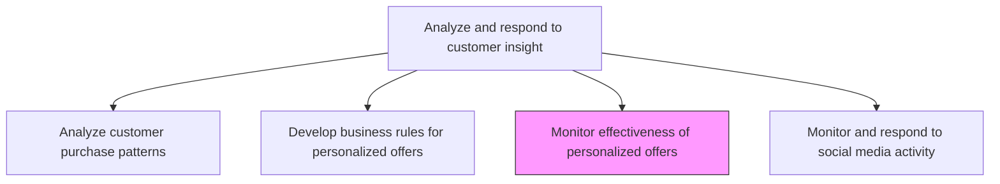
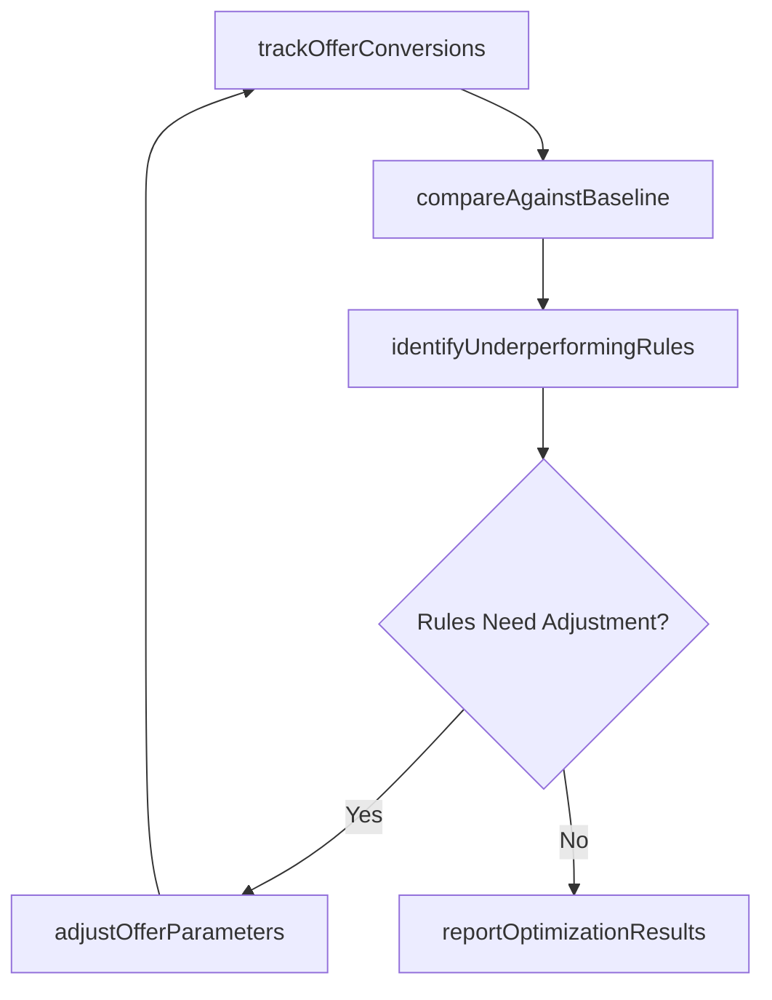

# Monitor effectiveness of personalized offers and adjust offers accordingly

> Business-as-Code definition for personalized offer performance monitoring and optimization. Models the continuous measurement of targeted offer effectiveness, identification of underperforming rules, and iterative adjustment of personalization strategies to maximize conversion rates.

## Overview

Analyzing how well the targeted offers perform to see whether they result in an increased conversion rate. Reanalyze the purchase patterns or modify those business rules that are produce effective recommendations.

## Process Hierarchy



## GraphDL

```yaml
monitor:
  object: Effectiveness Of Personalized Offers And Adjust Offers Accordingly
  actor: PersonalizationManager
  result: OfferEffectivenessReport
```

## Actions

| Action | Description |
|--------|-------------|
| trackOfferConversions | Measure conversion rates, click-through rates, and revenue generated by each personalized offer |
| compareAgainstBaseline | Evaluate personalized offer performance against non-personalized control groups and historical benchmarks |
| identifyUnderperformingRules | Flag business rules that consistently produce below-threshold engagement or conversion outcomes |
| adjustOfferParameters | Modify targeting criteria, offer content, timing, and channel mix to improve underperforming offers |
| reportOptimizationResults | Document offer adjustments made and their impact on conversion and revenue metrics |

## Events

| Event | Description |
|-------|-------------|
| offerConversionsTracked | Personalized offer performance metrics collected and aggregated |
| baselineComparisonCompleted | Offer performance evaluated against control groups |
| underperformingRulesIdentified | Business rules failing performance thresholds flagged for review |
| offerParametersAdjusted | Targeting criteria and offer content modified based on performance data |
| optimizationResultsReported | Impact of offer adjustments documented and distributed |

## Searches

| Search | Description |
|--------|-------------|
| getOfferPerformance | Retrieve conversion and engagement metrics for personalized offers by rule, segment, or channel |
| getUnderperformingOffers | Query offers and rules that fall below performance thresholds |
| getOptimizationHistory | Access historical record of offer adjustments and their outcomes |

## Process Flow



## RACI Matrix

| Activity | Responsible | Accountable | Consulted | Informed |
|----------|-------------|-------------|-----------|----------|
| trackOfferConversions | PersonalizationAnalyst | PersonalizationManager | MarketingOps | Sales |
| compareAgainstBaseline | PersonalizationAnalyst | PersonalizationManager | DataScience | Marketing |
| identifyUnderperformingRules | PersonalizationAnalyst | PersonalizationManager | CustomerInsights | ProductManagement |
| adjustOfferParameters | PersonalizationManager | VP Marketing | DataScience | ChannelManagers |

## Related Processes

| Process | Relationship |
|---------|-------------|
| 3.3.8.4 Develop business rules for personalized offers | Upstream - rules being monitored originate from rule development |
| 3.3.8.3 Analyze customer purchase patterns | Feedback - underperforming offers trigger reanalysis of purchase patterns |
| 3.3.5.6 Evaluate promotional performance metrics | Parallel - personalized offer metrics contribute to broader promotional evaluation |

## Related Departments

| Department | Role |
|-----------|------|
| Personalization | Leads offer performance monitoring and optimization cycles |
| Marketing Analytics | Provides baseline comparisons and statistical significance testing |
| Data Science | Refines recommendation models based on performance feedback |
| Marketing Operations | Implements offer parameter adjustments across channels |

## Related Occupations

| Occupation | Involvement |
|-----------|-------------|
| Personalization Manager | Oversees offer optimization strategy and approves parameter changes |
| Personalization Analyst | Monitors offer metrics and identifies optimization opportunities |
| Marketing Analytics Manager | Provides statistical analysis and A/B testing framework |

## KPIs

| KPI | Description | Unit |
|-----|-------------|------|
| Personalization Lift | Conversion rate improvement of personalized offers versus non-personalized control | % |
| Offer Response Rate | Percentage of targeted customers who engage with personalized offers | % |
| Rule Optimization Cycle Time | Average time from underperformance detection to adjusted offer deployment | Days |
| Revenue per Personalized Offer | Average incremental revenue generated per personalized offer delivered | Currency |

## Usage

```typescript
import { monitorEffectivenessOfPersonalizedOffersAndAdjustOffersAccordingly } from '@headlessly/monitor-effectiveness-of-personalized-offers-and-adjust-offers-accordingly'

const offerMonitor = monitorEffectivenessOfPersonalizedOffersAndAdjustOffersAccordingly()

// Track conversions across all active personalized offers
const performance = await offerMonitor.trackOfferConversions({
  period: 'last-30-days',
  channels: ['email', 'web', 'mobile-push'],
  metrics: ['conversion-rate', 'click-through-rate', 'revenue-per-offer'],
  groupBy: ['rule-id', 'segment', 'channel']
})

// Identify and adjust underperforming rules
const adjustments = await offerMonitor.adjustOfferParameters({
  underperformingRuleIds: performance.belowThreshold.map(r => r.ruleId),
  adjustmentTypes: ['targeting-criteria', 'offer-content', 'delivery-timing'],
  testApproach: 'a-b-split',
  controlPercentage: 20
})
```
